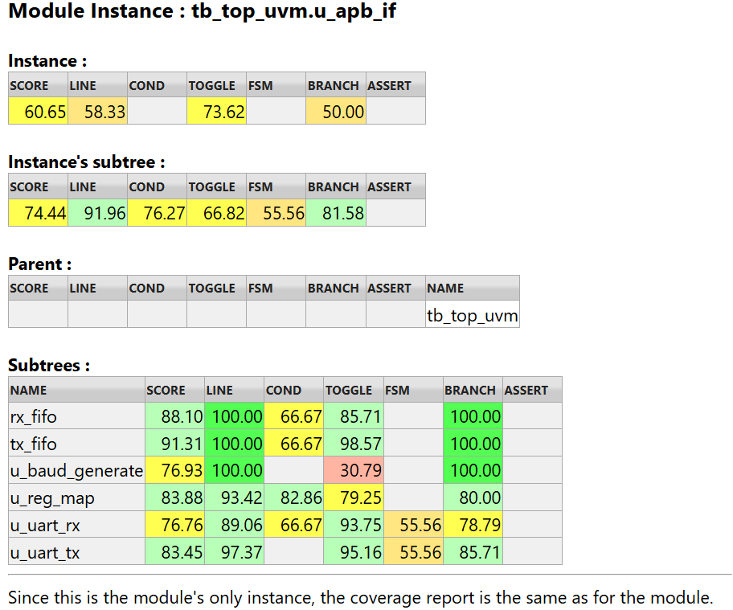

# APB UART

## 简介 (Introduction)

本项目实现了一个基于 APB (Advanced Peripheral Bus) 总线接口的 UART (Universal Asynchronous Receiver/Transmitter) 外设模块。该模块支持通过 APB 总线进行配置、数据收发以及状态查询，适用于 SoC 设计中的低速串行通信场景。


## 目录结构 (Directory Structure)

```text
APB_UART
├── design               # RTL 设计源码
│   ├── apb_if_pkg.sv    # 接口包定义
│   ├── apb_if.v         # APB 顶层接口
│   ├── baud_generate.v  # 波特率发生器
│   ├── fifo.v           # FIFO 缓冲区
│   ├── reg_map.v        # 寄存器映射
│   ├── uart_rx.v        # UART 接收模块
│   └── uart_tx.v        # UART 发送模块
├── flist                # 仿真文件列表
│   ├── cm.hier          # 覆盖率层级配置
│   ├── design_apb_sys.f
│   ├── design_fifo.f
│   ├── design_uart.f
│   ├── tb_apb_sys.f
│   ├── tb_fifo.f
│   ├── tb_top_uvm.f
│   ├── tb_uart_core.f
│   └── tb_uart_fifo.f
├── testbench            # 仿真测试平台
│   ├── apb_pkg.sv       # TB 包定义
│   ├── tb_apb_sys.v     # 系统级 Testbench
│   ├── tb_fifo.v        # FIFO Testbench
│   ├── tb_top_uvm.sv    # UVM Testbench (Top)
│   ├── tb_uart_core.v   # UART 核心 Testbench
│   └── tb_uart_fifo.v   # UART+FIFO Testbench
├── makefile             # 仿真脚本
└── README.md            # 项目说明文档
```

## 寄存器映射 (Register Map)

| 偏移地址 (Offset) | 寄存器名称 (Name) | 位宽 | 描述 (Description) |
| :---------------- | :---------------- | :--- | :----------------- |
| `0x0`           | `UART_DATA`     | 8    | 数据寄存器         |
| `0x4`           | `UART_CTRL`     | 8    | 控制寄存器         |
| `0x8`           | `UART_STAT`     | 8    | 状态寄存器         |
| `0xC`           | `UART_INT`      | 8    | 中断寄存器         |

### 寄存器位定义 (Bit Definitions)

#### UART_DATA (0x0)

- `[7:0]` **data**: 发送或接收的数据 (Data payload)。

#### UART_CTRL (0x4)

- `[0]` **en_sys**: 系统使能 (System Enable)。
- `[1]` **IE**: 中断使能 (Interrupt Enable)。
- `[3:2]` **clk_freq_index**: 时钟频率索引 (Clock Frequency Index)。
- `[6:4]` **baud_rate_index**: 波特率索引 (Baud Rate Index)。
- `[7]` **tx_en**: 发送使能 (Transmission Enable)。

#### UART_STAT (0x8)

- `[0]` **rx_empty**: 接收 FIFO 空 (Rx FIFO Empty)。
- `[1]` **rx_ready**: 接收就绪 (Rx Ready)。
- `[2]` **rx_busy**: 接收忙 (Rx Busy)。
- `[3]` **rx_err**: 接收错误 (Rx Error)。
- `[4]` **tx_full**: 发送 FIFO 满 (Tx FIFO Full)。
- `[5]` **tx_ready**: 发送就绪 (Tx Ready)。
- `[6]` **tx_busy**: 发送忙 (Tx Busy)。

#### UART_INT (0xC)

- `[0]` **rx_done**: 接收完成中断 (Rx Done Interrupt)。
- `[1]` **tx_done**: 发送完成中断 (Tx Done Interrupt)。



## 实现细节 (Implementation Details)

### 1. APB 接口与寄存器 (APB Interface & Registers)

* **APB Slave**: 符合 AMBA APB 协议标准，支持 32 位地址总线（实际解码低 4 位）和 8 位数据传输。
* **Register Access (reg_map)**:
    * 处理 APB 读写请求，映射到内部配置寄存器。
    * **中断机制**: 生成 `rx_done` (接收完成) 和 `tx_done` (发送完成) 中断信号。
    * **状态反馈**: 实时反馈 FIFO 状态（空/满）及 UART 核心状态（忙/就绪/错误）。

### 2. 时钟生成 (Baud Rate Generation)

* **Divider**: `baud_generate` 模块利用系统时钟 `PCLK` 进行整数分频。
* **输出信号**:
    * `baud_en`: 用于 TX 模块的发送时钟使能。
    * `baud_en_16x`: 用于 RX 模块的 16 倍过采样时钟使能。

### 3. 数据缓冲 (FIFO Buffering)

* 集成两个独立的同步 FIFO (`fifo.v`) 分别用于发送和接收路径。
* **规格**: 默认深度为 16 (ADDR_WIDTH=4)，位宽为 8 位。
* **作用**: 实现跨速率域的数据缓冲，CPU 可连续写入数据而无需等待当前字节发送完成。

### 4. UART 核心 (UART Core)

* **帧格式**: 1 起始位 + 8 数据位 + (可选奇偶校验位) + 1 停止位。
* **发送 (uart_tx)**:
    * 状态机控制：`IDLE` -> `START` -> `DATA` -> `PARITY` (可选) -> `STOP`。
    * 根据 `baud_en` 信号移位发送数据。
* **接收 (uart_rx)**:
    * **同步器**: 输入信号 `rx` 经过两级 D 触发器同步，消除亚稳态。
    * **过采样**: 采用 16 倍波特率采样 (`baud_en_16x`)，在计数值为 7 (中间点) 时采样数据，提高抗干扰能力。
    * **错误检测**: 支持接收错误 (`rx_err`) 检测。

### 5. 时钟与复位 (Clock & Reset)

* **时钟 (PCLK)**: 单时钟域设计，所有逻辑均同步于 APB 总线时钟。
* **复位 (PRESETn)**: 低电平异步复位。

## 仿真与测试 (Simulation & Verification)

本项目提供了完整的 Makefile 脚本与 SystemVerilog 测试平台，支持 Synopsys VCS 仿真器与 Verdi 波形查看器。

### 环境要求 (Prerequisites)

* VCS (Verilog Compiler Simulator)
* Verdi (Waveform Debugger)

### 运行命令 (Run Commands)

在 `APB_UART` 目录下终端执行以下命令：

1. **一键编译并仿真** (默认测试用例 `tb_uart_core`):

   ```bash
   make all
   ```
2. **运行指定测试用例**:
   可以通过 `TEST` 变量指定要运行的 Testbench 模块名（对应 `flist/` 下的 `.f` 文件名）。

   ```bash
   # 测试 APB 系统级读写
   make all TEST=tb_apb_sys

   # 单独测试 FIFO 模块
   make all TEST=tb_fifo
   ```
3. **查看波形**:
   仿真完成后，使用以下命令打开 Verdi 查看波形：

   ```bash
   make verdi
   ```
4. **清理生成文件**:

   ```bash
   make clean
   ```
