# AXI4

[TOC]

## Why and what to learn

- **Why**

​	掌握主流片上总线标准，从而高效连接和管理复杂 SoC 系统中的各类高性能外设。

- **What**

  **参考**：

  - 参考手册: [AMBA AXI Protocol Specification](https://developer.arm.com/documentation/ihi0022/l/?lang=en) 
  
    **AXI4 / AXI5**: Spec 在 **Version: H.c** 之后移除 **AXI4** 相关的内容，仅保留 **AXI5**，但目前主流商用 SoC 仍然以 **AXI4** 为主。
  
  - 参考设计: [RongyeL/EasyAXI](https://github.com/RongyeL/EasyAXI)

> [!note]
>
> The key **features** of the AXI protocol are:
>
> - Separate address/control and data phases.
>
> - Support for unaligned data transfers, using byte strobes.
>
> - Uses burst-based transactions with only the start address issued.
>
> - Separate read and write data channels, that can provide low-cost *Direct Memory Access* (DMA).
>
> - Support for issuing multiple outstanding addresses.
>
> - Support for out-of-order transaction completion.
>
> - Permits easy addition of register stages to provide timing closure.
>
> > [!tip]
> >
> > The AXI protocol is burst-based and defines **five independent transaction channels**:
> >
> > - **Read address**, which has signal names beginning with **AR**.
> >
> > - **Read data**, which has signal names beginning with **R**.
> >
> > - **Write address**, which has signal names beginning with **AW**.
> >
> > - **Write data**, which has signal names beginning with **W**.
> >
> > - **Write response**, which has signal names beginning with **B**.
>
> 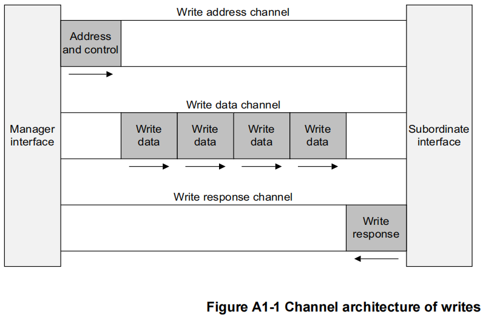
>
> 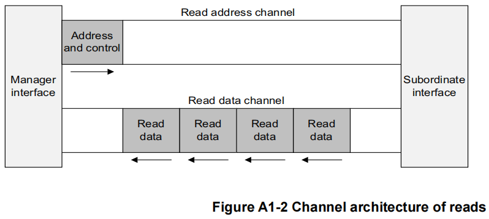
>
> > [!tip]
> >
> > **事务(transaction)**：一次 **读/写请求**，ID 是它的“编号”，五个通道是它的“载体”。

## Signals Define

### ID signals

**Identification tag for a read transaction.**

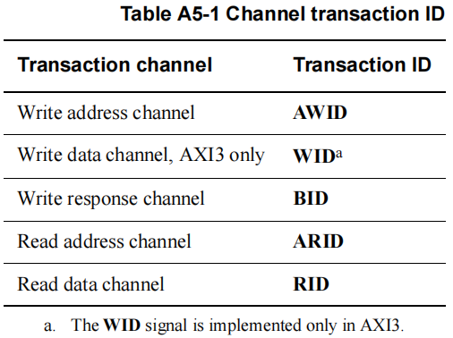

### Adder

**The address of the first transfer in a read transaction.** 

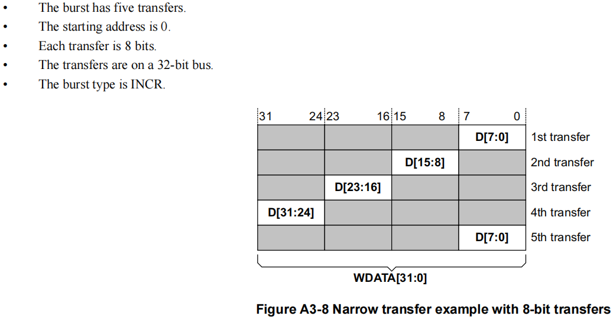

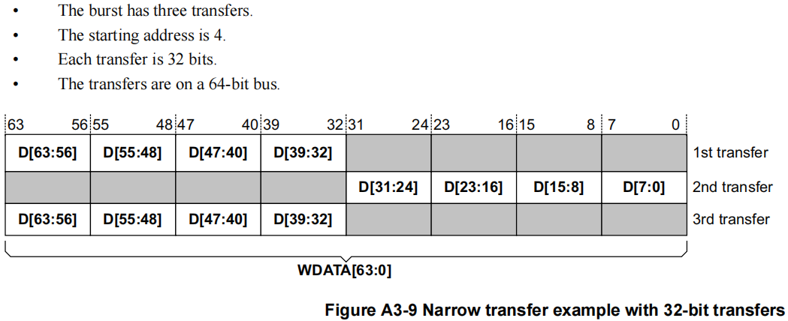

###  Burst length

**Length, the exact number of data transfers in a read transaction.** 

AXI4 extends burst length support for the **INCR burst type to 1-256 transfers**. Support for all other burst types in AXI4 remains at **1-16 transfers**.

To accommodate the extended burst length of the INCR burst type in AXI4, the burst length for AXI4 is defined as:

$$
\text{Burst-Length} = \text{AxLEN [7:0]} + 1
$$

### Burst size

**Size, the number of bytes in each data transfer in a read transaction.** 

The maximum number of bytes to transfer in each data transfer, or beat, in a burst, is specified by:

**ARSIZE [2:0]**, for read transfers

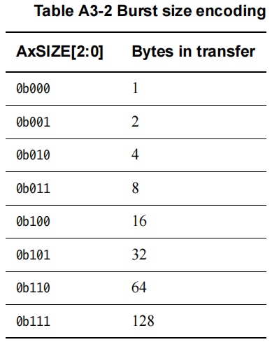

```verilog
bytes = 1 << arsize;
```

### Burst type

- **Burst**：In an AXI transaction, the payload data is transferred in a **==single burst==**, that can **==comprise multiple beats==**, or **individual data transfers**.

- **Beat** : An individual data transfer within an AXI burst.

> - **AR/AW**通道：只需要发1笔请求
> - **R/W**通道：可以对应1笔请求中配置的`BURST`信息，连续发出多笔数据

The AXI protocol defines three burst types:

> [!tip]
>
> **WSTRB**: Manager Write strobes, indicate which byte lanes hold valid data.
>
> > [!note]
> >
> > The **WSTRB [n: 0]** signals when HIGH, specify the byte lanes of the data bus that contain valid information. There is one write strobe for each 8 bits of the write data bus, therefore **WSTRB [n]** corresponds to **WDATA [(8n)+7: (8n)]**.
> >
> > A Manager must ensure that the write strobes are ==HIGH only for byte lanes that contain valid data==.
> >
> > When **WVALID** is LOW, the write strobes can take any value, although this specification ==recommends that they are either driven LOW or held at their previous value==.

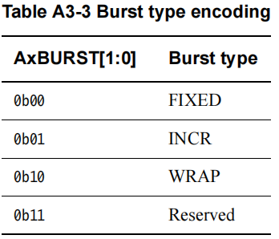

#### FIXED

In a fixed burst:

- The **address is the same** for every transfer in the burst.

- The byte lanes that are valid are constant for all beats in the burst. However, within those byte lanes, the actual bytes that have **WSTRB** asserted can differ for each beat in the burst.

This burst type is used for **repeated accesses to the same location such as when loading or emptying a FIFO**.

#### INCR

Incrementing. In an incrementing burst, the address for each transfer in the burst is an increment of the address for the previous transfer. The increment value **depends on the size of the transfer**. For example, for an aligned start address, the address for each transfer in a burst with a size of 4 bytes is the previous address plus four.

This burst type is used for **accesses to normal sequential memory**. 

#### WRAP

A wrapping burst is similar to an incrementing burst, **except that the address wraps around to a lower address if an upper address limit is reached**.

The following restrictions apply to wrapping bursts:

- ==The **start address must be aligned** to the size of each transfer==.

- ==The **length of the burst** must be **2, 4, 8, or 16** transfers==.

The behavior of a wrapping burst is:

- ==The **lowest address** that is used by the burst is **aligned to the total size of the data to be transferred**==, that is, to ($(\text{size of each transfer in the burst)} × \text{(number of transfers in the burst)}$). This address is defined as the ***wrap boundary***.

- After each transfer, the address increments in the same way as for an INCR burst. However, if this incremented address is ($\text{(wrap boundary)} + \text{(total size of data to be transferred)}$), then the address wraps round to the wrap boundary.

- The first transfer in the burst can use an address that is higher than the wrap boundary, subject to the restrictions that apply to wrapping bursts. **The address wraps for any WRAP burst when the first address is higher than the wrap boundary**.

This burst type is used for **cache line accesses**.

> [!caution]
>
> 允许起始地址与**Szie*Len**不对齐；但必须与**Size**对齐

> [!note]
>
> > [!tip]
> >
> > wrap boundary：**burst 所覆盖的最低地址必须对齐到整个 burst 的总大小**。
>
> 假设：
>
> - 每次传输大小 = 4 字节
> - burst 长度 = 4
> - 总大小 = 4×4 = 16 字节
>
> 那么 wrap boundary 就是 **16 字节对齐的地址**。
>
> **情况 A：起始地址 = 0x20（第32个字节）**
>
> > [!tip]
> >
> > 在 AXI 协议（及绝大多数计算机体系结构）中，地址空间是**按字节寻址**的。即地址 `0x00` 代表第 0 个字节，地址 `0x01` 代表第 1 个字节，以此类推。“16 字节对齐”，意味地址必须是 16 的整数倍。
>
> - 0x20 是 16 的倍数 → 已对齐
> - burst 地址范围：0x20, 0x24, 0x28, 0x2C
> - 全部落在 [0x20, 0x30) 这个 16 字节块里。
>
> **情况 B：起始地址 = 0x24**
>
> - 0x24 不是 16 的倍数 → 不对齐
> - wrap burst 会强制把 **最低地址** 对齐到 0x20（即 16 字节边界）。
> - burst 地址范围：0x24, 0x28, 0x2C, 然后 wrap 回到 0x20。
> - 所有地址仍然落在 [0x20, 0x30) 这个块里。
>
> ---
>
> 假设：
>
> - 总线宽度 = 32bit (4 字节)。
> - 突发长度 = 4。
> - 环绕边界大小 = 16 字节，对齐到 0x00–0x0F。
>
> 情况一：**第一个地址** = 0x00，**地址序列**：0x00, 0x04, 0x08, 0x0C
>
> 情况二：**第一个地址** = 0x0C，**地址序列**：0x0C, 0x00, 0x04, 0x08 （因为超过边界后回绕）

### Handshake pairs (VALID, READY, LAST)

- **Read address channel**

  The Manager can assert the **ARVALID** signal only when it drives valid address and control information. When asserted, ==**ARVALID** must remain asserted until the rising clock edge after the Subordinate asserts the **ARREADY** signal==.

  The default state of ==**ARREADY** can be either HIGH or LOW. This specification recommends a default state of HIGH==. If **ARREADY** is HIGH, then the Subordinate must be able to accept any valid address that is presented to it.

  > [!note]
  >
  >  This specification does ==not recommend a default **ARREADY** value of LOW==, because it forces the transfer to take **at least two cycles**, one to assert **ARVALID** and another to assert **ARREADY**.
  >
  
- **Read data channel**

  The Subordinate can assert the **RVALID** signal only when it drives valid read data. When asserted, ==**RVALID** must remain asserted until the rising clock edge after the Manager asserts **RREADY**==. Even if a Subordinate has only one source of read data, it must assert the **RVALID** signal only in response to a request for data. 

  The Manager interface uses the **RREADY** signal to indicate that it accepts the data. The default state of **RREADY** can be HIGH, but only if the Manager is able to accept read data immediately when it starts a read transaction.

  The ==Subordinate must assert the **RLAST** signal when it is driving the final read transfer== in the burst.

  > [!note]
  >
  > This specification ==recommends that **RDATA** is **driven to zero for inactive**== byte lanes.

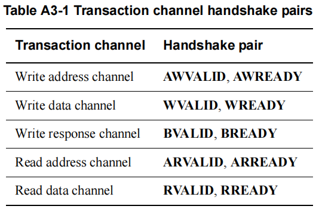

### Resp

For read transactions, the response information from the Subordinate **is signaled on the read data channel**.

- **OKAY**: Normal access success. Indicates that a **normal access has been successful**. Can also indicate that an **exclusive access has failed**. See *OKAY, normal access success*.

- **EXOKAY**: Exclusive access okay. Indicates that either the read or write portion of an **exclusive access has been** **successful**. See *EXOKAY, exclusive access success* on page A3-60.

- **SLVERR**: Subordinate error. Used when **the access has reached the Subordinate successfully**, but the **Subordinate wishes to return an error condition to the originating Manager**. See *SLVERR,* *Subordinate error* on page A3-60.

- **DECERR**: Decode error. Generated, typically by an interconnect component, to indicate that there is **no**  **Subordinate at the transaction address**. See *DECERR, decode error* on page A3-60.

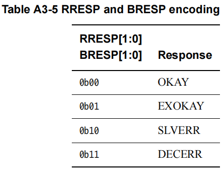

## Handshake process

All five transaction channels use the same **VALID**/**READY** handshake process to transfer address, data, and control information. This two-way flow control mechanism means both the Manager and Subordinate can control the rate that the information moves between Manager and Subordinate. The *source* generates the **VALID** signal to indicate when the address, data, or control information is available. The *destination* generates the **READY** signal to indicate that it can accept the information. ==Transfer occurs only when *both* the **VALID** and **READY** signals are HIGH==.

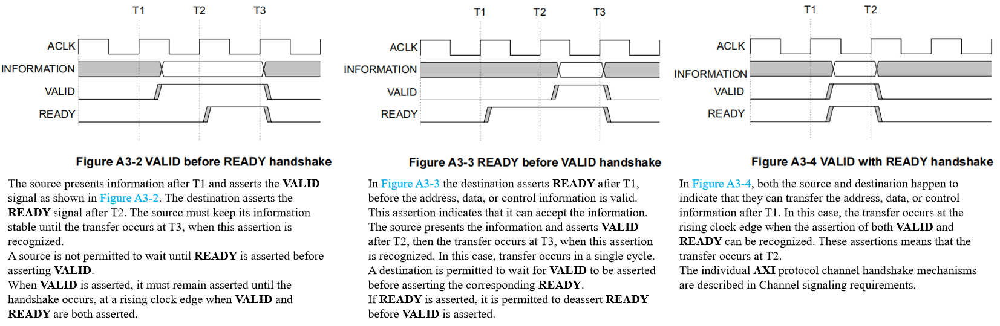

```verilog
always @(posedge aclk or negedge aresetn)begin
    if(!aresetn)begin
        arvalid <= 1'b0;
    end else begin
        if(!arvalid || arready) arvalid <= 1'b1;
        else if(arvalid && arready) arvalid <= 1'b0;
    end
end
```

## Reset

The AXI protocol uses a single active-LOW reset signal, **ARESETn**. The reset signal can be asserted asynchronously, but ==deassertion can only be synchronous with a rising edge of **ACLK**==.During reset the following interface requirements apply:

- A Manager interface must drive **ARVALID**, **AWVALID**, and **WVALID** LOW.

- A Subordinate interface must drive **RVALID** and **BVALID** LOW.

- All other signals can be driven to any value.

The earliest point after reset that a Manager is permitted to begin driving **ARVALID**, **AWVALID**, or **WVALID** HIGH is at a rising **ACLK** edge after **ARESETn** is HIGH. Figure A3-1 shows ==**the earliest point** after reset that **ARVALID**, **AWVALID**, or **WVALID**, can be driven HIGH==.

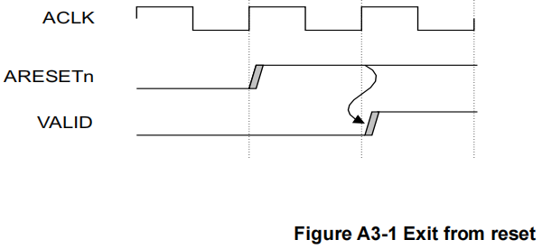

## Dependence deadlock

To **prevent a deadlock** situation, the dependency rules that exist between the handshake signals must be observed.

As summarized in *Channel signaling requirements* on page A3-42, in any transaction:

- The ==**VALID** signal== of the AXI interface sending information ==must not be dependent on the **READY** signal== of the AXI interface receiving that information.

- An AXI interface that is receiving information can wait until it detects a **VALID** signal before it asserts its corresponding **READY** signal.

> [!note]
>
> It is acceptable to ==wait for **VALID** to be asserted before asserting **READY**==.It is also acceptable to ==assert **READY** before== detecting the corresponding **VALID**. This can result in a more efficient design.

## Address calculate

The AXI protocol is burst-based. The Manager begins each burst by driving control information and the address of the first byte in the transaction to the Subordinate. As the burst progresses, the Subordinate must calculate the addresses of subsequent transfers in the burst.

==A burst must not cross a 4KB address boundary==.

> [!note]
>
>  This prohibition prevents a burst from ==crossing a boundary between two Subordinates==. It also limits the number of address increments that a Subordinate must support.

> [!caution]
>
> 1. 如果一次 brust 超过 4KB，会导致访问到下一个 slave 的内存，所以如果一次传输超过了 4KB 就要 **拆分传输**
> 2. 4KB 是 **物理内存一页** 的大小

### Burst address

This section provides methods for determining the address and byte lanes of transfers within a burst. The equations use the following variables:

- **Start_Address**: The start address that is issued by the Manager.
- **Number_Bytes**: The maximum number of bytes in each data transfer.

- **Data_Bus_Bytes**: The number of byte lanes in the data bus.

- **Aligned_Address**: The **aligned version of the start address**.

- **Burst_Length**: The total number of data transfers within a burst.

- **Address_N**: The address of transfer N in a burst. **N is 1 for the first transfer in a burst.**
- **Wrap_Boundary**: The lowest address within a wrapping burst.

- **Lower_Byte_Lane**: The byte lane of the lowest addressed byte of a transfer.

- **Upper_Byte_Lane**: The byte lane of the highest addressed byte of a transfer.

- **INT(x) / $\lfloor x\rfloor$**: The rounded-down integer value of x.

These equations determine addresses of transfers within a burst:

```
Start_Address = AxADDR
Number_Bytes = 2 ^ AxSIZE
Burst_Length = AxLEN + 1
Aligned_Address = (INT(Start_Address / Number_Bytes)) × Number_Bytes
```

This equation determines the address of the first transfer in a burst:

> [!note]
>
> 所以任何burst的**第一笔数据**的地址**允许是非对齐**的而不强制到`aligned`
>
> 后续数据的地址需要按`aligned`来


```
Address_1 = Start_Address
```

For an INCR burst, and for a WRAP burst for which the address has not wrapped, this equation determines the address of any transfer after the first transfer in a burst:

```
Address_N = Aligned_Address + (N – 1) × Number_Bytes
```

For a WRAP burst, the Wrap_Boundary variable defines the wrapping boundary:

```
Wrap_Boundary = (INT(Start_Address / (Number_Bytes × Burst_Length)))× (Number_Bytes × Burst_Length)
```

For a WRAP burst, if $\text{Address-N = Wrap-Boundary + (Number-Bytes × Burst-Length)}$​, then:

> [!note]
>
> 即**当笔**传输数据的初始地址到达**wrap上边界**，则直接转到**wrap下边界**

- Use this equation for **the current transfer**:

```
Address_N = Wrap_Boundary
```

- Use this equation for **any subsequent transfers**:

```
Address_N = Start_Address + ((N – 1) × Number_Bytes) – (Number_Bytes × Burst_Length)
```


> [!caution]
>
> 在 WRAP burst 中，地址必须限制在一个固定窗口：
> $$
> [\text{Wrap-Boundary, Wrap-Boundary + (Number-Bytes }\times \text{Burst-Length)})
> $$
> Start_Address 只是 burst 的起点，不是限制条件；真正的限制是 **Wrap_Boundary**。

These equations determine the byte lanes to use for the first transfer in a burst:

```
Lower_Byte_Lane = Start_Address – (INT(Start_Address / Data_Bus_Bytes)) × Data_Bus_Bytes
Upper_Byte_Lane = Aligned_Address + (Number_Bytes – 1) – (INT(Start_Address / Data_Bus_Bytes)) × Data_Bus_Bytes
```

These equations determine the byte lanes to use for all transfers after the first transfer in a burst:

```
Lower_Byte_Lane = Address_N – (INT(Address_N / Data_Bus_Bytes)) × Data_Bus_Bytes
Upper_Byte_Lane = Lower_Byte_Lane + Number_Bytes – 1
```


Data is transferred on:

```
DATA((8 × Upper_Byte_Lane) + 7: (8 × Lower_Byte_Lane))
```

The transaction container describes all the bytes that could be accessed in that transaction, if the address is aligned and strobes are asserted:

```
Container_Size = Number_Bytes x Burst_Length
```

For INCR bursts:

```
Container_Lower = Aligned_Address
Container_Upper = Aligned_Address + Container_Size
```

For WRAP bursts:

```
Container_Lower = Wrap_Boundary
Container_Upper = Wrap_Boundary + Container_Size
```

### Pseudocode of the transfers

> [!tip]
>
> 在Spec的伪代码基础上进行了一定修改

```c++
// DataTransfer()
// ==============

DataTransfer(Start_Address, Number_Bytes, Burst_Length, Data_Bus_Bytes, Mode, IsWrite)
// Data_Bus_Bytes is the number of 8-bit byte lanes in the bus
// Mode is the AXI transfer mode
// IsWrite is TRUE for a write, and FALSE for a read

    assert Mode IN {FIXED, WRAP, INCR};
    addr = Start_Address; 					// Variable for current address
    Aligned_Address = (INT(addr/Number_Bytes) * Number_Bytes);
    aligned = (Aligned_Address == addr); 	// Check whether addr is aligned to nbytes
    dtsize = Number_Bytes * Burst_Length; 	// Maximum total data transaction size

    if (mode == WRAP){
        Lower_Wrap_Boundary = (INT(addr/dtsize) * dtsize);
    	// addr must be aligned for a wrapping burst
    	Upper_Wrap_Boundary = Lower_Wrap_Boundary + dtsize;
    }
        
    for (n = 1; n<= Burst_Length; n++)
    {
        Lower_Byte_Lane = addr - (INT(addr/Data_Bus_Bytes)) * Data_Bus_Bytes;
        if (aligned)
            Upper_Byte_Lane = Lower_Byte_Lane + Number_Bytes - 1;
        else
            Upper_Byte_Lane = Aligned_Address + Number_Bytes - 1 - (INT(addr/Data_Bus_Bytes)) * Data_Bus_Bytes;

        // Peform data transfer
        if (IsWrite)
            dwrite(addr, low_byte, high_byte);
        else
            dread(addr, low_byte, high_byte);

        // Increment address if necessary
        if (mode != FIXED)
            if (aligned)
                addr = addr + Number_Bytes;
        	if (mode == WRAP )
                // WRAP mode is always aligned
                if (addr >= Upper_Wrap_Boundary)
                    addr = Lower_Wrap_Boundary;
        		else
                    addr = Aligned_Address + Number_Bytes;
        aligned = TRUE; // All transfers after the first are aligned
    }
return;
```

