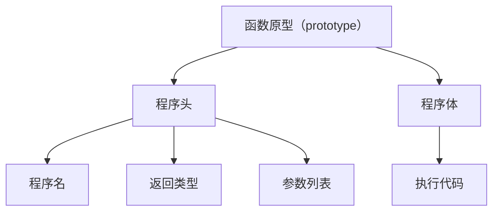

# System Verilog验证测试平台编写指南


[TOC]

## 验证流程

**验证目的：确保DUT符合Spec文档的规范**

- 阅读 spec 文档（信号含义、时序、寄存器、功能）
- 提取功能点，制定验证计划（excel）
- 搭建验证平台（SV 和 UVM）
- 编写测试激励（sequence/case，跑回归）
- Debug （log and verdi 波形）
- 收集覆盖率（代码覆盖率和功能覆盖率）

---

---

## SystemVerilog

### HVL 性质

硬件验证语言（Hardware Verification Language, HVL），与硬件描述语言（HDL）相比，HVL 具有一些典型的性质：

1. 受约束的随机激励生成：`random`, `constraint`
2. 功能覆盖率：`coverage`
3. 更高层次的结构，尤其是面向对象的编程：`class`
4. 多线程及线程间的通信：
   - 单线程（顺序调用）：`begin...end`
   - 多线程（并行调用）：`fork...join/join_any/join_none`
   - 线程间通信（模块间的 flag 信号）：<u>`mailbox`</u>, `event`, `semaphore` （常用 `mailbox`，其他通过 UVM 端口进行通信）
5. 支持 HDL 数据类型，例如 `Verilog` 的四状态数值：`0, 1, X, Z`
6. 集成了事件仿真器，便于对设计施加控制

---

### UVM 验证平台


---

---

## 数据类型

### 二值/四值类型

#### 二值

> [!note]
>
> **特点**：仅表示 0 和 1 两种逻辑状态，无高阻(Z)和未知(X)。
>
> **用途**：适用于仿真（测试平台 tb）。

| 类型       | 位数  | 说明                                  |
| ---------- | ----- | ------------------------------------- |
| `bit`      | 1bit  | 无符号，默认初始值为 $0$               |
| `byte`     | 8bit  | 有符号整数（范围：$-2^7 \sim 2^7-1$） |
| `shortint` | 16bit | 有符号整数                            |
| `int`      | 32bit | 有符号整数                            |
| `longint`  | 64bit | 有符号整数                            |

#### 四值

> [!note]
>
> **特点**：可表示 `0`、`1`、`Z`、`X`，更贴近硬件行为。
>
> **用途**：模拟实际电路（`module`），也可以用于 tb。

| 类型      | 位数  | 说明                                            |
| --------- | ----- | ----------------------------------------------- |
| `logic`   | 1bit  | 支持连续赋值 (`assign`) 和过程赋值 (`always`)。 |
| `reg`     | 1bit  | 无符号变量类型，通常用 `logic` 替代。           |
| `wire`    | 1bit  | 线网类型。                                      |
| `integer` | 32bit | 有符号变量类型。                                |
| `time`    | 64bit | 无符号变量类型，用于存储仿真时间。              |

---

### 数组类型

- **静态数组（定宽数组）**：数组大小在 **编译时确定**，不可动态改变。`bit[3:0][7:0] barray[3];`

  - 合并数组 `bit [3:0][7:0];`

  - 非合并数组 `bit [7:0]b_unpack[3];`

  - 合并与非合并的混合数组 `bit [3:0][7:0]barry[3];`

> [!tip]
>
> 使用信号时，对应地址查询顺序：1. **变量右侧**；2. **变量左侧从左到右**
>
> 例：`bit [x:0][y:0]mix_barry[z:0];`，确定 `bit[i][j][k]`，先找 `[z:0]` 中的 `i`，再找 `[x:0]` 中的 `j`，以此类推

> [!note]
>
> - **任何数组类型都可以合并**，包括动态数组、队列和关联数组。
> - 如果你需要 **等待数组中某位信号的变化**，则必须使用 **合并数组**。


- **动态数组**：数组大小在 **运行时动态分配**，使用 `new[]` 分配内存。`int dyn[],d2[];`

  ```systemverilog
  int dyn[],d2[];				// 声明动态数组
  
  initial begin
      dyn=new[5];				// A:分配5个元素
      foreach(dyn) dyn[j]=j;	// B:对元素进行初始化
      d2=dyn;					// C:复制一个动态数组
      d2[0]=5;				// D:修改复制值
      
      bit[7:0] mask[] = '{8'b0000_0000,8'b0000_0001,
                          8'b0000_0011,8'b0000_0111,
                          8'b0000_1111,8'b0001_1111,
                          8'b0011_1111,8'b0111_1111,
                          8'b1111_1111};		// 注意静态/动态数组赋值需要`
  ```

> [!note]
>
> **动态数组**、**队列** 内建的子程序（`routines`）：`$size$`、`$delete$`

- **队列**：支持动态增删元素，使用 `$` 符号声明。支持高效的前后 **插入**（`pop_front`, `push_back`）和 **删除** 操作。

  ```systemverilog
  int j=1,
  	q2[$]={3,4},			// 队列的常量不需要使用“`”
  	q[$]={0,2,5};			// {0,2,5}
  initial begin
      q.insert(1,j);			// {0,1,2,5}在2之前插入1
      q.insert(3,q2);			// {0,1,2,3,4,5} 在q中插入一个队列
      q.delete(1);			// {0,2,3,4,5}删除第1个元素
  //下面的操作执行速度很快
      q.push_front(6);		// {6,0,2,3,4,5}	在队列前面插入
      j=q.pop_back;			// {6,0,2,3,4}  	j=5
      q.push_back(8);			// {6,0,2,3,4,8} 	在队列末尾插入
      j=q.pop_front;			// {0,2,3,4,8}		j=6
      foreach (q[i])
          $display(q[i]);		// 打印整个队列
      q.delete();				// 删除整个队列
  end
  ```

- **关联数组**：通过 **任意数据类型（不要求整型）** 作为索引（如 `int, string`）。索引无需连续，**稀疏数据存储**。`int switch[string];`


> [!caution]
>
> **队列** 与 **关联数组** 因为使用到了 **指针**，所以相比 **静态** 与 **动态** 数组的 **存取效率稍差**

---

### 自定义类型`typedef`

> 引入自定义类型语法

#### 基础

> [!tip]
>
> 参考如下:`typedef 已有类型 新类型;`
>
> ```systemverilog
> typedef logic [7:0] byte_t;
> typedef logic [15:0] word_t;
> typedef logic [31:0] dword_t;
> typedef logic [63:0] qword_t;
> 
> // 另外又如
> typedef logic[5:0] entry_t;
> typedef entry_t[31:0] table_t;
> ```
>
> 后续代码基于如上参考的自定义类型

```systemverilog
word_t a, b;
assign b= {a[7:0], a[15:8]};

table_t table1;	// logic [31:0][5:0]
assign table1[1] = `0;
assign table1[0][1] = `0;
```

---

#### 结构体`struct`

> 描述一组相关的数据
>
> 便于相关信号的**位宽管理**

```systemverilog
alufunc_t alufunc;
logic mem_read;
logic mem_write;
logic regwrite;

logic [6:0] control;
assign control = {alufunc, mem_read, mem_write, regwrite};	// 当规模变大，如何管理control的位数呢？
```

结构体类型相关的语法如下：

```systemverilog
// type definition
typedef struct packed {
    logic [3:0] alufunc;
    logic mem_read;
    logic mem_write;
    logic regwrite;
} control_t;
// packed: 将结构体内的成员在内存中形成一个连续的位向量，从而允许位运算或赋值给硬件信号

// variable declaration
control_t control;

logic regwrite;
assign regwrite = control.regwrite; // control[0]

// using struct without typedef
struct packed {
    logic [3:0] alufunc;
    logic mem_read;
    logic mem_write;
    logic regwrite;
} control_without_typedef;
// 缺点：不可复用。不推荐这么写
```

```systemverilog
// 流水线寄存器描述
typedef struct packed {
    
}pipline_decode_t;
pipline_decode_t p, p_nxt;
always_ff @(posedge clk)begin
	p <= p_nxt;
end
```

---

#### 枚举`enum`

> 常用于**编码**（包括状态机编码），等价于**定义一堆宏**：``define ADD 4'b0000`
>
> **强类型**

```systemverilog
typedef enum <datatype> {
    IDEN_1, IDEN_2
}typename;
```

举例：

```systemverilog
typedef enum logic [3:0] {
    ALU_ADD, ALU_AND, ALU_SUB
}alufunc_t;	// logic [3:0]表示最多可以存16种状态，这里只用了3种状态

alufunc_t alufunc;

enum logic [3:0] {
    ALU_ADD, ALU_AND, ALU_SUB
} alufunc_without_typedef;
```

> [!tip]
>
> 定义`enum`后，编译器会自动分配：
>
> - **`ALU_ADD`** = `4'd0`
> - **`ALU_AND`** = `4'd1`
> - **`ALU_SUB`** = `4'd2` 
>
> 默认从 0 开始递增。也可以手动指定，例如 `{ALU_ADD=4'b1000, ...}`。

工业界的标准写法：将 `enum` 嵌套进 `struct` 

```systemverilog
typedef struct packed {
    alufunc_t        op;	// 使用枚举定义操作码
    logic [31:0]     a, b;
} instruction_t;
```

```systemverilog
typedef enum logic [1:0] {
    STATE_0, STATE_1, STATE_2
}state_t;

state_t state, state_nxt;
always_ff @(posedge clk) begin
    if (~resetn) begin
        state <= state_t'(0);
        // 将数值 0 强制转换为枚举类型 state_t，并赋值给状态寄存器 state
        // <type>'( <expression> )一种编译时确定的类型转换
    end else begin
    	state <= state_nxt;    
    end
end
```

---

#### 联合`union`

> 多套“马甲”**共用同一块内存**（位向量）

> [!tip]
>
> `packed`要求所有成员的**总位宽必须完全相等**

```systemverilog
typedef union packed {
    struct packed {
        logic zero; // 确保与其他数据量位宽一致，无实际作用
        logic [31:0] aluout;
    }alu;
    struct packed {
        logic branch_tanken;
        logic [31:0] pcbranch;
    }branch;
    struct packed {
        logic [31:0] addr;
        logic mem_read;
    }memory;
}result_t;

result_t res;

logic [31:0] addr;
assign addr = res.memory.addr; // assign addr = res[32:1]
assign aluout = res.alu.aluout; // assign aluout = res[31:0]

assign res.alu.aluout = '1;
```

> [!caution]
>
> 对`union`类型的变量进行赋值时，要注意多驱动。
>
> 如已经有`assign res.alu.aluout = '1;`，即低32位已经有驱动了，`branch`的`pcbranch`、`memory`的`mem_read`都不能再赋值

---

#### `struct`与`union`对比

> [!tip]
>
> 相同的成员定义，struct占用空间≈3*union占用空间

| **特性**     | **struct packed (结构体)**     | **union packed (联合体)**                  |
| ------------ | ------------------------------ | ------------------------------------------ |
| **位宽计算** | 各成员位宽**之和**             | 等于**最长成员**的位宽                     |
| **内存关系** | 成员按顺序排列，互不干扰       | **所有成员共享同一段内存**                 |
| **硬件隐喻** | 一条包含多个字段的**复合总线** | 一个具有多种解释方式的**多路复用器 (MUX)** |
| **应用场景** | 组织指令包、状态控制信号       | 节省面积、实现通用的计算结果通路           |

---

### 类型转换

#### 静态类型转换

**静态类型转换** 是一种 **显式** 类型转换方式，用于在编译时将数据从一种类型强制转换为另一种类型。它 **不进行检查**，需开发者自行确保转换的合法性。

> [!tip]
>
> 方式：==目标类型变量 = <目标类型>‘(源表达式);==

```systemverilog
// case 1
int i_val = 42;
real r_val = real'(i_val);			// int → real
int i_new = int'(r_val);			//real → int（直接截断小数部分）

// case 2
typedef struct packed {
    logic [3:0] addr;
    logic [7:0] data;
}packet_t;

packet_t pkt;
bit [11:0] bits = bit[11:0]'(pkt);	//合并结构体 → 12位向量
```

> [!caution]
>
> Verilog 对 **整数** 和 **实数** 类型，或者不同位宽的向量之间进行 **隐式转换**
>
> | 特性       | 显式转换                     | 隐式转换                     |
> | ---------- | ---------------------------- | ---------------------------- |
> | **语法**   | 需使用 `type'(expr)` 或 `$cast` | 无特殊语法，自动触发         |
> | **安全性** | 高（开发者明确意图）         | 低（可能意外截断或丢失信息） |
>
> ```systemverilog
> logic [7:0] byte_val = 8'hFF;
> logic [15:0] word_val = byte_val;	//隐式扩展为16位(高位补0)
> ```

#### 动态类型转换 `$cast(x,y)`

枚举类型的缺省类型为双状态 int。可以使用简单的赋值表达式把枚举变量的值直接赋给非枚举变量如 int。但 SystemVerilog 不允许在没有进行显式类型转换的情况下把整型变量赋给枚举变量。SystemVerilog 要求显式类型转换的目的在于让你意识到可能存在的数值越界情况。

---

## 面向对象编程

### OOP 术语

- **类**(`class`)：**包含变量和子程序的基本构建块**。Verilog 中与之对应的是 **模块** `(module`)。

  > [!tip]
  >
  > 软件范围——`class`；硬件范围——`module`

```systemverilog
// 简单的Transaction类
class Transaction;
    bit [31:0] addr,crc,data[8];
    function void display;
        $display("Transaction:&h",addr);
    endfunction:display
    
    function void calc_crc;
        crc = addr ^ data.xor;
    endfunction:calc_crc
endclass:ransaction
```

- **对象**(`object`)：**类的一个实例**。在 Verilog 中，你需要 **实例化模块** 才能使用它。

- **句柄**(`handle`)：**指向对象的指针**。在 Verilog 中，你通过实例名在模块外部引用信号和方法。一个 OOP 句柄就像一个对象的 **地址**，但是它保存在一个只能指向单一数据类型（包括父类与子类）的指针中。

```systemverilog
// tr是一个指向Transaction类型对象的句柄，因此tr可以简称为一个Transaction句柄
// 声明和使用一个句柄
Transaction tr;	// 声明一个句柄
Tr = rew();		// 为一个Transaction对象分配空间，即实例化
```

> [!tip]
>
> 下方第二行调用 `new()` 创建了一个对象，并且将其地址保存在句柄 `t` 中。
>
> 下一个 `new()` 函数的调用创建了一个新的对象，并将其地址放在 `t` 中，覆盖了句柄 `t` 先前的值。
>
> 因为此时已经没有任何句柄指向第一个对象，SystemVerilog 就可以将其解除分配了。
>
> 对象可以立刻被删除，或者等上一小段时间再删除。最后一行明确地清除句柄，所以至此第二个对象也可以被解除分配了。

```systemverilog
t=new();	//分配一个新的Transaction
t=new();	//分配第二个，并且释放第一个t
t=null;		//解除分配第二个
```

> [!note]
>
> - `new()` 和 `new[]` 的区别
>
>   都是 **申请内存并初始化变量**，但使用的 **目标** 不同
>
>   `new()`：仅创建一个 **对象（实例化 class）**；可使用参数设置对象的数值
>
>   `new[]`：创建一个含有多个元素的 **数组**；只需使用一个数值来设置数组的大小
>
> - **对象使用方式**
>
> ```systemverilog
> Transaction t;	// 声明一个Transaction句柄
> t = new();		//创建一个Transaction对象
> t.addr = 32'h42;//设置变量的值
> t.display();	//调用一个子程序
> ```
>

- **属性**(`property`)：**存储数据的变量**。在 Verilog 中，就是寄存器(`reg`)或者线网(`wire`)类型的 **信号**。
- **方法**(`method`)：**任务或者函数中操作变量的程序性代码**。Verilog 模块除了 `initial` 和 `always` 块以外，还含有 `task` 和 `function`。
- **原型**(`prototype`)：



```systemverilog
// prototype 声明（程序头）
extern function int calc_sum(int a, int b, bit enable);
```

- `extern` → **声明但不定义**，让编译器知道某个函数或任务的存在，而具体实现会在别处给出。

```systemverilog
class MyClass;
   extern function void display(); // 声明
endclass

function void MyClass::display();  // 定义在类外
   $display("Hello SystemVerilog!");
endfunction
```

- `function` → 声明这是一个函数
- `int` → 返回类型
- `calc_sum` → 程序名
- `(int a, int b, bit enable)` → 参数列表（信号变量默认 `input`+`logic`）

```systemverilog
// 程序体（实现）
function int MyClass::calc_sum(int a, int b, bit enable);
    if(enable)begin
    	return a + b;
    end else begin
        return 0;
    end
endfunction
```

---

### `public`/`protected`/`local`

- `public`：**没有任何限制**，**默认**。
- `protected`：允许 **类内部及其子类访问**。
- `local`：**只允许类内部访问**，**子类也不可见**。

> [!tip]
>
> `local` 的值外部不能直接访问，但可以通过 `Class` 内部定义 `public`(默认)的 `function`，来外部调用 `return` 这个值。

| 修饰符      | 类内部访问 | 子类访问 | 类外部访问 |
| ----------- | ---------- | -------- | ---------- |
| `public`    | ✅ 允许      | ✅ 允许    | ✅ 允许      |
| `protected` | ✅ 允许      | ✅ 允许    | ❌ 禁止      |
| `local`     | ✅ 允许      | ❌ 禁止    | ❌ 禁止      |

```systemverilog
class Counter;
    // 私有属性，只能类内部访问
    local int count = 0;

    // 公共方法：递增计数器
    public function void increment();
        count++;  // ✅ 当前类内部访问合法
    endfunction

    // 公共方法：获取计数器值
    function int getCount();
        return count;  // ✅ 通过接口暴露值
    endfunction
endclass

class DoubleCounter extends Counter;
    // 公共方法：尝试对子类中的 count 进行操作
    function void doubleIncrement();
        // count *= 2;  // ❌ 编译错误：子类不能访问 local 成员
    endfunction
endclass

module test;
    initial begin
        Counter c = new();
        c.increment();
        $display("Count: %d", c.getCount());  // ✅ 通过接口访问
        // c.count = 10;  // ❌ 编译错误：外部不能直接访问 local 成员
    end
endmodule
```

---

### 静态/动态变量

#### 静态变量：`static`

- **生命周期**：存在于整个仿真期间（从时间 0 开始到仿真结束）
- **初始化**：仅在仿真开始时初始化一次
- **默认值**：未显式初始化时为 `0` 或 `null`

```systemverilog
module example;
    static int counter = 0;  // 静态变量，所有实例共享

    task increment();
        counter++;
        $display("Counter = %d", counter);
    endtask
endmodule

module test_static;
    initial begin
        example ex1 = new();
        example ex2 = new();

        ex1.increment();  // 输出: Counter = 1
        ex2.increment();  // 输出: Counter = 2（共享同一个静态变量！！！）
    end
endmodule
```

#### 动态变量：`automatic`

- **存储期限**：随作用域创建/销毁（如任务/函数调用时创建，退出时销毁）
- **初始化**：每次进入作用域时重新初始化
- **默认值**：未初始化时为 **不确定值**（`x for 4-state`，`0 for 2-state`）
- **作用域规则**：
  - 在 `task`、`function` 或带 `automatic` 的程序块中声明
  - 类方法默认是 `automatic`（除非显式声明为 `static`)

```systemverilog
module test_automatic_task;
    task automatic dynamicDemo();
        int local_var = 0;  // 默认为 automatic
        local_var++;
        $display("local_var = %d", local_var);
    endtask

    initial begin
        dynamicDemo();  // 输出: local_var = 1
        dynamicDemo();  // 输出: local_var = 1（重新初始化）
    end
endmodule
```

```systemverilog
module test_recursive_function;
    function automatic int factorial(int n);
        if (n <= 1) return 1;
        else return n * factorial(n - 1);  // 递归调用
    endfunction

    initial begin
        $display("5! = %0d", factorial(5));  // 输出: 120
    end
endmodule
```

> [!important]
>
> **模块级变量** `module`
>
> - 默认是 `static`（即使不加 `static` 关键字）
>
> **类成员变量** `class`
>
> - **不加修饰符**：每个实例独立（隐含为 `automatic` )
> - 加 `static`：所有实例共享（类级别变量）
>
> **方法内变量** `function`/`task`
>
> - 类方法内默认 `automatic`
> - 显式声明 `static` 则变为静态（跨调用保持值）
>
> > [!caution]
> >
> > **静态变量属于类本身而不是类的实例，不需要实例化类就可以直接引用（但受访问权限影响）**。
> >
> > | 特性     | 静态变量         | 实例变量           |
> > | -------- | ---------------- | ------------------ |
> > | 访问方式 | `ClassName::var` | `objectHandle.var` |
> > | 共享性   | 所有实例共享     | 每个实例独立       |
> > | 生命周期 | 整个仿真期间     | 对象存在期间       |
> >
> > ```systemverilog
> > class Security;
> >     // 公开静态变量（可直接访问）
> >     static public int publicCount = 0;
> > 
> >     // 受保护静态变量（仅类内和子类可访问）
> >     static protected int protectedCount;
> > 
> >     // 私有静态变量（仅当前类内部可访问）
> >     static local int secretCode;
> > 
> >     // 公开静态方法：用于访问私有变量
> >     static function int getSecret();
> >         return secretCode;
> >     endfunction
> > endclass
> > 
> > module test_access;
> >     initial begin
> >         // ✅ 允许：直接访问 public 成员
> >         Security::publicCount = 10;
> > 
> >         // ❌ 编译错误：外部不能访问 protected 成员
> >         // Security::protectedCount = 5;
> > 
> >         // ❌ 编译错误：外部不能访问 local 成员
> >         // Security::secretCode = 123;
> > 
> >         // ✅ 允许：通过 public 方法访问 local 成员
> >         $display("Secret: %d", Security::getSecret());
> >     end
> > endmodule
> > ```
> >
> > 

---

### `function`/`task`

| 特性       | Function                                           | Task                             |
| ---------- | -------------------------------------------------- | -------------------------------- |
| 返回值     | ✅ 除定义为 `void` 类型，必须返回一个值（有返回类型） | ❌ 无返回值（`void`）             |
| 时间控制   | ❌ 不能包含时间控制语句（`#`, `@`, `wait`）         | ✅ 可以包含时间控制语句           |
| 调用位置   | ✅ 可在表达式中调用（如赋值右侧）                   | ❌ 必须作为独立语句调用           |
| 执行时间   | ✅ 零仿真时间（立即执行）                           | ✅ 可消耗仿真时间                 |
| 用途       | ✅ 计算/转换/返回值                                 | ✅ 牵涉操作/流程控制              |
| 多结果返回 | ❌ 只能返回一个值                                   | ✅ 可通过多个 `output` 返回多个值 |

`Function` 定义为 `void` 类型的时候，不需要返回值。

若需要返回值，则需要 `return`。

```systemverilog
function void print_state(...);
    $display("@%0t: state = &s",$time, cur_state.name());
endfunction
```

`function` 的两种返回值方式：

- 通过函数名赋值（传统方式）

```systemverilog
function [7:0] add;	// 声明返回类型
    input[7:0]a, b;
    begin
    	add = a + b;// 通过函数名赋值
    end
endfunction
```

- 使用 `return` 语句（Verilog-2001 支持）

```systemverilog
function [7:0] add(input [7:0] a,b);
    return a + b;	//直接使用return
endfunction
```

#### 返回值

```systemverilog
//Function→必须声明返回类型并返回值
function int add(int a, int b);
    return a+b;		//必须使用return
endfunction

//Task→无返回值
task print_sum(int a, int b);
    $display("Sum: %0d", a + b);// 无return
endtask
```

#### 调用方式

```systemverilog
// Function→表达式内调用
initial begin
    int result = add(5,3);	// 在赋值右侧调用
    if(check_signal());		// 在条件表达式中
end

// Task→独立语句调用
initial begin
    print_sum(5,3);			// 必须作为独立语句
    monitor_bus();			// 不能嵌入表达式
    // int x= monitor_bus(); 非法
end
```

- 需要 **返回值**：选 `function`
- 需要 **耗时操作**：选 `task`
- 需要两者混合：用 `void function`（无耗时）或 `task` 调用 `function`
  - 由 `function` 的特性可知，`function` 中不能调用 `task`

#### 引用传递

`ref`：引用传递

- **作用**：直接传递变量的引用（类似 C/C++的指针），`task`/`function` 内部对参数的修改会直接影响外部原始变量
- **特点**：
  - 避免大型数据（如数组、结构体）的复制开销
  - 参数方向隐含为 `inout`（输入输出双向）

```systemverilog
module test_ref_task;
    // 定义一个任务，使用 ref 参数传引用
    task modify(ref int x);
        x = x + 1;  // 修改直接影响外部变量
    endtask

    int a = 10;

    initial begin
        modify(a);  // 传递引用，a 的值会被修改
        $display("a = %d", a);  // 输出: a = 11
    end
endmodule
```

`const ref`：常量引用传递

- **作用**：传递 **只读** 引用，`task`/`function` 内部 **无法修改参数值**，但避免了数据复制开销。

```systemverilog
module test_const_ref_array;
    // 定义一个函数，使用 const ref 引用数组
    function void print(const ref int arr[10]);
        for (int i = 0; i < 10; i++)
            $display("arr[%0d] = %0d", i, arr[i]);  // ✅ 只读访问

        // arr[0] = 1;  // ❌ 编译错误：禁止修改 const 引用
    endfunction

    int data[10] = '{0, 1, 2, 3, 4, 5, 6, 7, 8, 9};

    initial begin
        print(data);  // ✅ 高效传递数组，无复制，只读访问
    end
endmodule
```

---

### 类的三要素

> [!tip]
>
> **封装** 让你“**藏起来**”，**继承** 让你“**用起来**”，**多态** 让你“**变起来**”。

#### 封装 `class`

> 把 **数据**（属性）和 **操作**（方法）打包在 **类** 中，并通过访问控制保护内部细节。

- 使用 `local`、`protected`、`public` 控制访问权限
- 提供接口函数（如 getter/setter）实现安全访问
- 增强模块化和可维护性

#### 继承 `extend`

> **子类继承父类的属性和方法**，实现代码复用和功能扩展。

- 使用 `extends` 关键字定义继承关系
- 子类自动拥有父类的 `public` 和 `protected` 成员
- 可添加新功能或重写已有方法（**override**）

#### 多态

> 同一个 **方法** 调用，根据对象类型不同，表现出不同行为。
>
> **父类句柄指向子类对象** 时，当父类的 **方法** 定义为 `virtual`，且 **子类方法同名并重载**，可以调用该子类的方法；否则，仍然使用 **父类** 方法。
>
> > [!caution]
> >
> > **方法** 的多态，不是 **变量** 的多态

- 父类定义 `virtual` **虚方法**
- 子类使用相同签名 `override` **方法重写** 实现
- 通过父类句柄调用，运行时自动分派到子类实现

---

### `virtual`

多态的前提：父类的 **`virtual` 虚方法**

```systemverilog
class Transaction;	// 父类
// 随机变量：源地址、目的地址、数据数组
rand bit [31:0] src, dst, data[8];

// CRC 校验字段
bit [31:0] crc;

// 虚方法：计算 CRC（异或所有字段）
virtual function void calc_crc();
  crc = src ^ dst ^ data.xor;
endfunction
endclass : Transaction

class BadTr extends Transaction;	// 子类
// 随机变量：是否故意制造错误 CRC
rand bit bad_crc;

// 重写虚方法：在原始 CRC 基础上可能制造错误
virtual function void calc_crc();
  super.calc_crc();         // 调用父类方法计算正确 CRC
  if (bad_crc)
      crc = ~crc;           // 如果标志为真，则反转 CRC 制造错误
endfunction
endclass : BadTr
```

```systemverilog
module test_polymorphism;
Transaction tr;
BadTr bad;

initial begin
  // 创建基类对象并调用方法
  tr = new();
  tr.calc_crc();  // 调用 Transaction::calc_crc

  // 创建子类对象并调用方法
  bad = new();
  bad.calc_crc();  // 调用 BadTr::calc_crc

  // 基类句柄指向子类对象
  tr = bad;
  tr.calc_crc();  // 调用 BadTr::calc_crc（多态生效）
end
endmodule
```

#### 非虚方法（无多态）

```systemverilog
module p0;
class Packet;
 int crc;
 extern function int compute_crc();
endclass

function int Packet::compute_crc();
 return 1;
endfunction

class MyPacket extends Packet;
 extern function int compute_crc();
endclass

function int MyPacket::compute_crc();
 return 0;
endfunction

function int crc(Packet pkt);
 crc = pkt.compute_crc();  // 非虚方法：调用的是句柄类型的方法
endfunction

initial begin
 Packet p1 = new();
 MyPacket p2 = new();

 p1.crc = p1.compute_crc();  // 输出: 1
 $display("p1.crc = %0d", p1.crc);

 p2.crc = p2.compute_crc();  // 输出: 0
 $display("p2.crc = %0d", p2.crc);

 p1.crc = crc(p1);           // 输出: 1
 $display("p1.crc = %0d", p1.crc);

 p2.crc = crc(p2);           // 输出: 1（因为 pkt 是 Packet 类型）
 $display("p2.crc = %0d", p2.crc);
end
endmodule
```

#### 虚方法（支持多态）

```systemverilog
module p0;
class Packet;
 int crc;
 extern virtual function int compute_crc();  // 声明为虚方法
endclass

function int Packet::compute_crc();
 return 1;
endfunction

class MyPacket extends Packet;
 extern virtual function int compute_crc();  // 重写虚方法
endclass

function int MyPacket::compute_crc();
 return 0;
endfunction

function int crc(Packet pkt);
 crc = pkt.compute_crc();  // 虚方法：根据对象实际类型调用
endfunction

initial begin
 Packet p1 = new();
 MyPacket p2 = new();

 p1.crc = p1.compute_crc();  // 输出: 1
 $display("p1.crc = %0d", p1.crc);

 p2.crc = p2.compute_crc();  // 输出: 0
 $display("p2.crc = %0d", p2.crc);

 p1.crc = crc(p1);           // 输出: 1
 $display("p1.crc = %0d", p1.crc);

 p2.crc = crc(p2);           // 输出: 0（多态生效）
 $display("p2.crc = %0d", p2.crc);
end
endmodule
```

---

### `this`/`super`

#### `this`

当使用一个变量名时，SystemVerilog 将先在当前作用域内寻找，接着在上一级作用域内寻找，直到找到该变量为止。

**`this` 用途**：在复杂作用域中，明确指向类成员，**跳出局部作用域** 的遮蔽，**直接访问类的成员**

```systemverilog
class Scoping;
    string oname;
    
    function new(string oname);
        this.oname=oname;	// 类变量 oname = 局部变量oname
        endfunction
endclass
```

#### `super`

**`super` 用途**：引用父类的成员（变量或方法）

- 当子类重写父类方法时，调用父类的原始方法
- 访问父类中被隐藏的成员变量
- 在子类构造函数中调用父类构造函数

```systemverilog
module test_super_this;

    class BasePacket;
        int id = 1;

        // 虚方法：显示父类 id
        virtual function void display();
            $display("Base ID: %0d", id);
        endfunction
    endclass

    class ExtendedPacket extends BasePacket;
        int id = 2;  // 子类定义同名变量，遮蔽父类成员

        // 重写 display 方法
        function void display();
            super.display();  // 调用父类方法

            // 显式访问父类成员
            $display("Parent ID: %0d", super.id);  // 输出 1

            // 显式访问子类成员
            $display("Child ID: %0d", this.id);    // 输出 2
        endfunction

        // 修改父类和子类成员
        function void reset();
            super.id = 0;  // 修改父类成员
            this.id  = 0;  // 修改子类成员
        endfunction
    endclass

    initial begin
        ExtendedPacket pkt = new();
        pkt.display();  // 展示 super 与 this 的区别

        pkt.reset();    // 修改两个 id
        pkt.display();  // 再次展示，验证修改结果
    end
endmodule
```

| 关键字  | 作用对象                 | 用途说明                         |
| ------- | ------------------------ | -------------------------------- |
| `this`  | **当前类的实例**         | 引用当前对象的属性或方法         |
| `super` | **当前类的父类（基类）** | 调用父类中被重写的方法或访问成员 |

| 场景                   | `this` 示例      | `super` 示例                           |
| ---------------------- | ---------------- | -------------------------------------- |
| 访问当前类属性         | `this.value`     | ❌ 不适用                               |
| 调用当前类方法         | `this.do_work()` | ❌ 不适用                               |
| 构造器中区分参数与成员 | `this.id = id;`  | ❌ 不适用                               |
| 子类调用父类方法       | ❌ 不适用         | `super.calc_crc();`                    |
| 子类访问父类属性       | ❌ 不适用         | `super.base_value`（若为 `protected`） |

> [!tip]
>
> **`this` 作用于类的内部，`super` 作用于父类与子类，一个指当前类实例，一个指父类行为。**

---

### 作用域

按照 **从近到远** 的原则引用变量：

1. 首先看变量是否是 **函数内部定义** 的 **局部** 变量
2. 其次看变量是否是 **当前类定义** 的 **成员** 变量
3. 最后看变量是否是 **父类或者更底层** 的变量

```systemverilog
module outer;
    int x = 10;  // 模块级变量

    task inner_task;
        int y = 20;  // 任务内部局部变量
        $display("x = %0d", x);  // ✅ 外部变量可见
        $display("y = %0d", y);  // ✅ 内部变量可见
    endtask

    initial begin
        inner_task();

        // $display("y = %0d", y);  // ❌ 编译错误：任务内部变量不可见
    end
endmodule
```

> [!tip]
>
> - 内部作用域可访问外部作用域
> - 外部作用域不能访问内部作用域

---

### `$cast`

> [!note]
>
> **`$cast` 是 SystemVerilog 中实现安全向下类型转换的关键工具，确保在多态环境中访问派生类成员时不出错。**

> **类型转换系统函数**，用于在运行时将一个对象或变量转换为指定类型。
>
> ```systemverilog
> $cast(target, source);
> ```
>
> - `target`：目标变量（转换后的类型）
>
> - `source`：原始对象或变量
>
> > [!tip]
> >
> > `$cast` 返回一个 **布尔值**，表示转换 **是否成功**
> >
> > 可用于判断句柄是否 **属于某个类类型**（多态场景常用）

#### 基类句柄指向派生类对象（不需要 `$cast`）

```systemverilog
Transaction tr;
BadTr bad;

bad = new();   // 创建 BadTr 对象
tr = bad;      // ✅ 合法：基类句柄指向派生类对象
tr.display();  // 实际调用 BadTr::display（多态）
```

- **向上转换**，不需要 `$cast`。
- `tr` 虽然是 `Transaction` 类型，但指向的是 `BadTr` 对象，因此调用的是子类方法。

#### 基类对象赋值给派生类句柄（编译错误）

```systemverilog
tr = new();    // 创建基类对象
bad = tr;      // ❌ 编译错误：基类对象不能赋值给派生类句柄
```

- 因为 `tr` 是真正的 `Transaction` 对象，不包含 `BadTr` 的成员（如 `bad_crc`），所以不能直接赋值给 `BadTr` 类型的句柄。

#### 使用 `$cast` 进行安全转换（向下转换）

```systemverilog
Transaction tr;
BadTr bad2;

$cast(bad2, tr);  // ✅ 如果 tr 实际指向 BadTr 对象（tr = bad;），则转换成功
```

- `$cast(bad2, tr)` 会在运行时检查 `tr` 所指对象的真实类型。
- 如果是 `BadTr` 类型，则转换成功（数据流类似于 `bad->tr->bad2`），`bad2` 可访问 `bad_crc` 等成员。
- 如果不是，转换失败，`bad2` 保持原值。

#### 函数式 `$cast`：带返回值判断是否成功

```systemverilog
if (! $cast(bad2, tr))
  $display("cannot assign tr to bad2");
```

- 函数式 `$cast` 返回布尔值（0 失败，非 0 成功）。
- **不会报错**，只能通过返回值判断是否转换成功。

| 用法场景           | 是否允许 | 是否需要 `$cast`  | 说明                 |
| ------------------ | -------- | ----------------- | -------------------- |
| 子类 → 父类赋值    | ✅ 允许    | ❌ 不需要           | 向上转换，自动安全   |
| 父类 → 子类赋值    | ❌ 禁止    | ✅ 必须使用 `$cast` | 向下转换，需类型检查 |
| `$cast` 任务式调用 | ✅ 允许    | ❌ 无返回值         | 类型不匹配时报错     |
| `$cast` 函数式调用 | ✅ 允许    | ✅ 返回布尔值       | 类型不匹配时不报错   |

#### `$cast` 在 UVM 的作用

在 UVM 中，`$cast` 是 **驱动器等组件处理多态 transaction 的核心工具**，确保类型安全、行为正确，是高质量验证环境不可或缺的一环。

> [!tip]
>
> Transaction：验证环境里的“**数据包**”或“**操作描述**”，它把一次读写/通信抽象成 **对象**，方便在 UVM 组件之间传递和处理。

##### UVM 中的 `uvm_driver`

UVM 驱动器通常定义为：

```systemverilog
class my_driver extends uvm_driver #(base_transaction);
```

其中 `base_transaction` 是一个基类，实际传入的 transaction 可能是其子类，如 `read_transaction`、`write_transaction` 等。

##### 从基类句柄转换为子类句柄（向下转换）

```systemverilog
class base_transaction extends uvm_sequence_item;
  rand bit [31:0] addr;
endclass+

class write_transaction extends base_transaction;
  rand bit [31:0] data;
endclass

class my_driver extends uvm_driver #(base_transaction);
  virtual task run_phase(uvm_phase phase);
    base_transaction tr;
    write_transaction wr_tr;

    seq_item_port.get_next_item(tr);  // 获取的是 base_transaction 类型

    // 使用 $cast 转换为子类句柄
    if (!$cast(wr_tr, tr)) begin
      `uvm_error("DRIVER", "Cast failed: not a write_transaction")
    end else begin
      // ✅ 安全访问 write_transaction 的 data 字段
      send_to_dut(wr_tr.addr, wr_tr.data);
    end

    seq_item_port.item_done();
  endtask
endclass
```

- `seq_item_port.get_next_item(tr)` 返回的是基类句柄。
- 实际 sequence 中可能发送的是 `write_transaction` 类型。
- 通过 `$cast(wr_tr, tr)`，可以安全地访问子类特有字段（如 `data`）。
- 如果转换失败，说明 sequence 发来的不是 `write_transaction`，应报错或忽略。

##### 支持多种 transaction 类型（多态分发）

```systemverilog
base_transaction tr;
read_transaction rd_tr;
write_transaction wr_tr;

seq_item_port.get_next_item(tr);

if ($cast(rd_tr, tr)) begin
  handle_read(rd_tr);
end else if ($cast(wr_tr, tr)) begin
  handle_write(wr_tr);
end else begin
  `uvm_error("DRIVER", "Unknown transaction type")
end
```

- 通过多个 `$cast` 分支判断实际类型。
- 实现类似“类型分发”机制，避免使用 `tr.get_type_name()` 等不安全方式。

##### UVM Monitor 或 Scoreboard 中也常用

在 monitor 中从 `analysis_port.write(tr)` 接收到的句柄也可能是基类类型，需 `$cast` 后才能访问子类字段进行检查或比较。

---

## 覆盖率

### 作用


覆盖率是衡量芯片功能验证是否完备的指标

1. **带有约束的随机化**（包括修改随机种子，调整随机约束）来满足覆盖率
2. **定向测试来覆盖一些 corner 的情况**（难以通过随机到达的场景）来满足覆盖率的指标

---

### 分类

#### 代码覆盖率

> [!note]
>
> 对于所实现的 verilog（设计代码）进行遍历，包括：行覆盖率/条件覆盖率/状态机覆盖率/翻转覆盖率等。

统计 **DUT（设计待测单元）源代码** 在仿真中被执行的程度

衡量测试是否充分触发了 **设计逻辑**

#### ==功能覆盖率==

> [!note]
>
> 对于设计功能点的提取后所写的 covergroup，衡量设计在实际场景是否达标。

基于验证计划，统计设计功能点是否被测试到

验证是否满足 **功能需求**，而不仅仅是代码执行

#### 断言覆盖率

> [!note]
>
> 核对/校验 design 两根内部信号之间关系的代码。

统计断言（SVA）在仿真中是否被触发、验证过

保证 **关键协议/时序约束** 在仿真中被检查过

---

### `bins`/`sample`

> [!note]
>
> **bins 是覆盖点的“分类计数器”，用于统计变量是否命中指定值或模式，是功能覆盖率的核心组成。**
>
> **定义 `bins` → 实例化覆盖组 → 在关键时刻采样**，是功能覆盖率的标准三步流程。

#### 定义覆盖组中的 bins `define covergroup/coverpoint/bins`

```systemverilog
covergroup cg_formatter_length;
  id: coverpoint fmt_vif.mon_ck.fmt_chid {
    bins ch0 = {0};
    bins ch1 = {1};
    bins ch2 = {2};
    illegal_bins illegal = default;
    // ignore_bins...
  }

  length: coverpoint fmt_vif.mon_ck.fmt_length {
    bins len4  = {4};
    bins len8  = {8};
    bins len16 = {16};
    bins len32 = {32};
    illegal_bins illegal = default;
  }
endgroup
```

- `covergroup`：定义一个 **覆盖组**，名字为 `cg_formatter_length`。
- `coverpoint`：定义一个 **覆盖点**，监控某个信号的取值情况。
- `bins`：定义 **具体的值分类**，表示我们关心哪些取值是否被激励到。
- `illegal_bins`：自动捕捉未定义的非法值，辅助协议检查。

#### 实例化覆盖组（构造器中）`covergroup_name.new();`

```systemverilog
function new(string name = "mcdf_coverage", uvm_component parent);
  super.new(name, parent);
  this.cg_formatter_length = new();
  this.cg_formatter_grant  = new();
endfunction
```

- 每个 `covergroup` 必须通过 `new()` 显式实例化，才能在仿真中使用。
- 实例化后才能调用 `.sample()` 进行采样。

#### 覆盖组采样（采样时机）`covergroup_name.sample();`

```systemverilog
task do_formatter_sample();
  fork
    forever begin
      @(posedge fmt_vif.clk iff fmt_vif.rstn)
      if (fmt_vif.mon_ck.fmt_req == 1)
        this.cg_formatter_length.sample();  // ✅ 采样 fmt_chid 和 fmt_length
    end

    forever begin
      @(posedge fmt_vif.mon_ck.fmt_req)
      forever begin
        if (fmt_vif.fmt_grant == 1) begin
          this.cg_formatter_grant.sample();  // ✅ 采样 grant 行为
          break;
        end
      end
    end
  join
endtask
```

- `.sample()` 是覆盖率采集的关键动作，表示“**此刻记录一次值**”。
- 通常在某个事件触发时采样，如 `posedge clk` 或 `fmt_req == 1`。
- 每次采样会检查当前信号值是否命中某个 bin。

| 类型           | 示例代码                          | 作用说明                     |
| -------------- | --------------------------------- | ---------------------------- |
| 显式 `bins`    | `bins ch0 = {0};`                 | 明确指定值，统计是否被激励到 |
| 范围 `bins`    | `bins mid = {[4:7]};`             | 统计某个范围是否覆盖         |
| 通配符 `bins`  | `bins high = {8'b1???_????};`     | 模糊匹配某类值               |
| `illegal bins` | `illegal_bins illegal = default;` | 捕捉非法值，辅助协议检查     |

---

### 是否要到 100%

1. 代码覆盖率存在一些边界条件很难到达 100%，通常收集到 **90-95%** 即可。
   - 行覆盖率：`default`条件
   - 翻转覆盖率：多bits同时翻转
2. 功能覆盖率要 **力求 100%**，通常公司要求 **95-98%**。实际上功能覆盖率是可以到达 100%的，可根据实际情况排除对应不合理的 `bins`，设置为 `ignore_bins` or `illegal_bins`。

