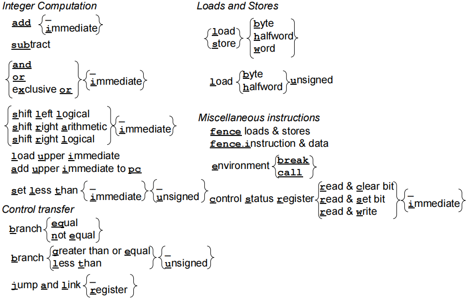
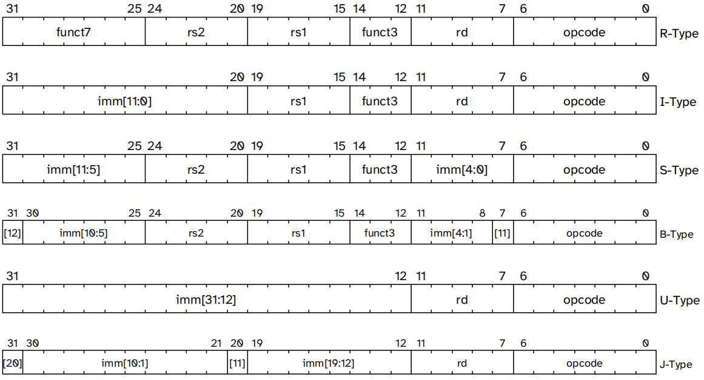
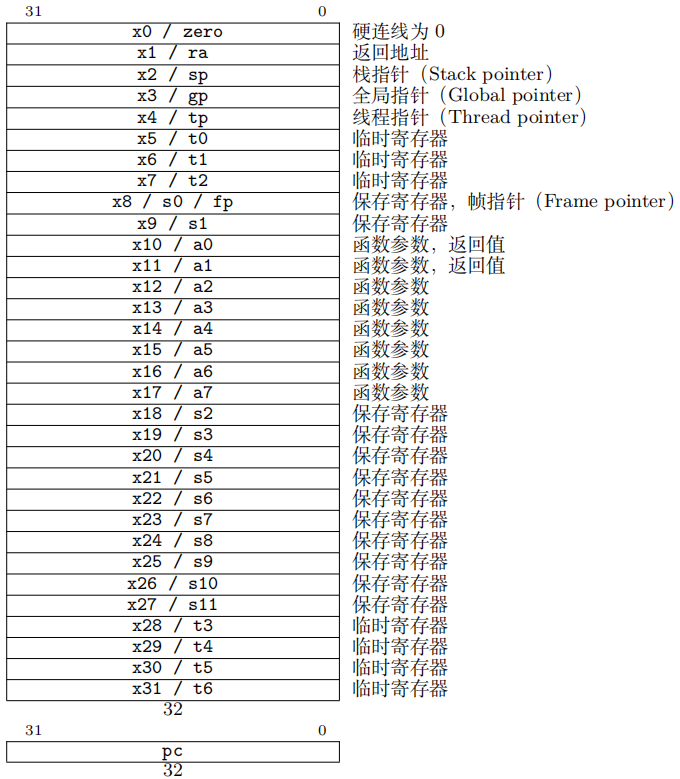
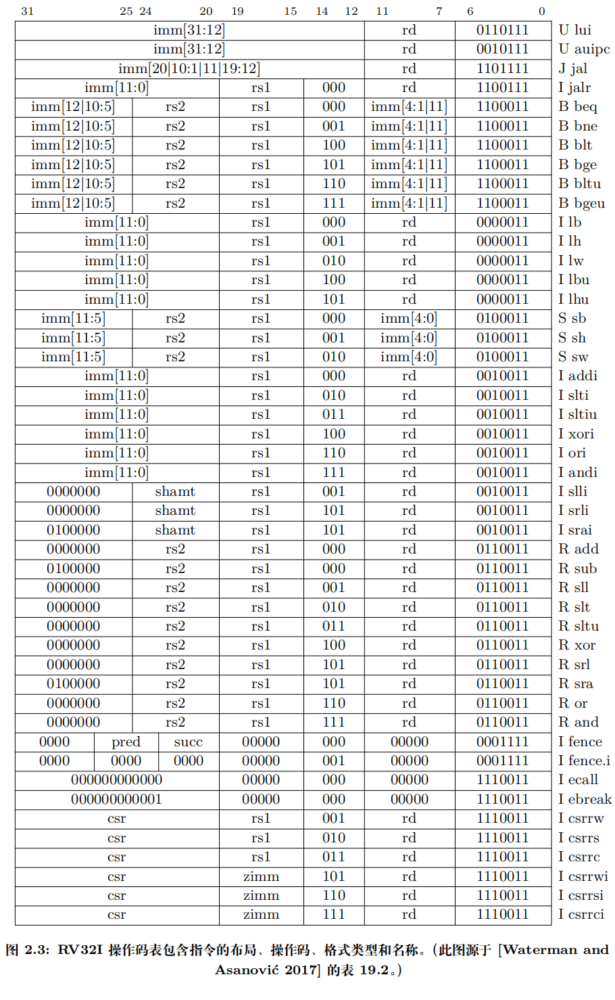

# RISC-V

> [!note]
>
> 学习与参考材料与网站：
>
> - [RISC-V 官方手册：The RISC-V Instruction Set Manual](https://docs.riscv.org/reference/isa/)
>- RISC-V 开放架构设计之道 (大卫·帕特森 安德鲁·沃特曼)
> - [中科大计算机系统结构系列实验课程网站：USTC SOC Homepage](https://soc.ustc.edu.cn/)
> - [极简 RV32I 指令集单核 MCU：XuanTongYao/XT_RISC-V_Soc](https://github.com/XuanTongYao/XT_RISC-V_Soc)

## 处理器内核基本组件

### 内核基本功能

**取指 → 译码 → 执行**

1. 从指令存储器取出指令

2. 对指令进行译码，从中提取出必要的东西

3. 确认指令无误后执行指令

### 机器语言与指令



从左到右连接带下划线的字母即可组成 RV32I 指令。大括号 `{ }` 中每一项都是该指令的不同变体，其中下划线 ` _ ` 意味着不含大括号中任意一项亦可组成一条指令。例如，靠近左上角的记号表示以下 6 条指令：`and`、`or`、`xor`、`andi`、`ori`、`xori`。

共 6 种基本指令格式，分别是：用于 **寄存器间操作**（register）的 **R 型**，用于 **短立即数和取数**（load）操作的 **I 型**，用于 **存数**（store）操作的 **S 型**，用于 **条件分支**（branch）的 **B 型**，用于 **长立即数** 的 **U 型** 和用于 **无条件跳转** 的 **J 型**。

> [!tip]
>
> **功能相近** 的指令，**操作码相同**，方便 **译码**。



一条 RISC-V 指令（**32 位宽-4 字节**）的核心内容就是： **操作码 + 寄存器字段 + 功能码 + 立即数（可选）**。

| 字段名称                   | 作用说明                                               |
| -------------------------- | ------------------------------------------------------ |
| 操作码（opcode）           | 指令类型标识，**决定属于哪类指令**（算术/访存/跳转等） |
| 寄存器字段（rs1, rs2, rd） | 指定 **源寄存器（地址）** 和 **目标寄存器**            |
| 功能码（funct3, funct7）   | 进一步区分同类指令的 **具体功能**（如加/减/与/或）     |
| 立即数（imm）              | 指令中直接 **嵌入的常量**，用于 **运算或地址偏移**     |

1. **操作码（opcode）**
   - 位于最低的 7 位（bits [6:0]）。
   - 决定指令属于哪一类（R/I/S/B/U/J）。
2. **寄存器字段**
   - **rd**：目标寄存器（bits [11:7]）。
   - **rs1**：源寄存器 1（bits [19:15]）。
   - **rs2**：源寄存器 2（bits [24:20]）。
   - 并非所有类型都有这三个字段，例如 U/J 型只有 rd。
3. **功能码（funct3, funct7）**
   - **funct3**：3 位，用于进一步区分同类指令（bits [14:12]）。
   - **funct7**：7 位，用于区分算术/逻辑操作的具体变体（bits [31:25]）。
   - 主要出现在 R 型指令中。
4. **立即数（imm）**
   - 用于表示常数或偏移量。
   - 在不同类型中分布方式不同：
     - I 型：12 位立即数（bits [31:20]）。
     - S 型：分散在 [31:25] 和 [11:7]。
     - B 型：分散在 [31], [30:25], [11:8], [7]。
     - U 型：高 20 位立即数（bits [31:12]）。
     - J 型：分散在 [31], [30:21], [20], [19:12]。

| 指令类型 | 主要字段                             | 立即数分布                              |
| -------- | ------------------------------------ | --------------------------------------- |
| R-Type   | opcode, rd, rs1, rs2, funct3, funct7 | 无立即数                                |
| I-Type   | opcode, rd, rs1, funct3              | imm [11:0] (31–20)                       |
| S-Type   | opcode, rs1, rs2, funct3             | imm [11:5] (31–25), imm [4:0] (11–7)      |
| B-Type   | opcode, rs1, rs2, funct3             | imm [12], imm [10:5], imm [4:1], imm [11]   |
| U-Type   | opcode, rd                           | imm [31:12]                              |
| J-Type   | opcode, rd                           | imm [20], imm [10:1], imm [11], imm [19:12] |

> [!note]
>
> #### 各类指令概述
>
> **==整数计算==**：简单算术指令（`add`、`sub`）、逻辑运算指令（`and`、`or`、`xor`）和移位指令（`sll`、`srl`、`sra`），其功能与其他 ISA 类似。它们 **从源寄存器中读取两个 32 位值，并将 32 位结果写入目的寄存器**。 RV32I 还提供这些指令的 **立即数版本**。比较操作的结果是一个布尔值，RV32I 提供一条 **小于则置位**（*set less than*）指令。若第一个操作数小于第二个操作数，则将目的寄存器设为 1，否则设为 0。该指令包括有 **符号版本（`slt`）和无符号版本（`sltu`）**，分别用于有符号和无符号整数的比较，同时也有相应的 **立即数版本**（`slti`、`sltiu`）。
>
> 剩下的两条整数计算指令有助于**汇编和链接**。装入高位立即数（`lui`）**将 20 位立即数装入寄存器的高 20 位，可与后续一条 RV32I 立即数指令共同构造出 32 位常数**。*PC* 加高位立即数（`auipc`）使得仅需 **2 条指令即可实现任意偏移的 PC 相对控制流转移和数据访问**。具体地，将 `auipc` 与 `jalr` 中 12 位立即数组合，可将控制流转移到任意 32 位 PC 相对地址；而 `auipc` 加上**访存指令**的 12 位立即数偏移量，可访问任意 32 位 PC 相对地址的数据。
>
> > [!tip]
> >
> > RV32I 的立即数总是进行 **符号扩展**，因此它们 **也能表示负数**，故 RV32I 中 **无需包含立即数版本** 的 `sub` 指令。
>
> **==取数与存数==**：除了 32 位字的取数和存数指令（`lw`、`sw`）外，RV32I 还支持有符号和无符号的字节和半字取数指令（`lb`、`lbu`、`lh`、`lhu`），以及字节和半字的存数指令（`sb`、`sh`）。访存指令唯一支持的寻址模式是**将 12 位立即数符号扩展后与寄存器相加**，这在 x86-32 中称为 **偏移寻址**。
>
> - 对于有符号的字节和半字数据，指令先将其符号扩展为 32 位，再写入目的寄存器，使后续整数计算指令可正确处理 32 位数据。
> - 而对于常用于文本和无符号整数的无符号字节和半字数据，指令先将其零扩展为 32 位，再写入目的寄存器。
>
> **==条件分支==**：RV32I 可比较两个寄存器，并根据比较结果是否相等（`beq`）、不相等（`bne`）、大于等于（`bge`）或小于（`blt`），决定是否跳转。后两种为有符号比较，RV32I 也提供相应的无符号版本：`bgeu` 和 `bltu`。剩余两种比较操作（大于和小于等于）可简单通过交换操作数实现，如 $y > x$ 等价于 $x < y$，$y ≤ x$ 等价于 $x ≥ y$。
>
> 由于 RISC-V 指令长度必须是两字节的倍数（可选的两字节指令参见第 7 章），**分支指令的寻址方式将 12 位立即数乘以 2，符号扩展后与 PC 相加**。
>
> **==无条件跳转==**：跳转并链接（`jal`）指令具有两种功能。为支持过程调用，它将下一条指令的地址（PC+4）保存到目的寄存器中，通常保存到 **返回地址寄存器 ra**（见通用寄存器组）。为支持无条件跳转，可将目的寄存器从 **ra** 换成 **零寄存器（x0）**，因为写入 x0 不改变其值。和分支指令类似，**`jal` 将 20 位立即数乘以 2，符号扩展后与 PC 相加，从而得到跳转目标地址。**

### 内核的基本工作过程

> [!caution]
>
> 每种硬件运算电路只有唯一一份。

### 指令译码模块

### 指令执行模块

### 通用寄存器组

> [!note]
>
> RISC-V 没有专用的栈指令，通过将一个通用寄存器作为 **栈指针**，即可使标准寻址模式具备 **压栈（push）** 和 **弹栈（pop）** 指令的大部分优点，而无需增加 ISA 复杂性。
>
> - 与 MIPS-32 不同，RISC-V 不支持 **延迟取数**（*delayed load*）。
>
> - 不像 ARM-32 和 x86-32 那样 **使用条件码实现条件分支**。条件码的存在使大多数指令必须隐式设置若干额外状态，使乱序执行的依赖关系判断变得更复杂。
>
> - RISC-V 不支持 x86-32 的循环指令，包括 `loop`、`loope`、`loopz`、`loopne`、`loopnz`。

> [!tip]
>
> **获取** **PC**：RV32I 可通过立即数字段为 0 的 `auipc` 获取当前 PC。
>
> **软件检查溢出**：大部分（但并非所有）程序都忽略整数算术溢出，故 RISC-V 让软件检查溢出。



## PC 寄存器

PC（Program Counter）存储的是当前指令的地址。执行完一条指令后，PC 会自动指向下一条指令。

> [!tip]
>
> 在 RISC-V 基本指令集（RV32I）里，**每条指令固定长度为 32 位（即 4 字节）**。
>
> - 因为每条指令占 4 字节，所以 PC 必须加 4，才能跳到下一条指令的起始地址。
>
> - 最小寻址单位：1 字节 = 8 比特。

## RISC-V 指令

> [!note]
>
> **RV32I 基本特性**：
>
> - **32 位字节寻址** 的地址空间
>
> - 所有指令均为 **32 位**
>
> - **31 个 32 位寄存器**，**0 号** 寄存器硬连线为 **零**
>
> - 在 **寄存器间进行所有操作**，**没有寄存器和内存间** 的操作
>
> - 存/取字指令，以及 **有符号和无符号** 的 **字节和半字** 存/取指令
>
> - 所有算术、逻辑和移位指令都有相应的 **立即数版本**
>
>   > [!tip]
>   >
>   > 1. **寄存器版本**：操作数来自寄存器，例 `add x1, x2, x3` → 把寄存器 x2 和 x3 相加，结果存入 x1。
>   > 2. **立即数版本**：其中一个操作数是嵌入在指令里的常量（立即数），例 `addi x1, x2, 10` → 把寄存器 x2 的值加上常数 10，结果存入 x1。
>   >
>   > - **算术指令**：`add` ↔ `addi`
>   > - **逻辑指令**：`and` ↔ `andi`，`or` ↔ `ori`，`xor` ↔ `xori`
>   > - **移位指令**：`sll` ↔ `slli`，`srl` ↔ `srli`，`sra` ↔ `srai`
>
> - 立即数总是 **符号扩展**
>
> - 仅提供唯一一种 **数据寻址模式（寄存器 + 立即数）** 和 **PC 相对分支跳转**
>
> - **无乘法和除法** 指令
>
> - 一条 **将大立即数装入寄存器高位** 的指令，故 **构造 32 位常数只需两条指令**



> [!warning]
>
> 特别的，B 型与 J 型立即数是 **非连续分布** 的，需要重新组合
>
> ```systemverilog
> wire [31:0] imm_b = {{19{inst[31]}}, inst[31], inst[7], inst[30:25], inst[11:8], 1'b0};	// imm[12|10:5](31~25) + imm[4:1|11](11~7)
> wire [31:0] imm_j = {{11{inst[31]}}, inst[31], inst[19:12], inst[20], inst[30:21], 1'b0};	// imm[20|10:1|11|19:12](31~12)
> ```

> [!caution]
>
> RISC-V 通过 **内存映射 I/O 访问设备**，而不像 x86-32 那样使用 in、ins、insb、insw 和 out、outs、outsb 等专用的 I/O 指令。此外，RISC-V 可 **通过字节访存指令处理字符串**，而无需像 x86-32 那样添加 rep、movs、coms、scas、lods 等 16 条专用的字符串处理指令。

> [!tip]
>
> **通过内存映射 I/O 访问设备**：把外设的寄存器地址空间直接映射到处理器的内存地址空间里。这样，CPU 就可以像访问普通内存一样，用 `lw`、`sw` 等指令读写外设寄存器，从而完成设备控制和数据交互。

**所有位全为 0 的指令** 是一条 **非法** 的 RV32I 指令。 因此，错误地跳转到被清零的内存区域将立即触发自陷，从而帮助调试。

**所有位全为 1 的指令** 也是 **非法** 指令，这能在发生其他常见错误时触发自陷，如访问未编程的非易失性内存设备、断开连接的内存总线或损坏的内存芯片。


RV32I 程序和数据的内存分配。图中顶部为高地址，底部为低地址。在 RISC-V 软件约定中，栈指针（sp）从 $bfff fff0_{hex}$ 开始向下方的静态数据区生长；代码从 $0001 0000_{hex}$ 开始，包含静态链接库；代码区上方是静态数据区，本例假设从 $1000 0000_{hex}$​ 开始；静态数据区上方是动态数据区，在 C 语言中通过 `malloc()` 分配，称为堆（heap），它向上方的栈区生长，还包含动态链接库。

> [!tip]
>
> RISC-V 采用小端字节序，因为它在商业上占主导地位。

> [!note]
>
> **提交点**：流水线中指令执行的最后一个阶段，指令的结果在此被正式写入体系结构状态（如 **寄存器或内存**），从而对外部可见。（指令在流水线中“**真正生效**”的时刻，它确保处理器内部的复杂优化不会破坏程序的正确性。）
>
> - 在提交点之前，指令的 **执行** 结果只是暂存在内部缓冲或寄存器中，**不会影响程序的可见状态**。
>
> - 一旦到达提交点，**结果就不可逆地生效**，成为程序的“真实历史”。
>
> > [!tip]
> >
> > 所以不能在译码模块提前访问内容