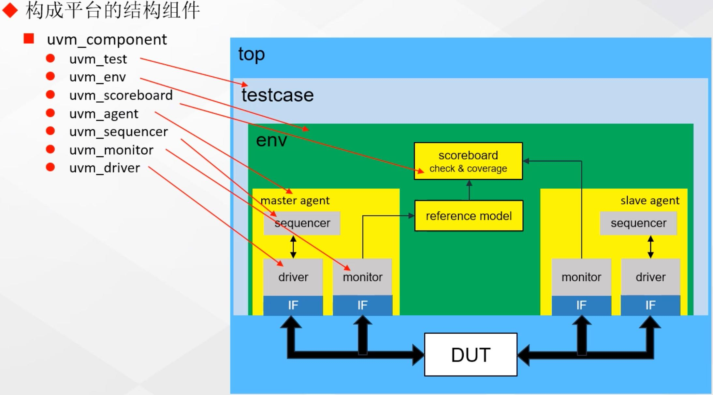
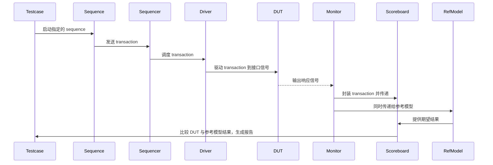
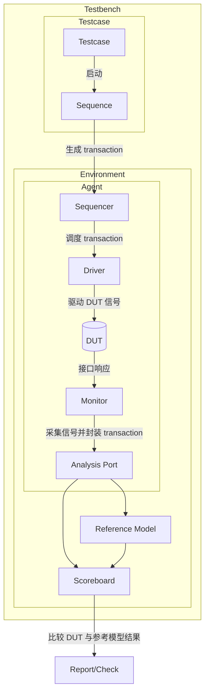
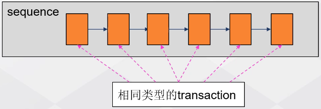

# UVM overview

> RTL 功能验证

## UVM 基本概念

### 验证计划

- 验证目标：功能覆盖率，结构覆盖率（100%）
- 验证层次：模块级/芯片级/系统级验证
- 验证策略：
  - 验证形式：白盒/灰盒/黑盒
  - 参考模型：C/C++/matlab
  - 验证平台：基于 Verilog 的验证平台/基于 systemverilog、==UVM 的验证平台==

### UVM 的特点与内容

> Universal Verification Methodology，通用验证方法学

- 一个标准的验证平台的模板
- 一套完备的源码库
- 支持受约束随机激励的产生
- 支持覆盖率驱动的验证模式
- 代码可重用，平台可移植

> [!tip]
>
> UVM 的基础是一个 **源码库**，这个源码库为用户 **提供了各种资源**
>
> 思想是 **高度可重用性** 和 **结构统一性**。不同项目的 UVM 验证平台在框架上大同小异，主要通过组件、激励、通信机制和宏来实现模块化、可扩展的验证环境

- **编程指导**

  - **理念**：
    - 在同一平台上支持多种验证方式
    - 以覆盖率驱动的验证流程

  - **功能**：
    - UVM factory（工厂机制）
    - UVM TLM（事务级建模）
    - 信息服务（日志、报告等）
    - 配置机制（Configuration）
    - Phase（阶段机制）
    - RAL（寄存器抽象层）

- **验证组件**，常见组件包括：
  - `uvm_component`
  - `uvm_driver`
  - `uvm_monitor`
  - `uvm_sequencer`
  - `uvm_agent`
  - `uvm_env`
  - `uvm_test`

- **验证激励/事务**，用于 **生成和组织测试激励**：
  - `uvm_sequence`
  - `uvm_sequence_item`

- **通信机制**，**组件之间的交互接口**：
  - `uvm_*_port`
  - `uvm_*_export`
  - `uvm_*_import`

- **宏**，常用宏定义：
  - ``uvm_info()`
  - ``uvm_component_utils()`
  - ``uvm_field_*()`

### 典型 UVM 平台结构

## 简单 UVM

> [!caution]
>
> 在一个测试项目中，测试案例 **testcase 有很多**，但环境 **env 只能有一个**
>
> - env 在确定后不可修改，否则之前通过的测试案例需要重新执行
>
> uvm 库中没有 `reference model` 这一基类，但需要从 `uvm_component` 中扩展

### transaction

- 验证平台中用来**描述一次“操作”或“数据包”的对象**。

- 定义了需要驱动到 DUT 的字段（如地址、数据、控制位），并通过随机约束生成多样化的测试场景。

- 是 sequencer、driver、monitor 之间传递信息的统一格式。

- 定义 transaction
  - 需要从 `uvm_sequence_item` 扩展
  - 为了使 tranasction 能随机化，需要为每个成员指定为 `rand`

### sequence

当 `transaction` 类创建好之后，需要通过某种方式来**产生对象**，这需要 sequence 的帮助：

- sequence 需要从 `uvm_sequence` 扩展
- sequence 控制并产生一系列 transaction
- 一种 sequence 一般只用来产生一种类型的 transaction
- sequence 中最重要的部分是 `body()` 任务

### sequencer

从 UVM 的平台结构上看，sequence_item 和 sequence 并不属于结构的的一部分。它们其实是流动在这些组件中的数据流。uvm_sequencer 的作用：

- 启动 sequence
- 将 sequence 产生的 item 发送到 UVM 的组件中（具体来说就是 driver）

sequencer 的功能大多数已经在 UVM 源码中实现，所以创建 sequencer 的工作是比较简单的。

### `phase 机制`

UVM 平台中的所有组件具有 phase 的概念，它们由按照一定顺序执行的任务或函数组成。

```mermaid
flowchart LR
    build_phase[build_phase] --> connect_phase[connect_phase]
    connect_phase --> end_of_elaboration_phase[end_of_elaboration_phase]
    end_of_elaboration_phase --> start_of_simulation_phase[start_of_simulation_phase]
    start_of_simulation_phase --> run_phase[run_phase]
    run_phase --> extract_phase[extract_phase]
    extract_phase --> check_phase[check_phase]
    check_phase --> report_phase[report_phase]
```

这些 **`*_phase`** 是组件中的任务或者函数，需要根据具体情况对它们进行重载。

- 存在于每个组件当中，仅仅是 task 或者 function
- 需要根据具体情况进行 **重载**，实现我们想要的功能
- 这些 phase 是根据 UVM 已经固定好的顺序自动执行，**无需手动调用**

### driver

- 从 sequencer 获取 transaction
- 将 transaction 分解为 DUT 可以接受的 PIN 级信号
- 将转化之后的 PIN 级信号按照 DUT 总线协议的方式驱动给 DUT

### monitor

- 监视接口信号，捕获接口上活动的事务并且将 pin 级的信号事务转化为事务级的数据包，之后将这些数据包发送到 analysis 组件（包括 reference model、scoreboared 等）进行分析和产生报告

- 通过 TLM-port 与其他组件相连

### agent

- agent 封装了 ` sequencer`、`driver` 和 `monitor`
- agent 中需要实例化 sequencer、driver 和 monitor 对象并将 sequencer 和 driver 连接起来
- agent 有 active 和 passive 之分。passive 模式的 agent 只包含 monitor 而没有 sequencer 和 drvier

### env

- env 中封装了一个或多个 `agent`、`reference model`、`scoreboard` 以及其他组件
- env 需要实例化 agents、reference model、scoreboard 以及其他组件并将这些组件相互连接

### testcase

- testcase 实例化和配置 `env`
- 配置需要启动的 sequence

