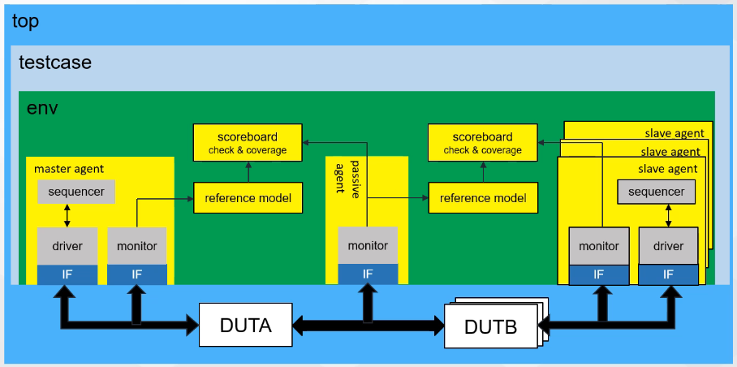
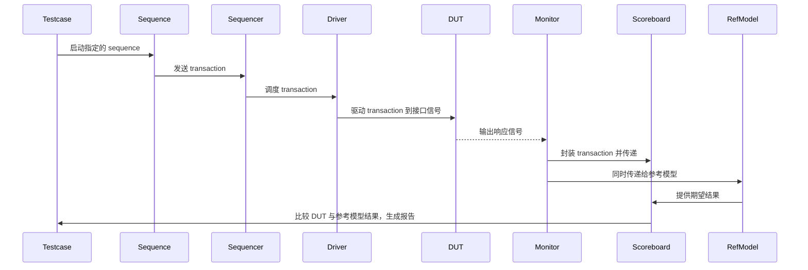
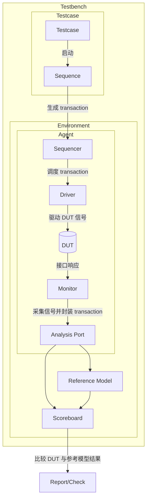
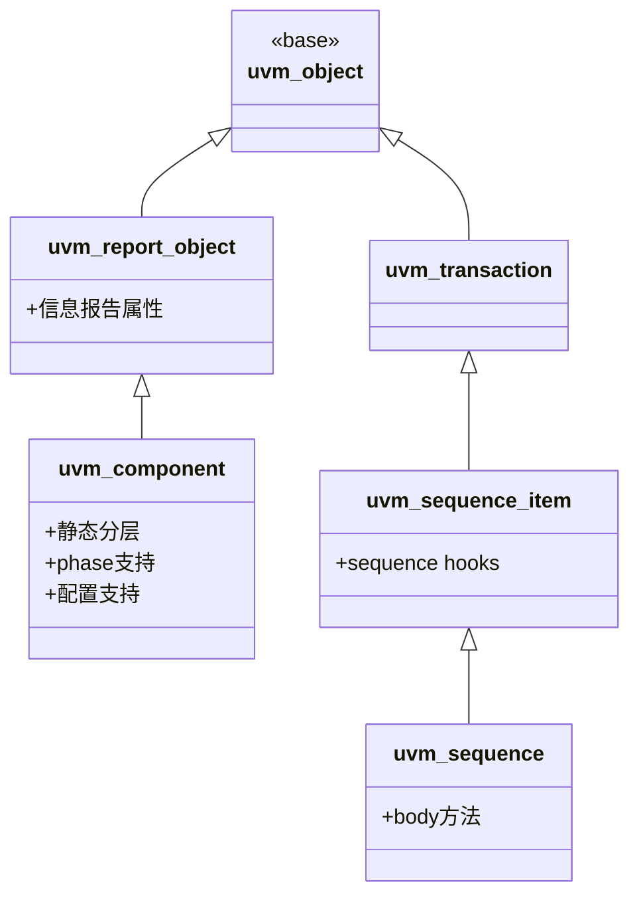
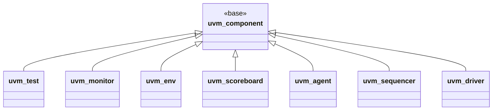
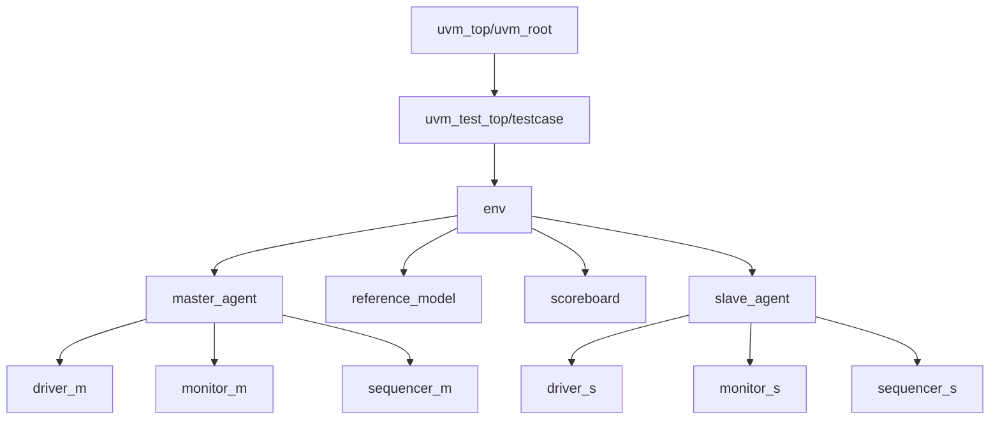
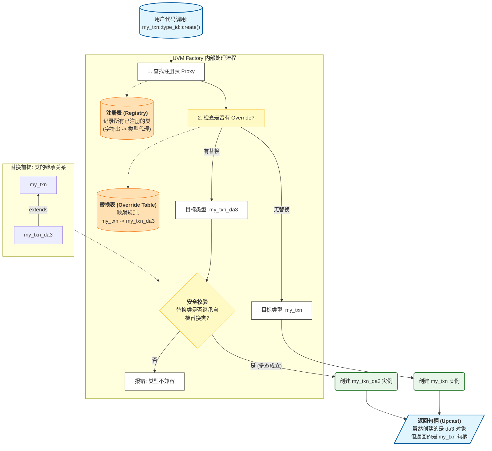

# UVM overview1

> RTL 功能验证

## UVM 基本概念

### 验证计划

- 验证目标：功能覆盖率，结构覆盖率（100%）
- 验证层次：模块级/芯片级/系统级验证
- 验证策略：
  - 验证形式：白盒/灰盒/黑盒
  - 参考模型：C/C++/matlab
  - 验证平台：基于 Verilog 的验证平台/基于 systemverilog、**UVM 的验证平台**

### UVM 的特点与内容

> Universal Verification Methodology，通用验证方法学

- 一个标准的验证平台的模板
- 一套完备的源码库
- 支持受约束随机激励的产生
- 支持覆盖率驱动的验证模式
- 代码可重用，平台可移植

> [!tip]
>
> UVM 的基础是一个 **源码库**，这个源码库为用户 **提供了各种资源**
>
> 思想是 **高度可重用性** 和 **结构统一性**。不同项目的 UVM 验证平台在框架上大同小异，主要通过组件、激励、通信机制和宏来实现模块化、可扩展的验证环境

- **编程指导**

  - **理念**：
    - 在同一平台上支持多种验证方式
    - 以覆盖率驱动的验证流程

  - **功能**：
    - UVM factory（工厂机制）
    - UVM TLM（事务级建模）
    - 信息服务（日志、报告等）
    - 配置机制（Configuration）
    - Phase（阶段机制）
    - RAL（寄存器抽象层）

- **验证组件**，常见组件包括：
  - `uvm_component`
  - `uvm_driver`
  - `uvm_monitor`
  - `uvm_sequencer`
  - `uvm_agent`
  - `uvm_env`
  - `uvm_test`

- **验证激励/事务**，用于 **生成和组织测试激励**：
  - `uvm_sequence`
  - `uvm_sequence_item`

- **通信机制**，**组件之间的交互接口**：
  - `uvm_*_port`
  - `uvm_*_export`
  - `uvm_*_import`

- **宏**，常用宏定义：
  - ``uvm_info()`
  - ``uvm_component_utils()`
  - ``uvm_field_*()`

### 典型 UVM 平台结构




## 简单 UVM

> [!caution]
>
> 在一个测试项目中，测试案例 **testcase 有很多**，但环境 **env 只能有一个**
>
> - env 在确定后不可修改，否则之前通过的测试案例需要重新执行
>
> uvm 库中没有 `reference model` 这一基类，但需要从 `uvm_component` 中扩展






### transaction

- 验证平台中用来 **描述一次“操作”或“数据包”的对象**。

- 定义了需要驱动到 DUT 的字段（如地址、数据、控制位），并通过随机约束生成多样化的测试场景。

- 是 sequencer、driver、monitor 之间传递信息的统一格式。

- 定义 transaction
  - 需要从 `uvm_sequence_item` 扩展
  - 为了使 tranasction 能随机化，需要为每个成员指定为 `rand`

### sequence

当 `transaction` 类创建好之后，需要通过某种方式来 **产生对象**，这需要 sequence 的帮助：

- sequence 需要从 `uvm_sequence` 扩展
- sequence 控制并产生一系列 transaction
- 一种 sequence 一般只用来产生一种类型的 transaction
- sequence 中最重要的部分是 `body()` 任务


### sequencer

从 UVM 的平台结构上看，sequence_item 和 sequence 并不属于结构的的一部分。它们其实是流动在这些组件中的数据流。uvm_sequencer 的作用：

- 启动 sequence
- 将 sequence 产生的 item 发送到 UVM 的组件中（具体来说就是 driver）

sequencer 的功能大多数已经在 UVM 源码中实现，所以创建 sequencer 的工作是比较简单的。

### `phase 机制`

UVM 平台中的所有组件具有 phase 的概念，它们由按照一定顺序执行的任务或函数组成。

```mermaid
flowchart LR
    build_phase[build_phase] --> connect_phase[connect_phase]
    connect_phase --> end_of_elaboration_phase[end_of_elaboration_phase]
    end_of_elaboration_phase --> start_of_simulation_phase[start_of_simulation_phase]
    start_of_simulation_phase --> run_phase[run_phase]
    run_phase --> extract_phase[extract_phase]
    extract_phase --> check_phase[check_phase]
    check_phase --> report_phase[report_phase]
```



这些 **`*_phase`** 是组件中的任务或者函数，需要根据具体情况对它们进行重载。

- 存在于每个组件当中，仅仅是 task 或者 function
- 需要根据具体情况进行 **重载**，实现我们想要的功能
- 这些 phase 是根据 UVM 已经固定好的顺序自动执行，**无需手动调用**

### driver

- 从 sequencer 获取 transaction
- 将 transaction 分解为 DUT 可以接受的 PIN 级信号
- 将转化之后的 PIN 级信号按照 DUT 总线协议的方式驱动给 DUT

### monitor

- 监视接口信号，捕获接口上活动的事务并且将 pin 级的信号事务转化为事务级的数据包，之后将这些数据包发送到 analysis 组件（包括 reference model、scoreboared 等）进行分析和产生报告

- 通过 TLM-port 与其他组件相连

### agent

- agent 封装了 ` sequencer`、`driver` 和 `monitor`
- agent 中需要实例化 sequencer、driver 和 monitor 对象并将 sequencer 和 driver 连接起来
- agent 有 active 和 passive 之分。passive 模式的 agent 只包含 monitor 而没有 sequencer 和 drvier

### env

- env 中封装了一个或多个 `agent`、`reference model`、`scoreboard` 以及其他组件
- env 需要实例化 agents、reference model、scoreboard 以及其他组件并将这些组件相互连接

### testcase

- testcase 实例化和配置 `env`
- 配置需要启动的 sequence

## UVM 组件

### UVM 库

- **TLM**：提供通信标准
  - 作为组件之间通信的标准接口。
  - 提供统一的传输机制，保证不同模块之间的交互一致。
- **Structural Elements**：提供通用类支持
  - 包含各种通用类，例如组件、信息系统、仿真阶段等。
  - 这些结构元素为不同方法学提供基础支持。
- **Methodology**：赋予用户灵活性和可重用性
  - 是用户进行平台重用的主要接口。
  - 用户可以通过这些接口在不修改测试平台代码的情况下：
    - 更改平台配置
    - 替换平台组件
    - 使用不同激励源
    - 改变仿真行为

> [!tip]
>
> - **VCS 内置了 UVM 库**
>
>   当使用 VCS 编译命令时，通常会加上一个编译选项，比如：
>
>
> ```Bash
> -ntb_opts uvm
> # 或者指定具体版本
> -ntb_opts uvm-1.2
> ```
>
> - **`uvm_pkg.sv` 的作用**
>
>   在 SystemVerilog 中，UVM 被组织成一个 **Package**。`uvm_pkg.sv` 里面写满了 `include` 语句，把 `base/`, `comps/`, `seq/`, `tlm/` 等文件夹里的所有 `.sv` 文件都包含进来了。在写代码时，只需要做两件事：
>
>   - **代码中：** `import uvm_pkg::*;`
>   - **编译时：** 让编译器找到 `uvm_pkg.sv`（通过 `-ntb_opts uvm` 实现）。

UVM package 包含了三个主要的类

- **uvm_component**：是用来构建 UVM **testbench 层次结构** 最基本的类
- **uvm_object**：作为 UVM 的一种数据结构，可作为 **配置对象** 来配置测试平台
- **uvm_transaction**：用来 **产生激励和收集响应**

### uvm_component

从 **uvm_object** 分出 **uvm_component** 与 **uvm_sequence** 2 个分支





- **平台组件** 扩展于 uvm_component
- 组件中包含了 **task 和 function phases(自动执行机制)**
- **组件** 是 UVM 结构树上的节点

### UVM 结构树

> [!note]
>
> 在 UVM 中，**组件的层次结构由 parent-child 关系决定**。

使用 `this` 作为 parent 参数，可以让 `sequencer`、`driver`、`monitor` 都挂在 `master_agent` 之下，**形成清晰的层次树**。这种结构保证了 testbench 的组织性和可扩展性。

```systemverilog
class master_agent extends uvm_agent;
	// ...
  virtual function void build_phase(uvm_phase phase);
    super.build_phase(phase);
      // 通过factory机制，实例化3个组件
    if (is_active == UVM_ACTIVE) begin
      my_seqr = my_sequencer::type_id::create("my_seqr", this);
        my_driv = my_driver::type_id::create("my_driv", this);// <--
    end
    my_moni = my_monitor::type_id::create("my_moni", this);
  endfunction
	// ...
endclass

// ----------------------------------------

class my_driver extends uvm_driver #(my_transaction);
  	// ...
  function new(string name = "my_driver", uvm_component parent);// <--
    super.new(name, parent);
  endfunction
	// ...
endclass
```

使用 `this` 作为 parent 参数，让 `master_agent` 挂在 `env` 之下

```systemverilog
class my_environment extends uvm_env;
	// ...
  virtual function void build_phase(uvm_phase phase);
    super.build_phase(phase);
    my_agent = master_agent::type_id::create("my_agent", this);// <--
  endfunction
	// ...
endclass

// ----------------------------------------

class master_agent extends uvm_agent;
	// ...
  function new(string name = "master_agent", uvm_component parent);// <--
    super.new(name, parent);
  endfunction
	// ...
endclass
```

使用 `this` 作为 parent 参数，让 `env` 挂在 `testcase` 之下

```systemverilog
class my_test extends uvm_test;
	// ...
  virtual function void build_phase(uvm_phase phase);
    super.build_phase(phase);
    my_env = my_environment::type_id::create("my_env", this);
      uvm_config_db#(uvm_object_wrapper)::set(this, "*.my_seqr.run_phase", "default_sequence", my_sequence::get_type());
  endfunction
	// ...
endclass

// ----------------------------------------

class my_environment extends uvm_env;
	// ...
  function new(string name = "my_environment", uvm_component parent);
    super.new(name, parent);
  endfunction
	// ...
endclass
```

综上，有 UVM 的结构树（即 **逻辑层次结构**）

> [!tip]
>
> UVM 结构树的 **根节点** 不是 testcase，而是 **uvm_root**
>
> 当启动 UVM 平台时，UVM 会 **自动** 创建 **uvm_root 类** 的对象，并命名为 **uvm_top**



> [!caution]
>
> 当调用 `run_test()`（或者带参数 `run_test("my_test_name")`）来启动 UVM 验证平台时，UVM 核心会自动做两件事：
>
> - **根据工厂机制创建 Test 组件**：实例化指定的 Test 类（比如 `my_test`）
>
> - **给该实例一个固定的名字**：无论 Test 类叫什么名字（`my_test`, `base_test`, `sanity_test`），UVM 都会把这个最顶层的实例命名为 **"uvm_test_top"**

UVM 构建这种逻辑原因：

- 为 **config 机制** 提供搜索路径
- 为 **override 机制** 提供搜索路径
- 为 **phase 机制** 连锁自动执行提供链接

### UVM phase 机制

> [!caution]
>
> 在包含多个 Agent（甚至数十个 IP）的复杂 SoC 环境中，让所有的组件在这些细分的 12 个 Run-time Phases（如 `pre_reset` 到 `post_shutdown`）中保持严格的时间对齐几乎是不可能的，非常容易导致死锁或 Objection 丢失
>
> ==工业界通常 **只使用 `run_phase`**。所有的复位、配置、主测试逻辑，全部交给顶层的 Virtual Sequence 来按时间轴统一调度，环境组件本身不做过于细碎的时间划分。==

#### 基本概念

UVM 中为平台组件定义了一套 **phase 流程** 来控制仿真平台的执行过程

phase 是 `uvm_component` 的属性

**phase 的特性**：

- phase 按下图顺序执行
- 不同 phase 和 components 中相应的 task 或 function 相对应
  - build 对应 `function void build_phase()`
  - connent 对应 `function void connect_phase()`
  - ...
- 同一 phase 的 **自顶向下** 和 **自下向上** 执行
  - 自顶向下：从 UVM 结构树的根部开始，按层次顺序依次执行
  - 自下向上：从 UVM 结构树的枝叶开始，按层次顺序依次执行

```mermaid
graph TD
    %% --- 样式定义 ---
    %% 定义节点的样式：灰色填充，黑色边框
    classDef greyNode fill:#bfbfbf,stroke:#333,stroke-width:1px,color:black;
    
    %% 定义子图背景样式
    classDef orangeBg fill:#ff9933,stroke:none,color:black,font-size:16px,font-weight:bold;
    classDef yellowBg fill:#ffff00,stroke:none,color:black,font-size:16px,font-weight:bold;

    %% --- 第一部分：建立平台 ---
    subgraph Build["建立平台，为执行做准备"]
        direction TB
        build(build):::greyNode
        connect(connect):::greyNode
        end_elaboration(end_of_elaboration):::greyNode
        start_sim(start_of_simulation):::greyNode

        build --> connect
        connect --> end_elaboration
        end_elaboration --> start_sim
    end

    %% --- 第二部分：执行阶段 ---
    subgraph Execution["执行阶段"]
        direction TB
        
        %% 左侧并行的大 Run Phase
        %% 注意：Mermaid 很难画出跨越高低的大方块，这里用并行路径表示逻辑关系
        run(run):::greyNode
        
        %% 右侧的 12 个 Runtime Phases
        subgraph Runtime_Phases_Group [" "]
            direction TB
            style Runtime_Phases_Group fill:none,stroke:none
            
            pre_reset(pre_reset):::greyNode
            reset(reset):::greyNode
            post_reset(post_reset):::greyNode
            
            pre_config(pre_configure):::greyNode
            config(configure):::greyNode
            post_config(post_configure):::greyNode
            
            pre_main(pre_main):::greyNode
            main(main):::greyNode
            post_main(post_main):::greyNode
            
            pre_shutdown(pre_shutdown):::greyNode
            shutdown(shutdown):::greyNode
            post_shutdown(post_shutdown):::greyNode

            %% 连接 Runtime Phases
            pre_reset --> reset --> post_reset
            post_reset --> pre_config --> config --> post_config
            post_config --> pre_main --> main --> post_main
            post_main --> pre_shutdown --> shutdown --> post_shutdown
        end
    end

    %% --- 第三部分：清理阶段 ---
    subgraph Cleanup["清理阶段"]
        direction TB
        extract(extract):::greyNode
        check(check):::greyNode
        report(report):::greyNode
        final(final):::greyNode

        extract --> check
        check --> report
        report --> final
    end

    %% --- 跨子图的关键连接 ---
    %% 从 Start Simulation 分叉：一路去 Run，一路去 Pre_reset
    start_sim --> run
    start_sim --> pre_reset

    %% 汇聚到 Extract：Run 结束 和 Post_shutdown 结束
    run --> extract
    post_shutdown --> extract

    %% --- 应用背景颜色到子图 ---
    class Build,Cleanup orangeBg
    class Execution yellowBg
```



> [!caution]
> <span style="background-color: yellow">黄色的phase为task phase</span> ：**消耗** 仿真时间
>
> - 每个组件 **相同的 task phase** 是 **并行执行** 的
>
> - **run phase** 与 **12 个 run time phase**（pre_reset ... post_shutdown）**并行执行**（**run 与 run time** 以及 **所有组件的同名 phase**：同时开始，且要都结束，才能进入下一个 **phase**）
>   - 不是所有组件都有 12 个 run time phase，但仍然保持所有组件并行执行同一 phase
>
> - `run_phase` 是为了兼容 **OVM 旧习惯** 和处理“**后台任务**”，而 12 个 `run-time phases` 是为了解决“**多组件协同**”的难题（提供一套标准化的“**时间对齐**”机制）
>   - **后台灯光师、音响师** 与 **舞台演员顺序的序幕、正剧、谢幕** 的关系
>
> - **不要在同一个组件里既写 `run_phase` 又写 `main_phase`。** 虽然 UVM 允许，但它们是并行跑的，容易造成逻辑混乱
>
> <span style="background-color: orange">橙色的phase为function phase</span>：**不消耗** 仿真时间
>
> - 在<span style="background-color: orange">function phase</span>中，除了 **build phase** 是 **自顶向下** 执行，其余 phase 都是 **自底向上** 执行的

| Phase                     | 说明                           | 主要作用                           |
| ------------------------- | ------------------------------ | ---------------------------------- |
| **build_phase**           | **构建顶层测试平台的拓扑结构** | 创建并实例化各类组件               |
| **connect_phase**         | **连接测试平台的各个组件**     | 建立组件之间的连接关系             |
| end_of_elaboration_phase  | 打印平台相关信息（如结构）     | 检查并输出平台结构信息             |
| start_of_simulation_phase | 配置验证组件                   | 在仿真开始前完成配置               |
| **run_phase**             | **仿真的整个过程在此进行**     | 执行激励、采集、验证等主要仿真逻辑 |
| extract_phase             | 收集 DUT 的最终状态            | 提取仿真数据                       |
| check_phase               | 检查仿真结果                   | 验证 DUT 行为是否符合预期          |
| report_phase              | 对仿真结果进行分析和报告       | 输出结果报告，便于总结与复盘       |

**phase 的必要性**：从验证平台的构建，到配置，到连接，再到运行，最后停止， **需要有一定先后顺序**。

- **对象创建**

  - 使用 `new()` 创建组件，例如：

    ```systemverilog
    scoreboard = new();
    reference_model = new();
    agent = new();
    ```

  - 所有 **创建语句应集中** 放在 **build_phase()** 中执行

- **对象连接**

  - 在 **connect_phase()** 中完成 **所有组件的连接**，例如：

    ```systemverilog
    reference_model.connect(scoreboard);
    agent.monitor.connect(scoreboard);
    ```

  - 保证先创建对象，再进行连接

- **阶段顺序**

  - `build_phase()` 总是先于 `connect_phase()` 执行
  - 这样可以确保组件在连接之前已经被正确实例化

#### build phase 工作原理

每一个 component 中都有一个 `task` 或 `function` 与某个 phase 相对应，这些 `task` 或 `function` 会在该 phase 阶段被 **自动执行**

==如 **build phase**：`my_test.build_phase()` 创建 env --> `my_env.build_phase()` 创建 agent --> `master_agent.build_phase()` 创建 sequencer、driver、monitor==

> [!tip]
>
> **build phase** 是由 UVM 结构树 **自顶向下** 执行的 phase
>
> 同一层的组件（如 sequencer、driver、monitor）的执行顺序 **由 UVM 内部算法决定**

```systemverilog
// -------------------- 1 --------------------
class my_test extends uvm_test;
	// ...
  virtual function void build_phase(uvm_phase phase);
    super.build_phase(phase);
    my_env = my_environment::type_id::create("my_env", this);
      uvm_config_db#(uvm_object_wrapper)::set(this, "*.my_seqr.run_phase", "default_sequence", my_sequence::get_type());
  endfunction
	// ...
endclass

// -------------------- 2 --------------------
class my_environment extends uvm_env;
	// ...
  virtual function void build_phase(uvm_phase phase);
    super.build_phase(phase);
    my_agent = master_agent::type_id::create("my_agent", this);
  endfunction
    // ...
endclass

// -------------------- 3 --------------------
class master_agent extends uvm_agent;
    // ...
  virtual function void build_phase(uvm_phase phase);
    super.build_phase(phase);
    if (is_active == UVM_ACTIVE) begin
      my_seqr = my_sequencer::type_id::create("my_seqr", this);
      my_driv = my_driver::type_id::create("my_driv", this);
    end
    my_moni = my_monitor::type_id::create("my_moni", this);
  endfunction
    // ...
endclass
```

#### uvm_phase 的启动

```systemverilog
module
    // ...
    initial begin
        run_test();	// 启动UVM平台
    end
    // ...
endmodule
```

#### task phase 的 `objection`

UVM phase 具有 **objection 属性**

UVM phase 的 objection 属性有 **两个作用**：

- 控制 task phase 的运行与终止
- 同步各个 components 同名的 task phase

**使用方法**：

- 在 task phase 中成对调用 `raise_objection()` 和 `drop_objection()`

- task phase 中其他需要执行的语句放在这两个方法之间

==**注意事项**==：

- objection **对 task phase 才有意义**，控制 task phase 的运行和终止

```systemverilog
virtual task reset_phase(uvm_phase phase);	// 未使用objection
    #100;
    `uvm_info("DRV_RESET_PHASE", "NOW driver reset the DUT...", UVM_MEDIUM)
endtask
```

- 必须在执行 **消耗仿真时间的语句之前** raise objection，否则 **UVM 立即退出当前 phase，raise objection 失效**，且当前 task phase 后续代码不会被执行

```systemverilog
virtual task reset_phase(uvm_phase phase);	// 未在执行消耗仿真时间的语句之前raise objection
    #100;
    phase.raise_objection(this);
    `uvm_info("DRV_RESET_PHASE", "NOW driver reset the DUT...", UVM_MEDIUM)
    phase.drop_objection(this);
endtask
```

- 在 task phase **结束时 drop objection**，否则将永远不会执行下个 objection

```systemverilog
virtual task configure_phase(uvm_phase phase);	// 未使用drop objection
    phase.raise_objection(this);
    #100;
    `uvm_info("DRV_CONFIGURE_PHASE", "NOW driver configure the DUT...", UVM_MEDIUM)
endtask
```

- 在一个 component 中的某个 task phase 中 raise 和 drop objection 会 **影响到其他 component 中相同名字的 task phase**（有 objection 的同名 phase 执行完所有语句，**不管其他没有 objection 的同名 phase 是否执行完，都会结束当前 phase**）
- 建议在每个 task phase 中都 raise 和 drop objection 一次

```systemverilog
class my_driver extends uvm_driver #(my_transaction);
    // ...
    virtual task reset_phase(uvm_phase phase);	// 正确使用raise与drop objection
        phase.raise_objection(this);
        #100;
        `uvm_info("DRV_RESET_PHASE", "NOW driver reset the DUT...", UVM_MEDIUM)
        phase.drop_objection(this);
    endtask
    // ...
endclass

// ----------------------------------------

class my_monitor extends uvm_monitor;
    // ...
    virtual task reset_phase(uvm_phase phase);	// 未使用objection，但有可能正常执行（消耗的时间 < 有objection的同名phase时）
        #50;
        `uvm_info("MON_RESET_PHASE", "Monitor reset complete", UVM_MEDIUM)
    endtask
    // ...
endclass
```

**遵循原则**：

- 尽量在每个 task phase 使用 `raise_objection` 和 `drop_objection`
- 不要在拥有无限循环的 task phase 中使用 `raise_objection` 和 `drop_objection`，导致 objection 无法被释放
- 要成对使用 `raise_objection` 和 `drop_objection`
- 每个 task phase 中尽量只使用一次 objection，多次无意义
- `raise_objection` 需要在消耗仿真的时间语句之前使用

## UVM factory 机制

> factory 是用来实现 **代码复用** 机制中的一种

### 基本概念

- factory 机制可以使用户在不更改代码的情况下 **实现不同对象的替换**
- factory 是 UVM 的一种数据结构。它的作用范围是 **整个平台空间**，它有且 **仅有一个实例化对象**（即单实例类）。它是一个 **多态构造器**，可仅仅使用一个函数让用户实例化很多不同类型的对象
- 为了使用一个函数而可以返回多种对象，这些对象 **必须从一个基类扩展** 而来

### 实现原理



**运作步骤**：

- 将用户自定义的类向 factory 的注册表进行 **注册**

```systemverilog
`uvm_component_utils(my_monitor)	// 针对component进行注册
`uvm_object_utils(my_sequence)		// 针对object进行注册
```

- 要使用 `class_name:type_id:create()` 来代替 `new()` **实例化** 对象

```systemverilog
my_seqr = my_sequencer::type_id::create("my_seqr", this);
my_driv = my_driver::type_id::create("my_driv", this);
my_moni = my_monitor::type_id::create("my_moni", this);
```

- 根据具体要求向替换表 **添加替换条目**
- 在运行仿真时，UVM 会根据这两张表自动的实现 factory 机制

**注意事项**：

- 用户需要 **向注册表注册**
- 用户需要向 **替换表添加相应的替换信息**
- 被替换对象的类型是 **替换对象类型的基类**

### 使用方法

- 使用 **macro**（宏）向 factory 进行 **注册**：
  1. 使用``uvm_object_utils()`对**uvm_object 类**进行注册
  2. 使用``uvm_component_utils()`对**uvm_component 类**进行注册

- **实例化** 对象：

  使用 `classname:type_id::create();` 类实例化对象

### `uvm_component_utils 与 uvm_object_utils 的实际作用
- 为注册的类创建一个代理类：**type_id**
  - 这个类在注册类的内部，起到间接实例化对象的代理作用
  - 创建一个注册类的对象并将该对象向 factory 注册
  - type_id 内建 **create** 函数，该函数的任务是 **根据替换表创建指定类的对象**，以下是 `create()` 的执行内容
    - 调用 factory 的 `get` 函数获取 factory 对象
    - 以当前所要创建对象的类名为索引，在 factory 的替换列表中查询该类或者该对象是否被替换
    - 如果替换列表中 **没有相关条目**，则调用 **当前类的 `new()` 函数**；如果 **有相关条目**，则调用 **替换类的 `new()` 函数** 实例化对象。
- 创建一个 **静态** 函数 `get_type()`
- 创建一个函数 `get_object_type()`

> [!tip]
>
> 如果要 **注册一个参数化的类** 需要使用：
>
> ``uvm_object_param_utils()`对 object 进行注册
>
> ``uvm_component_param_utils()`对 component 进行注册

### override 机制

**factory 机制要与 override 机制结合使用**

**factory** 是基础，**override** 机制是为实现 **向 factory 的替换列表中添加替换项（==激励/组件==）** 而存在的

常用的 **override** 函数有两个。这两个函数存在于 component 中，并且一般需要 **在 `build_phase()` 中调用**，否则替换可能不会被执行

```systemverilog
set_type_override_by_type(original_class_name::get_type(), target_class_name::get_type());	// 全局替换

set_inst_override_by_type("original_inst_path", original_class_name:get_type(), target_class_name::get_type());	// 局部替换
```


**1.`set_type_override_by_type`**

- **作用**：在 **整个仿真平台** 范围内，**将某个类的所有实例替换为目标类**

  ```systemverilog
  set_type_override_by_type(original_class_name::get_type(), target_class_name::get_type());
  ```

- **全局生效**：使用 `get_type()`，将凡是通过 factory 创建 `original_class_name` 的地方，都会被替换为 `target_class_name`

- 常用于统一替换，比如将默认的 driver 替换为一个带有特殊功能的 driver

**2. `set_inst_override_by_type`**

- **作用**：只在 **指定的实例路径** 下，**将某个类替换为目标类**

  ```systemverilog
  set_inst_override_by_type("original_inst_path", original_class_name::get_type(), target_class_name::get_type());
  ```

- **局部生效**：仅对路径匹配的实例有效

- 常用于精细化控制，比如只替换某个特定 agent 下的 driver，而不影响其他 agent

  > [!tip]
  >
  > 如果只将 **env** 中 **master_agent** 中 `my_seqr` 这个特定的序列发生器（Sequencer）下面的所有的 `my_transaction` 类型替换成 `my_transaction_da3` 类型，则 **相对** **实例** 路径为：`"my_env.my_agent.my_seqr.*"` 
  >
  > > [!note]
  > >
  > > 通配符 `*` 是一个“泛指”，它不限定具体名字，而是允许匹配一组对象
  > >
  > > - 例如在文件系统里：`*.txt` 表示匹配所有以 `.txt` 结尾的文件
  > > - 在正则或路径匹配里：`*` 可以代表任意名称或层次

> [!caution]
>
> **当同时包含 type 与 inst 两个 override**，两者会都会生效，但是 **instance override 优先级更高**，它会覆盖掉同路径下的 type override。没有匹配 instance override 的地方，仍然会应用 type override。

> [!tip]
>
> override 的 **组件应用**
>
> 将路径为 `my_env.my_agent.my_driv` 的这一个特定组件实例，从 `my_driver` 替换为 `my_driver_count`。
>
> ```systemverilog
> set_inst_override_by_type("my_env.my_agent.my_driv", my_driver::get_type(), my_driver_count::get_type());
> ```

## UVM 事务级建模

### 基本概念

- **网络数据包**：TCP/IP、WIFI、BlueTooth、NFC
- **总线事务**：AMBA-AHB/APB/AXI、PCI/PCI-E、UART、I2C、USB
- **指令集**：X86、ARM、RISCV

**事务级建模**：一系列具有 **一定关系和功能的数据集合**

**事务** 是平台 **各个组件之间通信/信息交互** 的 **基本单元**

- `driver` 接收 `sequencer` 的数据，`sequencer` 接收 `driver` 的响应
- `monitor` 向 `reference model` 和 `scoreboard` 发送数据

### 事务定义

- `din[15:0]` 是输入端口，即源端口，每一位代表一个输入通道
- `dout[15:0]` 是输出端口，即目标端口，每一位代表一个输出通道
- 共有 16X16 个通道
- `din[n]`、`frame_n[n]` 和 `valid_n[n]` 是一组信号
- `dout[n]`、`frameo_n[n]` 和 `valido_n[n]` 是一组信号


1. **从 uvm_sequence_item 扩展事务**：用户定义的 transaction，必须扩展于 **uvm_sequence_item** 或从 **已有的事务类** 扩展

   ```systemverilog
   class my_transaction extends uvm_sequence_item;
   class my_transaction_da3 extends my_transaction;
   ```

2. **受约束的随机事务**：可以为 transaction 的成员指定 `rand` 属性，用于产生随机的激励

   > [!tip]
   >
   > - 可以调用 `rand_mode` 手动的关闭 `rand` 属性
   >
   >   比如在 `new()` 中使用 `this.sa.randmode(0)`：这样 sa 就不会产生一个随机的值
   >
   > - `rand` 属性不是必须的，在 transaction 中可能需要 **其他辅助变量**，这些变量就 **不用指定 rand 属性**

   为成员 **添加 constraint 约束**，使其在随机化时可以产生预期激励。注意在 **继承** 时 **新约束不能与原有约束发生冲突**

   ```systemverilog
   rand bit [3:0] sa;
   rand bit [3:0] da;
   rand reg [7:0] payload[$];
   
   constraint Limit {
       sa inside {[0 : 15]};
       da inside {[0 : 15]};
       payload.size() inside {[2 : 4]};
   }
   
   // ----------------------------------------
   
   constraint da3 {da == 3;}
   ```

### ~~UVM field automation 机制~~

> [!caution]
>
> `uvm_field_*` 这些宏在底层展开时会生成极其庞大且低效的代码，严重拖慢仿真速度（在大型项目中可能导致仿真变慢 30%~50%）
>
> 工业界 ==普遍要求禁止使用 `uvm_field_*` 宏==，而是要求工程师手动重载（Override）`do_copy()`、`do_compare()`、`do_print()` 等核心函数。这不仅执行效率高，而且比对逻辑更可控

UVM field automation 机制是为了方便用户 **对事务进行打印、复制、打包、解压、比较、记录** 等一系列功能而建立的一套 **服务机制**。

即，可使用 UVM **内建的函数** 对 **事务进行处理**

使用``uvm_field_*`系列宏，为成员添加**field automation**机制

```systemverilog
rand bit [3:0] sa;
rand bit [3:0] da;
rand reg [7:0] payload[$];  // 动态数组

`uvm_object_utils_begin(my_transaction)
    `uvm_field_int(sa, UVM_ALL_ON)				// 注册普通变量
    `uvm_field_int(da, UVM_ALL_ON)
    `uvm_field_queue_int(payload, UVM_ALL_ON)	// 注册动态数组
`uvm_object_utils_end
```

> [!tip]
>
> 对于 **component 类型** 需要将``uvm_field_*`系列宏包含在以下语句之间
>
> ```systemverilog
> `uvm_component_utils_begin(mytransaction)
> 	// ...
> `uvm_component_utils_end
> ```

若类成员用了 UVM 的 `field automation` 宏，则可使用以下方法（包括对象的复制、比较、打印、打包/解包、记录等操作）来简化 testbench 中对对象的管理

| 方法名      | 功能说明                                                     |
| ----------- | ------------------------------------------------------------ |
| **clone**   | **深度复制**：将目标对象完整复制，包括其成员对象（成员对象也会调用自身的 `clone` 方法）。 |
| **copy**    | **普通复制**：只复制成员句柄，不会递归调用子对象的 `copy` 方法。 |
| **print**   | **按指定格式打印对象成员**。                                 |
| **sprint**  | 与 `print` 类似，但 **返回的是字符串** 而不是直接打印。      |
| **compare** | **深度比较**：对比对象成员的值                               |
| **pack**    | **将对象成员打包成数据流**                                   |
| **unpack**  | **从数据流中解包，恢复对象成员**                             |
| **record**  | **对对象成员进行记录**                                       |

- 这些方法都是 **UVM 提供的自动化机制**，依赖于 `uvm_field_*` 宏来注册成员。
- **共同点**：**==只对使用了 field automation 注册的成员生效==**。

```systemverilog
`uvm_field_*(ARG, FLAG)	// 大部分的宏格式相同，除了enum

`uvm_field_int(ARG, FLAG)
`uvm_field_real(ARG, FLAG)
`uvm_field_enum(T, ARG, FLAG)
`uvm_field_object(ARG, FLAG)
`uvm_field_string(ARG, FLAG)
`uvm_field_array_enum(ARG, FLAG)
`uvm_field_array_int(ARG, FLAG)
`uvm_field_array_string(ARG, FLAG)
`uvm_field_queue_int(ARG, FLAG)
`uvm_field_queue_string(ARG, FLAG)
`uvm_field_aa_int_string(ARG, FLAG)
`uvm_field_aa_string_string(ARG, FLAG)

`uvm_field_enum(T, ARG, FLAG)	// T: enum名
```

- `*`：变量类型
- ARG：变量名
- FLAG：field automation 机制 **标识符**

**FLAG 的可选参数**

1. **默认参数**

   - **UVM_DEFAULT**：默认配置，部分操作开启，部分关闭。

   - **UVM_ALL_ON**：所有操作都开启。

2. **单独控制参数**（通过 **位掩码** 实现）
- **UVM_COPY / UVM_NOCOPY**：控制成员是否参与 `copy()` 操作。
  
- **UVM_COMPARE / UVM_NOCOMPARE**：控制成员是否参与 `compare()` 操作。
  
- **UVM_PRINT / UVM_NOPRINT**：控制成员是否参与 `print()` 操作。
  
- **UVM_RECORD / UVM_NORECORD**：控制成员是否参与 `record()` 操作。
  
- **UVM_PACK / UVM_NOPACK**：控制成员是否参与 `pack()` 操作。

通过 **位或运算符 `|`** 指定 FLAG 打印和记录时显示 **数据格式**

| FLAG             | 功能                           |
| ---------------- | ------------------------------ |
| **UVM_BIN**      | 使用二进制格式打印和记录       |
| **UVM_DEC**      | 使用十进制格式打印和记录       |
| **UVM_UNSIGNED** | 使用无符号十进制格式打印和记录 |
| **UVM_OCT**      | 使用八进制格式打印和记录       |
| **UVM_HEX**      | 使用十六进制格式打印和记录     |
| **UVM_STRING**   | 使用字符串格式打印和记录       |
| **UVM_TIME**     | 使用时间格式打印和记录         |
| **UVM_REAL**     | 使用实数格式打印和记录         |

```systemverilog
`uvm_field_int(field, UVM_ALL_ON | UVM_BIN)
// 该整型成员在所有操作开启的同时，打印时使用二进制格式。
```

