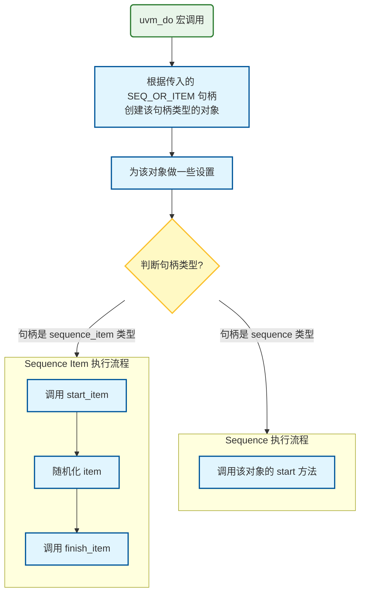

# UVM overview2

## UVM 信息服务机制

UVM 的信息机制在打印追踪信息具有比 `$display` 更好的优势：

- 可显示打印信息在测试平台中的位置
- 可以通过层次、可视化等级和时间等选项对打印信息进行过滤

如``uvm_info`可打印报告类型、代码位置、仿真时间、打印信息来源对象全路径、信息 ID、打印信息

```systemverilog
`uvm_info("SCB_WR", $sformatf("Memory Updated for Addr=%0h (Burst Len=%0d)", aw_tr.addr, aw_tr.len+1), UVM_MEDIUM)
// 3个参数: ID、打印信息、可视化等级
```

```log
UVM_INFO ./verify/axi_scoreboard.sv(165) @ 310000: uvm_test_top.env.scb [SCB_WR] Memory Updated for Addr=85ec (Burst Len=7)
```

| **安全等级**    | **默认执行的行为**          | **行为描述**                                   |
| --------------- | --------------------------- | ---------------------------------------------- |
| **UVM_FATAL**   | `UVM_DISPLAY` + `UVM_EXIT`  | 打印信息并 **直接退出** 仿真。                   |
| **UVM_ERROR**   | `UVM_DISPLAY` + `UVM_COUNT` | 打印信息并 **累加错误计数**（计数达标则退出）。 |
| **UVM_WARNING** | `UVM_DISPLAY`               | 仅在终端 **打印相关信息**。                     |
| **UVM_INFO**    | `UVM_DISPLAY`               | 仅在终端 **打印相关信息**。                     |

```systemverilog
`uvm_fatal("ID", "Message")
`uvm_error("ID", "Message")
`uvm_warning("ID", "Message")
`uvm_info("ID", "Message", "verbosity")
// verbosity: UVM_LOW、UVM_MEDIUM、UVM_HIGH、UVM_FULL、UVM_DEBUG
// 从左到右等级越高，越易被屏蔽
```

`uvm_fatal`、`uvm_error` 和 `uvm_warning` 的打印信息 **总是会显示**，无可视化等级

`uvm_info` 的打印信息可根据 **可视化等级** 的不同显示或者不显示，在运行仿真时，需要指定信息可视等级，在仿真命令行中加入：

```systemverilog
+UVM_VERBOSITY = UVM_*
```

如果没有指定，则默认值为 `UVM_MEDIUM`。可视等级 **大于** 它的信息将会 **被过滤** 而不被显示

可以通过在仿真命令中加入 `UVM_VERBOSITY` 进行 **全局设定**，也可以通过函数来为单个 **component** 或者 **层次** 进行设置：

```systemverilog
set_report_verbosity_level(verbosity);
set_report_verbosity_level_hier(verbosity);
```

用户可以在 **test** 中更改信息机制的默认行为

在 `start_of_simulation phase` 中

```systemverilog
set_report_severity_action(severity, action)	// 覆盖最广，优先级最低
set_report_id_action(ID, action)
set_report_severity_id_action(severity, ID, action)//覆盖最小，优先级最高 
// example
set_report_severity_action(UVM_INFO, UVM_NO_ACTION)
set_report_id_action("DRV_RUN_PHASE", UVM_DISPLAY)
set_report_severity_id_action(UVM_INFO,"MON_RUN_PHASE", UVM_EXIT)
```

更复杂自定义信息设置不再赘述

在 log 的最后通常会根据 **安全等级与 ID** 进行总结报告，类似如下

```shell
--- UVM Report Summary ---

** Report counts by severity
UVM_INFO : 1005
UVM_WARNING :    0
UVM_ERROR :    0
UVM_FATAL :    0
** Report counts by id
[RNTST]     1
[SCB_PASS]   476
[SCB_WR]   524
[SEQ]     2
[TEST_DONE]     1
[TOPO]     1
```

## UVM configuration 机制

### 基本概念

一个强大的属性配置工具：传递值、传递对象、传递 interface

如使用 **uvm_config** 机制配置 **agent_sequencer** 的 **default_sequence**

```systemverilog
uvm_config_db#(uvm_object_wrapper)::set(this, "*.my_seqr.run_phase", "default_sequence", my_sequence::get_type());
```

**特点**：

- **半个全局变量**，避免全局变量带来的风险
- 高层组件可以通过 configuration 机制实现在 **不改变代码的情况下更改它所包含子组件的变量**
- 在 **各个层次上都可以使用** configuration 机制
- 支持 **通配符和正则表达式** 对多个变量进行配置
- 支持 **用户自定义的数据类型**
- 可以在 **仿真运行的过程中** 进行配置

**原理**： **先存后取**

- **存**：把配置项放入 **资源池**
- **取**：通过 **路径和 ID** 在资源池中检索并应用

- **UVM 资源池** 存放了配置资源，每条配置包含以下信息：

  - **资源源**：配置的来源对象（如 `uvm_top`、`uvm_test_top`、`m_env` 等）

  - **配置路径**：资源在层次结构中的路径（如 `.m_seq`、`.m_agent`）

  - **资源类型**：可以是 `int`、`string`、`uvm_object`、`uvm_component` 等

  - **资源 ID**：资源的标识符（如 `"num"`、`"massage"`、`"m_config"`）

  - **资源值**：具体的配置值（如 `20`、`"config"`、`m_config`、`m_comp`）

### 使用方法

配置平台 **步骤**：

- **定义** 控制变量或控制对象
- 在使用这些控制变量或对象前，使用 `uvm_config_db#(type)::get` 从高层获取配置
- 使用这些控制变量或对象 **配置平台或控制行为**
- 在高层使用 `uvm_config_db#(type):set` 配置这些控制变量或对象

```systemverilog
// set() 设置配置资源
uvm_config_db#(type)::set(				// 资源类型
        uvm_component cntxt,			// 设置该配置资源的源平台组件
    	string        instance_name,	// 该配置资源的目标对象所属组件(路径)
        string        field_name,		// 该配置资源的ID
        T             value				// 资源值
                        );

// get() 获取配置资源
uvm_config_db#(type)::get(
        uvm_component cntxt,			// 获取配置资源的源组件
    	string        instance_name,	// 该配置资源的目标对象所属组件(路径)
        string        field_name,		// 该配置资源的ID
        inout T       variable			// 目标变量或对象
                        );
```

#### 例 1：配置 sequence 产生 transaction 的数量

```systemverilog
class my_test extends uvm_test;
    // ...
    virtual function void build_phase(uvm_phase phase);
        super.build_phase(phase);
        // ...
        // 在build_phase中设置配置项，使用uvm_config_db将item_num的值设置为20，这样在my_sequence的pre_randomize方法中就会从uvm_config_db获取这个值，并使用它来控制生成事务的数量
        uvm_config_db#(int)::set(this, "*.my_seqr", "item_num", 20);
    endfunction
    // ...
endclass

// ----------------------------------------

class my_sequence extends uvm_sequence #(my_transaction);
    int item_num = 10;

    function void pre_randomize();
        // 通过前3个参数查找资源，找到则赋值给item_num，否则语句无效
        uvm_config_db#(int)::get(my_seqr, "", "item_num", item_num);
    endfunction

    virtual task body();
        // ...
        repeat (item_num) begin
            // ...
        end
        // ...
    endtask
endclass
```

#### 例 2：配置 interface

- 首先需要根据 DUT 构建 **interface**

  ```systemverilog
  interface dut_interface (
      input bit clk
  );
      logic        rst_n;
      // ...
      clocking driver_cb @(posedge clk);
          default input #1 output #0;// 默认输入延迟为1周期，输出无延迟
          output rst_n;  // 方向：Driver -> 输出 -> DUT
          // ...
          input busy_n;  // 方向：DUT -> 输入 -> Driver (Driver 只能读取/等待这个信号)
      endclocking
      // ...
      // 驱动modport，指定driver_cb时钟域中的rst_n信号为输出
      modport driver(clocking driver_cb, output rst_n);
          // ...
  endinterface
  ```

- 为 my_driver 添加 **virtual interface** 和驱动 DUT

  ```systemverilog
  class my_driver extends uvm_driver #(my_transaction);
      // ...
      virtual dut_interface my_vif;
  	// ...
      virtual function void build_phase(uvm_phase phase);
          super.build_phase(phase);
          uvm_config_db#(virtual dut_interface)::get(this, "", "vif", my_vif);
      endfunction
  
      virtual task reset_phase(uvm_phase phase);
          super.reset_phase(phase);
          phase.raise_objection(this);
          my_vif.driver_cb.frame_n <= '1;
          // ...
          repeat (5) @(my_vif.driver_cb);
          my_vif.driver_cb.rst_n <= '0;
          // ...
          phase.drop_objection(this);
      endtask
  
      virtual task run_phase(uvm_phase phase);
          logic [7:0] temp;
          repeat (15) @(my_vif.driver_cb);
          forever begin
              seq_item_port.get_next_item(req);
              // ...
              foreach (req.payload[index]) begin
                  temp = req.payload[index];
                  for (int i = 0; i < 8; i++) begin
                      // ...
                      my_vif.driver_cb.frame_n[req.sa] <= ((req.payload.size() - 1) == index) && (i == 7);
                      @(my_vif.driver_cb);
                  end
              end
              my_vif.driver_cb.valid_n[req.sa] <= 1'b1;
              seq_item_port.item_done();
          end
      endtask
  endclass
  ```

- **实例化 DUT**

  ```systemverilog
  module tb_top;
      bit sys_clk;
      dut_interface if0 (sys_clk);
      router dut (
          .clk     (if0.clk),
          .rst_n   (if0.rst_n),
          .din     (if0.din),
          // ...
      );
      // ...
      initial begin
          uvm_config_db#(virtual dut_interface)::set(null, "*.my_agent.*", "vif");
          run_test();
      end
  endmodule
  ```

#### 例 3：配置用户自定义的 config 类

> [!tip]
>
> **使用 class** 将需要配置的变量与接口 **打包在一起**，通过配置对象快速准确配置

- 可配置属性是平台重用性实现一种方法
- 将对同一个组件的所有配置项打包成一个配置对象(class)
- 将配置对象作为一个整体进行配置


```systemverilog
// 从顶至底，配置对象不断被分解，并被使用在需要的地方
module tb_top
    uvm_config_db#(virtual dut_interface)::set(null, "uvm_test_top", "top_if", if0);
endmodule

// ----------------------------------------
class my_test extends uvm_test;
    uvm_config_db#(virtual dut_interface)::get(this, "", "top_if", my_env_config.my_agent_config.my_vif);

    uvm_config_db#(env_config)::set(this, "my_env", "env_config", my_env_config);
endclass

// ----------------------------------------
class my_environment extends uvm_env;
    uvm_config_db#(agent_config)::set(this, "my_agent", "my_agent_config", my_env_config.my_agent_config);
endclass

// ----------------------------------------
class master_agent extends uvm_agent;
    uvm_config_db#(agent_config)::get(this, "", "my_agent_config", my_agent_config);

    uvm_config_db#(int unsigned)::set(this, "my_driv", "pad_cycles", my_agent_config.pad_cycles);
    uvm_config_db#(virtual dut_interface)::set(this, "my_driv", "vif", my_agent_config.my_vif);
    uvm_config_db#(virtual dut_interface)::set(this, "my_moni", "vif", my_agent_config.my_vif);

endclass

// ----------------------------------------
class my_driver extends uvm_driver #(my_transaction);
    virtual dut_interface my_vif;
    uvm_config_db#(int unsigned)::get(this, "", "pad_cycles", pad_cycles);
    uvm_config_db#(virtual dut_interface)::get(this, "", "vif", my_vif);
endclass


class my_monitor extends uvm_monitor;
    virtual dut_interface my_vif;
    uvm_config_db#(virtual dut_interface)::get(this, "", "vif", my_vif);
endclass
```

> [!note]
>
> **1.顶层 test 设置配置对象**
>
> - 在 test 中创建并初始化 `m_env_cfg`（环境配置对象），其中包含一些全局开关和子配置对象，例如：
>   - `is_coverage=0`
>   - `is_check=0`
>   - `m_agent_cfg`（代理配置对象）
>
> **2.环境层 env 使用配置对象**
>
> - **m_env** 接收并持有 `m_env_cfg`，作为环境的统一配置入口
> - `env_config` 中包含了对 agent 的配置对象 `m_agent_cfg`，用于进一步传递
>
> **3.agent 层配置传递**
>
> - m_agent 内部持有 `m_agent_cfg`，其中定义了：
>   - `is_active=UVM_ACTIVE`（代理是否激活）
>   - `pad_cycles=5`（驱动器的等待周期）
>   - `virtual dut_interface m_vif`（虚拟接口句柄）
>
> **4.子组件获取配置**
>
> - **m_driver**：通过 `m_agent_cfg` 获取 `pad_cycles` 和 `m_vif`
> - **m_monitor**：通过 `m_agent_cfg` 获取 `m_vif`
> - **m_sequencer**：同样由 agent 配置驱动
>
> **5.配置传递逻辑**
>
> - 配置对象在 **test → env → agent → driver/monitor/sequencer** 的层次结构中逐级传递
> - 每个组件通过 `uvm_config_db` 或资源池机制获取对应的配置对象
> - 这样保证了配置的集中管理与灵活传递，避免硬编码

- 创建 **agent_config** 类

  ```systemverilog
  class agent_config extends uvm_object;
      uvm_active_passive_enum is_active = UVM_ACTIVE;
      int unsigned pad_cycles = 5;
      virtual dut_interface my_vif;
  
      `uvm_object_utils_begin(agent_config)
      `uvm_field_enum(uvm_active_passive_enum, is_active, UVM_ALL_ON)
      `uvm_field_int(pad_cycles, UVM_ALL_ON)
      `uvm_object_utils_end
  
      function new(string name = "agent_config");
          super.new(name);
      endfunction
  endclass
  ```

- 创建 **env_config** 类

  ```systemverilog
  class env_config extends uvm_object;
    int is_coverage = 0;
    int is_check = 0;
    agent_config my_agent_config;
  
    `uvm_object_utils_begin(env_config)
      `uvm_field_int(is_coverage, UVM_ALL_ON)
      `uvm_field_int(is_check, UVM_ALL_ON)
      `uvm_field_object(my_agent_config, UVM_ALL_ON)
    `uvm_object_utils_end
  
    function new(string name = "env_config");
      super.new(name);
      my_agent_config = agent_config::type_id::create("my_agent_config");
    endfunction
  endclass
  ```

- **向 my_test 中添加 env_config**，并将该配置对象配置给 env

  ```systemverilog
  class my_test extends uvm_test;
    // ...
    env_config my_env_config;
  
    function new(string name = "my_test", uvm_component parent);
      super.new(name, parent);
      my_env_config = env_config::type_id::create("my_env_config");
    endfunction
  
    virtual function void build_phase(uvm_phase phase);
      super.build_phase(phase);
      //...
      my_env_config.is_coverage                = 1;
      my_env_config.is_check                   = 1;
      my_env_config.my_agent_config.is_active  = UVM_ACTIVE;
      my_env_config.my_agent_config.pad_cycles = 10;
      if (!uvm_config_db#(virtual dut_interface)::get(this, "", "top_if", my_env_config.my_agent_config.my_vif)) begin
        `uvm_fatal("CONFIG_ERROR", "...")
      end
  
      uvm_config_db#(env_config)::set(this, "my_env", "env_config", my_env_config);
    endfunction
  endclass
  ```

- **在 env 添加配置项，从 testcase 获取配置**，再将 **使用该对象配置 agent**

  ```systemverilog
  class my_environment extends uvm_env;
      // ...
      master_agent my_agent;
      env_config   my_env_config;
      // ...
      virtual function void build_phase(uvm_phase phase);
          super.build_phase(phase);
          if (!uvm_config_db#(env_config)::get(this, "", "env_config", my_env_config)) begin
              `uvm_fatal("CONFIG_FATAL", "...")
          end
          uvm_config_db#(agent_config)::set(this, "my_agent", "my_agent_config", my_env_config.my_agent_config);
  
          if (my_env_config.is_coverage) begin
              `uvm_info("COVERAGE_ENABLE", "...", UVM_LOW)
          end
          if (my_env_config.is_check) begin
              `uvm_info("CHECK_ENABLE", "...", UVM_LOW)
          end
          // ...
      endfunction
  endclass
  ```

- **在 agent 中添加配置项**，**从 env 获取配置**，并且 **使用该配置项配置 driver**

  ```systemverilog
  class master_agent extends uvm_agent;
      // ...
      agent_config my_agent_config;
      // ...
      virtual function void build_phase(uvm_phase phase);
          super.build_phase(phase);
          if (!uvm_config_db#(agent_config)::get(this, "", "my_agent_config", my_agent_config)) begin
              `uvm_fatal("CONFIG_FATAL", "...")
          end
          is_active = my_agent_config.is_active;
  
          uvm_config_db#(int unsigned)::set(this, "my_driv", "pad_cycles", my_agent_config.pad_cycles);
          uvm_config_db#(virtual dut_interface)::set(this, "my_driv", "vif", my_agent_config.my_vif);
          if (is_active == UVM_ACTIVE) begin
              // ...
          end
          // ...
      endfunction
      // ...
  endclass
  ```

- **driver 从上层获取配置信息**

  ```systemverilog
  class my_driver extends uvm_driver #(my_transaction);
      // ...
      virtual dut_interface my_vif;
      int unsigned pad_cycles;
      // ...
      virtual function void build_phase(uvm_phase phase);
          if (!uvm_config_db#(int unsigned)::get(this, "", "pad_cycles", pad_cycles)) begin
              `uvm_fatal("CONFIG_FATAL", "...")
          end
          if (!uvm_config_db#(virtual dut_interface)::get(this, "", "vif", my_vif)) begin
              `uvm_fatal("CONFIG_FATAL", "...")
          end
      endfunction
      // ...
      virtual task run_phase(uvm_phase phase);
          // ...
          repeat (pad_cycles) @(my_vif.driver_cb);
          // ...    
      endtask
      // ...
  endclass
  ```

- 在 **顶层配置 virtual interface**

  ```systemverilog
  module tb_top;
    dut_interface if0 (sys_clk);
    router dut (
        .clk     (if0.clk),
        .rst_n   (if0.rst_n),
        .din     (if0.din),
        // ...
    );
    initial begin
        uvm_config_db#(virtual dut_interface)::set(null, "uvm_test_top", "top_if", if0);
      run_test();
    end
  endmodule
  ```

## UVM sequence 机制

### 基本概念

**控制（产生与发送的时间）** 和 **产生** 一系列的事务，并将 **事务发送给 driver** 的一套机制

sequence 机制是一个 **过程**，**需要消耗仿真时间**，所以此机制使用于 **task phase**

将事务的产生和驱动相互分离，即可存在多个 sequence，实现 driver 的可重用性

- sequence 专门 **产生激励**
- driver 专门实现 **激励驱动**


> [!tip]
>
> **Sequence** 负责“想”数据，把它扔进 **Sequencer** 这个“邮箱”里，然后等着；**Driver** 从“邮箱”里把信拿走，送给 DUT，送完后回来在“邮箱”上盖个章说“送到了”；**Sequence** 看到章盖好了，再开始写下一封信。

### 使用方法

#### driver

- **请求事务**：`seq_item_port.get_next_item(req);`
- **等待获取事务**：driver 会 **等待**，直到从 sequencer 获取事务，再执行下面的语句
- **处理事务**
- **完成事务后给出标志**：`seq_item_port.item_done();`
- **重新以上步骤**

```systemverilog
class my_driver extends uvm_driver #(my_transaction);
    virtual task run_phase(uvm_phase phase);
        logic [7:0] temp;
        repeat (15) @(my_vif.driver_cb);
        forever begin
            seq_item_port.get_next_item(req);
            // ... driver the DUT
            seq_item_port.item_done();
        end
    endtask
endclass
```

#### sequencer

sequencer 的功能相对 **通用**，**UVM 内部完成 sequencer 的全部功能**

#### sequence

- 产生 items 并放入对应的 sequencer：`start_item(req);`
- 等待 driver 返回完成标志：`finish_item(req);`

> [!tip]
>
> **uvm_do(req)** = **start_item(tr);** + **tr.randomize()** + **finish_item(tr);**

```systemverilog
class my_sequence extends uvm_sequence #(my_transaction);
    int item_num = 10;

    virtual task body();
        // my_transaction tr;
        if (starting_phase != null) begin
            starting_phase.raise_objection(this);
        end

        repeat (item_num) begin
            `uvm_do(req)
            // tr = my_transcation::type_id::create("tr");
            // start_item(tr);
            // if (!tr.randomize()) `uvm_error("RND", "...")
            // finish_item(tr);
        end

        if (starting_phase != null) begin
            starting_phase.drop_objection(this);
        end
    endtask
endclass
```

##### uvm_do_* 原理

`uvm_do` 宏本质是一个 **智能的自动化包装器**。主要作用是简化代码，用户不需要关心自己发送的是一个简单的“数据包（Item）”还是一个复杂的“子序列（Sub-sequence）”，宏会自动识别并执行正确的流程。常用的 **uvm_do_***宏系列

```systemverilog
`uvm_do(SEQ_OR_ITEM)	
// SEQ_OR_ITEM: 所要产生的item或者sequence的句柄
`uvm_do_with(SEQ_OR_ITEM, CONSTRAINTS)	
// CONSTRAINTS: 为item或sequence指定约束项
`uvm_do_on(SEQ_OR_ITEM, SEQR)	
// SEQR: 为该item或sequence指定关联的sequencer
`uvm_do_on_with(SEQ_OR_ITEM, SEQR, CONSTRAINTS)
```



##### sequence 启动的方法

- 法 1：配置 sequencer 的 default_sequence

  ```systemverilog
  uvm_config_db#(uvm_object_wrapper)::set(
      this,                     // 1. 发起者
      "*.my_seqr.run_phase",    // 2. 目标路径
      "default_sequence",       // 3. 关键字
      my_sequence::get_type()   // 4. 值
  );
  ```

- 等价于法 2：在组件中手动启动 sequence（更精细，更常用）

  ```systemverilog
  task run_phase(uvm_phase phase);
      my_sequence seq;
      seq = my_sequence::type_id::create("seq"); // 1. 创建实例
      seq.start(this); // 2. 挂载到sequencer上启动
  endtask
  ```

##### sequence 嵌套

```systemverilog
class reset_seq extends uvm_sequence #(my_transaction);
    // ...
endclass

class write_seq extends uvm_sequence #(my_transaction);
    // ...
endclass

class read_seq extends uvm_sequence #(my_transaction);
    // ...
endclass

class top_seq extends uvm_sequence #(my_transaction);
    // ...
    reset_seq t_seq;
    write_seq w_seq;
    read_seq  r_seq;

    virtual task body();	// 按顺序依次执行t_seq, w_seq, r_seq
        `uvm_do(t_seq)
        `uvm_do(w_seq)
        `uvm_do(r_seq)
    endtask
endclass
```

##### sequence 仲裁机制

**同一** sequencer **并发执行多个** sequence 时，需要 **仲裁**

```systemverilog
`uvm_do_pri(SEQ_OR_ITEM, PRIORITY)
`uvm_do_pri_with(SEQ_OR_ITEM, PRIORITY, CONSTRAINTS)
`uvm_do_on_pri(SEQ_OR_ITEM, SEQR, PRIORITY)
```

`PRIORITY`：为 item 或者 sequence 的指定优先级

```systemverilog
virtual task body();
    my_sequencer.set_arbitration(SEQ_ARB_STRICT_FIFO)
    // SEQ_ARB_STRICT_FIFO: 优先级优先,同级先来后到 (FIFO)
    fork	// fork并发执行，但实际为t_seq -> r_seq -> w_seq
        uvm_do_pri(t_seq, 1000)	// 1000权重值
        uvmn do_pri(w_seq, 50)	// 50权重值
        uvm_do(r_seq)			// 默认100权重值
    join
endtask
```

其他仲裁算法不再赘述

##### sequence 获取响应

- sequence：收到 driver **完成** 标志 **后**，即有 **获取响应** 的能力

- driver：在 **完成** 事务并给出标志 **前**，即可 **产生响应并关联事务**

```systemverilog
class my_sequence extends uvm_sequence #(my_transaction);
    // ...
    repeat (item_num) begin
        req = my_transaction::type_id::create("req");
        start_item(req);
        req.randomize();
        finish_item(req);
        // 获取响应
        get_response(rsp);  // rsp为泛型继承，无需提前定义
        // ...
    end
endclass

// ----------------------------------------
class my_driver extends uvm_driver #(my_transaction);
    // ...
    virtual task run_phase(uvm_phase phase);
        // ...
        seq_item_port.get_next_item(req);
        // driver the DUT
        
        // 产生响应，关联事务
        rsp = my_transaction::type_id::create("rsp");
        $cast(rsp, req.clone());
        rsp.set_id_info(req);	// 将Req的ID信息(Seq ID和Tr ID)复制给Rsp，关联事务(Seqr正确的把这个Rsp返回给相应的Seq)
        seq_item_port.put_response(rsp);	//发送响应

        seq_item_port.item_done();
    endtask
endclass
```

## UVM TLM

> Transaction-Level Modeling，事务级建模

TLM 为组件之间通信建立专门的 **通信信道**，**避免** 通信出现 **混乱**

- 如：保证 reference model 只能从 master agent 的 monitor 获取数据


> [!tip]
>
> **调用方法** 在 **port 所在的组件** 完成，**方法实现** 在 **ex/import 所在的组件** 完成（必须实现方法，否则无法通过编译）

### port / import / export

- **Port (发起端):**
  
  例如：`uvm_put_port #(T)`， 只需要指定 **Transaction 类型 (T)**
  
  ```systemverilog
  uvm_put_port #(T);
  uvm_blocking_put_port #(T);
  uvm_nonblocking_put_port #(T);
  // get同理
  ```
  
- **Imp (接收端):**
  
  例如：`uvm_put_imp #(T, IMP)`，需要指定两个参数：**Transaction 类型 (T)** 和 **实现该接口的组件类型 (IMP)**。`IMP` 参数通常填 `this` 所在的类名。因为 Imp 收到数据后，需要调用 `IMP` 这个类里定义的 `put()` 或 `get()` 函数
  
  ```systemverilog
  uvm_put_imp #(T, IMP);
  uvm_blocking_put_imp #(T, IMP);
  uvm_nonblocking_put_imp #(T, IMP);
  // get同理
  ```

- **Export (中间端)**

  ```systemverilog
  uvm_put_export #(T);
  uvm_blocking_put_export #(T);
  uvm_nonblocking_put_export #(T);
  // get同理
  ```

Port/Imp 分为了三类（Blocking, Non-blocking, 和通用的）

**A. Blocking (阻塞)**

- **关键字:** `uvm_blocking_put_port`, `uvm_blocking_get_port`
- **对应方法:** `put()`；`get()`
- **含义:** **Task**。调用会 **消耗仿真时间**
  - `put()`: 阻塞式发送，如果满会等，直到发送成功
  - `get()`: 阻塞式接收，如果空会等，直到接收成功

**B. Non-blocking (非阻塞)**

- **关键字:** `uvm_nonblocking_put_port`, `uvm_nonblocking_get_port`
- **对应方法:** `try_put()`, `can_put()`；`try_get()`, `can_get()`
- **含义:** **Function**。调用它们 **立刻返回**，不消耗时间
  - `try_put()`: 非阻塞尝试发送。成功返回 1，失败（满了）返回 0
  - `can_put()`:  查询是否可发送

**C. 通用模式**

- **关键字:** `uvm_put_port`, `uvm_get_port`

  如果定义了通用的 `uvm_put_port`，那么连接的 Imp 端 **必须同时实现** 阻塞 (`put`) 和 非阻塞 (`try_put`, `can_put`) 的所有方法

| **动作**       | **阻塞 (Task, 死等)** | **非阻塞 (Function, 尝试/查询)** |
| -------------- | --------------------- | -------------------------------- |
| **发送 (Put)** | `put()`               | `try_put()`   `can_put()`        |
| **获取 (Get)** | `get()`               | `try_get()`   `can_get()`        |

```systemverilog
virtual task put(input T t);
    `uvm_report_error("PUT", `UVM_TASK_ERROR, UVM_NONE)
endtask
virtual function bit try_put(input T t);
    `uvm_report_error("TRY_PUT", `UVM_FUNC_ERROR, UVM_NONE)
    return 0;
endfunction
virtual function bit can_put(input T t);
    `uvm_report_error("CAN_PUT", `UVM_FUNC_ERROR, UVM_NONE)
    return 0;
endfunction
// get同理，但传入参数类型为output
```

在实际应用（如写 Testbench）时：

1. 通常使用 **Blocking (阻塞)** 接口（即 `put()` 和 `get()`），来保持同步。
2. **Imp 端的写法**：当声明了一个 `uvm_put_imp #(trans, my_consumer)` 时， `my_consumer` 类里 **必须** 显式定义 `task put(trans t); ... endtask`，否则编译会报错。


```systemverilog
class uvm_sequencer #(type REQ=uvm_sequence_item, RSP=REQ) extends uvm_sequencer_param_base #(REQ, RSP);
    // ...
    uvm_seq_item_pull_imp #(REQ, RSP, this_type) seq_item_export;
    // ...
endclass

// ----------------------------------------
class my_driver extends uvm_driver #(my_transaction);
    // ...
    virtual task run_phase(uvm_phase phase);
        // ...
        seq_item_port.get_next_item(req);
        // ...
        seq_item_port.item_done();
        end
    endtask
endclass

// ----------------------------------------
class master_agent extends uvm_agent;
    my_sequencer my_seqr;
    my_driver my_driv;
    // ...
    virtual function void connect_phase(uvm_phase phase);
        if (is_active == UVM_ACTIVE) begin
            my_driv.seq_item_port.connect(my_seqr.seq_item_export);
        end
    endfunction
endclass
```

### 普通 TLM 端口使用方法

- **put 模式**：例 `monitor -> agent -> env -> ref_model`

```systemverilog
class my_reference_model extends uvm_component;
    // ...
    uvm_blocking_put_imp #(my_transaction, my_reference_model) i_m2r_imp;
    function new(string name = "", uvm_component parent);
        super.new(name, parent);
        this.i_m2r_imp = new("i_m2r_imp", this);
    endfunction
    task put(my_transaction tr);
        `uvm_info("REF_REPORT", "...", UVM_MEDIUM)
    endtask
endclass

// ----------------------------------------
class my_monitor extends uvm_monitor;
    // ...
    uvm_blocking_put_port #(my_transaction) m2r_port;
    // ...
    function new(string name = "", uvm_component parent);
        super.new(name, parent);
        this.m2r_port = new("m2r_port", this);
    endfunction
    // ...
    virtual task run_phase(uvm_phase phase);
        my_transaction tr;
        // ... driver the DUT
        this.m2r_port.put(tr);
    endtask
endclass

// ----------------------------------------
class master_agent extends uvm_agent;
    // ...
    my_monitor my_moni;
    uvm_blocking_put_export #(my_transaction) m_a2r_export;
    // ...
    function new(string name = "", uvm_component parent);
        super.new(name, parent);
        this.m_a2r_export = new("m_a2r_export", this);
    endfunction
    // ...
    virtual function void connect_phase(uvm_phase phase);
        // ...
        my_moni.m2r_port.connect(this.m_a2r_export);
    endfunction
endclass

// ----------------------------------------
class my_environment extends uvm_env;
    // ...
    master_agent my_agent;
    my_reference_model ref_model;
    // ...
    virtual function void connect_phase(uvm_phase phase);
        super.connect_phase(phase);
        my_agent.m_a2r_export.connect(ref_model.i_m2r_imp);
    endfunction
endclass
```

- **get模式**：基于put进行修改

```systemverilog
class my_reference_model extends uvm_component;
    // ...
    uvm_blocking_get_port #(my_transaction, my_reference_model) i_m2r_port;
    function new(string name = "", uvm_component parent);
        super.new(name, parent);
        this.i_m2r_port = new("i_m2r_port", this);
    endfunction
    virtual task run_phase(uvm_phase phase);
        `uvm_info("REF_MODEL_RUN", "...", UVM_MEDIUM)
        forever begin
            i_m2r_port.get(item);
            `uvm_info("REF_REPORT", {"\n", "...", item.sprint()}, UVM_MEDIUM)
        end
    endtask
endclass

// ----------------------------------------
class my_monitor extends uvm_monitor;
    // ...
    uvm_blocking_get_imp #(my_transaction) m2r_imp;
    my_transaction tr_fifo[$];
    // ...
    function new(string name = "", uvm_component parent);
        super.new(name, parent);
        this.m2r_imp = new("m2r_imp", this);
    endfunction
    // ...
    virtual task run_phase(uvm_phase phase);
        my_transaction tr;
        // ... driver the DUT
        tr_fifo.push_back(tr);
    endtask

    task get(output my_transaction s_tr);
        while (tr_fifo.size() == 0) @(my_vif.i_monitor_cb);
        s_tr = tr_fifo.pop_front();
        `uvm_info("Monitor", {"\n", "...", s_tr.sprint()}, UVM_MEDIUM)
    endtask

endclass

// ----------------------------------------
class master_agent extends uvm_agent;
    // ...
    my_monitor my_moni;
    uvm_blocking_get_export #(my_transaction) m_a2r_export;
    // ...
    function new(string name = "", uvm_component parent);
        super.new(name, parent);
        this.m_a2r_export = new("m_a2r_export", this);
    endfunction
    // ...
    virtual function void connect_phase(uvm_phase phase);
        // ...
        this.m_a2r_export.connect(my_moni.m2r_port);
    endfunction
endclass

// ----------------------------------------
class my_environment extends uvm_env;
    // ...
    master_agent my_agent;
    my_reference_model ref_model;
    // ...
    virtual function void connect_phase(uvm_phase phase);
        super.connect_phase(phase);
        ref_model.i_m2r_imp.connect(my_agent.m_a2r_export);
    endfunction
endclass
```

- **fifo模式**

```systemverilog
class my_reference_model extends uvm_component;
    // ...
    uvm_blocking_get_port #(my_transaction, my_reference_model) i_m2r_port;
    function new(string name = "", uvm_component parent);
        super.new(name, parent);
        this.i_m2r_port = new("i_m2r_port", this);
    endfunction
    virtual task run_phase(uvm_phase phase);
        `uvm_info("REF_MODEL_RUN", "...", UVM_MEDIUM)
        forever begin
            i_m2r_port.get(item);
            `uvm_info("REF_REPORT", {"\n", "...", item.sprint()}, UVM_MEDIUM)
        end
    endtask
endclass

// ----------------------------------------
class my_monitor extends uvm_monitor;
    // ...
    uvm_blocking_get_imp #(my_transaction) m2r_imp;
    my_transaction tr_fifo[$];
    // ...
    function new(string name = "", uvm_component parent);
        super.new(name, parent);
        this.m2r_imp = new("m2r_imp", this);
    endfunction
    // ...
    virtual task run_phase(uvm_phase phase);
        my_transaction tr;
        // ... driver the DUT
        tr_fifo.push_back(tr);
    endtask

    task get(output my_transaction s_tr);
        while (tr_fifo.size() == 0) @(my_vif.i_monitor_cb);
        s_tr = tr_fifo.pop_front();
        `uvm_info("Monitor", {"\n", "...", s_tr.sprint()}, UVM_MEDIUM)
    endtask

endclass

// ----------------------------------------
class master_agent extends uvm_agent;
    // ...
    my_monitor my_moni;
    uvm_blocking_get_export #(my_transaction) m_a2r_export;
    // ...
    function new(string name = "", uvm_component parent);
        super.new(name, parent);
        this.m_a2r_export = new("m_a2r_export", this);
    endfunction
    // ...
    virtual function void connect_phase(uvm_phase phase);
        // ...
        this.m_a2r_export.connect(my_moni.m2r_port);
    endfunction
endclass

// ----------------------------------------
class my_environment extends uvm_env;
    // ...
    master_agent my_agent;
    my_reference_model ref_model;
    uvm_tlm_analysis_fifo #(my_transaction) magt2ref_fifo;
    // ...
    function new(string name = "my_environment", uvm_component parent);
        super.new(name, parent);
        magt2ref_fifo = new("magt2ref", this);
    endfunction
    // ...
    virtual function void connect_phase(uvm_phase phase);
        super.connect_phase(phase);
        `uvm_info("ENV", "...", UVM_MEDIUM)
        my_agent.m_a2r_export.connect(this.magt2ref_fifo.blocking_put_export);
        `uvm_info("ENV", "...", UVM_MEDIUM)
        ref_model.i_m2r_port.connect(this.magt2ref_fifo.blocking_get_export);
    endfunction
endclass
```

### “常用UVM TLM analysis port/imp/export“和“analysis port的使用方法”（精简）

如果说“普通 TLM 端口”解决了模块间点对点传输数据的需求，那么 **`analysis port`（分析端口）则是构建自动化验证环境的基石**。

在实际项目中，Monitor抓取到总线上的数据后，通常需要把同一个数据发送给多个组件：

1. **Scoreboard：** 进行数据比对。
2. **Coverage Collector：** 收集功能覆盖率。
3. **Logger/Reference Model：** 打印日志或送给参考模型。

普通的 TLM 端口（如 `put/get`）通常是 **点对点** 的，且往往有 **阻塞**行为（比如 FIFO 满了发送者要等）。而 `analysis port` 完美解决了这两个问题：

1. **广播模式（一对多）：** 一个 Monitor 可以通过 `analysis port` 连接任意多个接收端。Monitor 发一次，所有连接的组件都能收到。
2. **非阻塞：** 它的操作是 `void write()`。Monitor 只是“通知”大家“我抓到数据了”，然后立刻继续工作，不需要等待接收端处理完毕。这符合 Monitor 被动监测的特性（不能因为它发数据慢了就漏抓总线信号）。

> **结论：** 只要你想写 Scoreboard 或者收集覆盖率，就必须用到 Analysis Port。

#### 1. 发送端（通常是 Monitor）

在 Monitor 中，你需要定义一个 `uvm_analysis_port`，并在抓取到数据后调用 `write()`。

```systemverilog
class my_monitor extends uvm_monitor;
    `uvm_component_utils(my_monitor)

    // 1. 定义分析端口，参数是你要传输的 transaction 类型
    uvm_analysis_port #(my_transaction) ap; 

    function new(string name, uvm_component parent);
        super.new(name, parent);
        // 2. 实例化端口
        ap = new("ap", this);
    endfunction

    task run_phase(uvm_phase phase);
        my_transaction tr;
        forever begin
            // ... 具体的总线抓取逻辑 ...

            // 3. 当收集好一个 transaction (tr) 后，广播出去
            ap.write(tr); 
        end
    endtask
endclass
```

==**关注 `write` 函数：** 记住 Monitor 只管 `write`，Scoreboard 必须定义 `function void write(T t)`，这就是核心机制。==

#### 2. 接收端（通常是 Scoreboard 或 Coverage）

接收端通常使用 `uvm_analysis_imp`。UVM 提供了一个专门的基类 `uvm_subscriber`，它已经内置了 `analysis_export`，通常我们建议直接继承它，或者自己定义 `imp`。

**方法 A：直接使用 `imp` (最常用在 Scoreboard)**

```systemverilog
class my_scoreboard extends uvm_scoreboard;
    `uvm_component_utils(my_scoreboard)

    // 1. 定义接收端口 imp
    // 注意两个参数：传的数据类型 (my_transaction) 和 当前组件类型 (my_scoreboard)
    uvm_analysis_imp #(my_transaction, my_scoreboard) exp_imp; 

    function new(string name, uvm_component parent);
        super.new(name, parent);
        exp_imp = new("exp_imp", this);
    endfunction

    // 2. 必须实现 write 函数！名字不能变，参数必须匹配
    // Monitor 调用 ap.write(tr) 时，实际上就是在执行这个函数
    function void write(my_transaction t);
        // 在这里写你的比对逻辑
        $display("Scoreboard received: %s", t.convert2string());
        // 比如： pushing to queue, compare with golden model...
    endfunction
endclass
```

#### 3. 连接（在 Agent 或 Environment 中）

在 `connect_phase` 中，将 Monitor 的“发送口”连到 Scoreboard 的“接收口”。

```systemverilog
function void connect_phase(uvm_phase phase);
    // monitor.ap 连接到 scoreboard.imp
    model_agent.monitor.ap.connect( m_scoreboard.exp_imp );
endfunction
```
