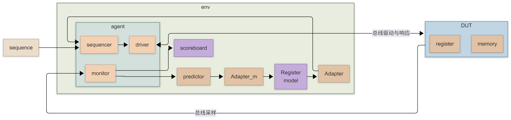

# UVM overview3

## UVM analysis component

> [!note]
>
> - **Reference model**：**模拟 DUT 的行为**，并 **根据输入计算出相应输出** 的组件
>
> - **Scoreboard**：将 **DUT 的输出** 与从 **参考模型获取的期望值** 相比对，判断 DUT 是否正常工作的组件

- 构建 **slalve agent** 中的 **monitor**

  ```systemverilog
  class out_monitor extends uvm_monitor;
      // ...
      virtual dut_interface                   my_vif;
      uvm_blocking_put_port #(my_transaction) m2s_port;
      // ...
      virtual function void build_phase(uvm_phase phase);
          super.build_phase(phase);
          `uvm_info("TRACE", $sformat("%m"), UVM_MEDIUM)
          if (!uvm_config_db#(virtual dut_interface)::get(this, "", "vif", my_vif)) begin
              `uvm_fatal("CONFIG_FATAL", "...")
          end
      endfunction
  
      virtual task run_phase(uvm_phase phase);
          my_transaction       tr;
          int                  active_port;
          logic          [7:0] temp;
          int                  count;
          forever begin
              active_port = -1;
              count       = 0;
              tr   = my_transaction::type_id::create("tr", this);
              // wait for bus active
              while (1) begin
                  @(my_vif.o_monitor_cb);
                  foreach (my_vif.o_monitor_cb.frameo_n[i]) begin
                      if (my_vif.o_monitor_cb.frameo_n[i] == 0) begin
                          active_port = i;
                      end
                  end
                  if (active_port != -1) begin
                      break;
                  end
              end
              // active port has been detected, get the source address
              tr.da = active_port;
              // get the payload
              forever begin
                  if (my_vif.o_monitor_cb.valido_n[tr.da] == 0) begin
                      temp[count] = my_vif.o_monitor_cb.dout[tr.da];
                      count++;
                      if (count == 8) begin
                          tr.payload.push_back(temp);
                          count = 0;
                      end
                  end
                  if (my_vif.o_monitor_cb.frameo_n[tr.da]) begin
                      if (count != 0) begin
                          tr.payload.push_back(temp);
                          `uvm_warning("PAYLOAD_WARNING", "...")
                      end
                      break;
                  end
                  @(my_vif.o_monitor_cb);
              end
              `uvm_info("OUT_MONITOR", {"...", tr.sprint()}, UVM_MEDIUM)
              `uvm_info("OUT_MONITOR", "...", UVM_MEDIUM)
              this.m2s_port.put(tr);
          end
      endtask
  endclass
  ```

- 构建 **slave agent**

  ```systemverilog
  class slave_agent extends uvm_agent;
      // ...
      out_monitor                               my_moni;
      agent_config                              my_agent_cfg;
      uvm_blocking_put_export #(my_transaction) s_a2s_export;
  
      function new(string name = "", uvm_component parent);
          super.new(name, parent);
          this.s_a2s_export = new("s_a2s_export", this);
      endfunction
  
      virtual function void build_phase(uvm_phase phase);
          super.build_phase(phase);
          if (!uvm_config_db#(agent_config)::get(this, "", "my_agent_cfg", my_agent_cfg)) begin
              `uvm_fatal("CONFIG_FATAL", "...")
          end
          uvm_config_db#(virtual dut_interface)::set(this, "my_moni", "vif", my_agent_cfg.my_vif);
          my_moni = out_monitor::type_id::create("my_moni", this);
      endfunction
  
      virtual function void connect_phase(uvm_phase phase);
          my_moni.m2s_port.connect(this.s_a2s_export);
      endfunction
  endclass
  ```

- 构建 **scoreboard**

  ```systemverilog
  class my_scoreboard extends uvm_scoreboard;
      // ...
      uvm_blocking_get_port #(my_transaction) r2s_port;
      uvm_blocking_get_port #(my_transaction) s_a2s_port;
      // ...
      virtual task run_phase(uvm_phase phase);
          my_transaction dut_output_tr;
          my_transaction expected_tr;
          forever begin
              `uvm_info("SCOREBOARD","...",UVM_MEDIUM)
              fork
                  r2s_port.get(expected_tr);
                  s_a2s_port.get(dut_output_tr);
              join
              `uvm_info("CHECK", "...", UVM_MEDIUM)
              if (expected_tr.compare(dut_output_tr)) begin
                  `uvm_info("CHECK", "...", UVM_MEDIUM)
              end
              else begin
                  `uvm_error("CHECK_ERROR", {"...",expected_tr.sprint(),,dut_output_tr.sprint()})
              end
          end
      endtask
  endclass
  ```

- 在 reference model 添加一个新的端口

  ```systemverilog
  class my_reference_model extends uvm_component;
      // ...
      uvm_blocking_put_imp #(my_transaction, my_reference_model) i_m2r_imp;
      uvm_blocking_put_port #(my_transaction)                    r2s_port;
  
      function new(string name = "", uvm_component parent);
          super.new(name, parent);
          this.i_m2r_imp = new("i_m2r_imp", this);
          this.r2s_port  = new("r2s_port", this);
      endfunction
  
      task put(my_transaction tr);
          `uvm_info("REF_REPORT", {"...", tr.sprint()}, UVM_MEDIUM)
          this.r2s_port.put(tr);
      endtask
  endclass
  ```

- 创建两个用于通信的 fifo

- 将组件与 fifo 相连接

  ```systemverilog
  class my_environment extends uvm_env;
      `uvm_component_utils(my_environment)
      master_agent                            my_agent;
      slave_agent                             my_slave_agent;
      env_config                              my_env_config;
      my_reference_model                      ref_model;
      my_scoreboard                           scb;
      uvm_tlm_analysis_fifo #(my_transaction) r2s_fifo;
      uvm_tlm_analysis_fifo #(my_transaction) s_a2s_fifo;
  
      function new(string name = "", uvm_component parent);
          super.new(name, parent);
          this.r2s_fifo   = new("r2s_fifo", this);
          this.s_a2s_fifo = new("s_a2s_fifo", this);
      endfunction
  
      virtual function void build_phase(uvm_phase phase);
          super.build_phase(phase);
          if (!uvm_config_db#(env_config)::get(this, "", "env_config", my_env_config)) begin
              `uvm_fatal("CONFIG_FATAL", "...")
          end
          uvm_config_db#(agent_config)::set(this, "my_agent", "my_agent_config", my_env_config.my_agent_config);
          uvm_config_db#(agent_config)::set(this, "my_slave_agent", "my_slave_agent_config", my_env_config.my_slave_agent_config);
  
          if (my_env_config.is_coverage) begin
              `uvm_info("COVERAGE_ENABLE", "...", UVM_LOW)
          end
          if (my_env_config.is_check) begin
              `uvm_info("CHECK_ENABLE", "...", UVM_LOW)
          end
  
          my_agent       = master_agent::type_id::create("my_agent", this);
          my_slave_agent = slave_agent::type_id::create("my_slave_agent", this);
          scb            = my_scoreboard::type_id::create("scb", this);
          ref_model      = my_reference_model::type_id::create("ref_model", this);
      endfunction
  
      virtual function void connect_phase(uvm_phase phase);
          super.connect_phase(phase);
          `uvm_info("ENV", "...", UVM_MEDIUM)
          my_agent.m_a2r_export.connect(this.r2s_fifo.blocking_put_export);
          my_slave_agent.s_a2s_export.connect(this.s_a2s_fifo.blocking_put_export);
          ref_model.i_m2r_port.connect(this.r2s_fifo.blocking_get_export);
          if (my_env_config.is_check) begin
              scb.r2s_port.connect(this.r2s_fifo.blocking_get_export);
              scb.s_a2s_port.connect(this.s_a2s_fifo.blocking_get_export);
          end
      endfunction
  endclass
  ```

## UVM advanced sequence（后续补充）

**Virtual Sequence 与 Virtual Sequencer：**

- 这是真正用来协调全局环境的“总指挥”。当系统里有多个不同类型的接口时（比如一边发正常数据，一边发控制指令或异常中断），你需要 Virtual Sequence 来调度底层不同 Agent 的 sequence 按照特定时间轴并发或串行执行。

**Sequence 的层级嵌套与 `start()` 方法：**

- 不要依赖隐式的随机，而是要学会在一个大的 Sequence 里面，手动实例化并 `start()` 其他小的 Sequence，像搭积木一样构造复杂的场景（比如针对流水线处理器发送特定依赖关系的指令流）。

**Sequence 的仲裁机制 (`lock` / `grab`)：**

- 学习当多个 sequence 同时想占用驱动器（Driver）时，如何通过设置优先级或强制抢占（grab）来模拟突发事件。

## UVM RAL

### 基本概念

> RAL: register abstraction layer，寄存器抽象层

> [!note]
>
> | 特性         | 寄存器                                                       | 存储器                                           |
> | ------------ | ------------------------------------------------------------ | ------------------------------------------------ |
> | **位置**     | 位于处理器或硬件模块内部，紧贴逻辑电路                       | 独立的存储单元，如 RAM、ROM                       |
> | **容量**     | 数量少，容量 **小**                                           | 容量 **大**，可存储大量数据                       |
> | **速度**     | 访问速度极 **快**，通常一个时钟周期即可完成                   | 相对较 **慢**，需要总线访问                       |
> | **用途**     | 保存 **控制** 信息、**状态** 位、**配置** 参数                   | 保存程序 **数据**、**指令**、**运行时信息**       |
> | **抽象层**   | 在验证中常通过 **寄存器抽象层（RAL）** 建模，便于读写和覆盖率收集 | 存储器抽象更偏向 **整体数据块** 的读写与一致性验证 |
> | **验证重点** | 正确性、可读写性、复位值、**覆盖率**                         | 地址映射、**数据一致性**、容量边界、时序约束     |

Register Model 是验证环境中的一个 **软件抽象结构**。它在内存中创建了一份 DUT 内部硬件寄存器（register）和存储器（memory）的 **镜像**。通过这个模型，可以在不直接操作物理总线的情况下，在验证环境中随时查看和管理硬件的状态


### 工作原理及构成

#### 前门访问 (Frontdoor)

- **路径**：`Register model` $\rightarrow$ `Adapter` $\rightarrow$ `sequencer` $\rightarrow$ `driver` $\rightarrow$ `DUT`
- 前门访问是 **模拟真实的物理总线时序** 来读写寄存器
  - 当在 Sequence 中调用 `reg.write()` 或 `reg.read()` 时，RAL 会生成一个通用的寄存器操作
  - 这个操作必须 **经过总线协议**（如 APB, AHB, AXI 等）才能到达 DUT，因此需要 **消耗仿真时间**

#### 适配器 (Adapter)

- **向下转换：** 寄存器模型发出的是 **通用的** 抽象总线事务（`uvm_reg_bus_op`），Adapter 将其转换为 sequencer 能支持的 **特定总线协议** 的 `sequence_item`，然后交给 `sequencer`
- **向上转换：** 当总线完成读操作返回数据时，Adapter 将协议相关的 **响应**（response）转换回 **通用** 格式，交还给寄存器模型

#### 后门访问 (Backdoor)

- 直接从寄存器模型绕过 Agent 指向 DUT 内部
- 后门访问是 **绕过物理总线**，利用仿真器的特性（通过层次化路径 HDL path，底层基于 VPI/DPI）直接读取或修改 DUT 内部信号的值
  - **特点：** **不消耗仿真时间**，不占用总线带宽
  - **用途：** 常用于环境初始化、快速配置、或者在不影响总线状态的情况下“偷看”寄存器当前值

#### Scoreboard

- **状态获取：** Scoreboard 在比对数据包时，经常需要知道当前 DUT 的工作模式。它可以直接通过 RAL 模型（如调用 `reg.get()` 或 `read()`）获取配置状态
- **预期值计算：** Monitor 抓取到总线上的数据后，可以传递给 Scoreboard，Scoreboard 再去对比 Register Model 中保存的镜像值，以此验证寄存器读写的正确性

#### Sequence

在引入 RAL 之后，我们在编写测试用例（Sequence）时，可以直接实例化寄存器模型，然后调用面向对象的方法（如 `my_reg_model.ctrl_reg.write(status, value, UVM_FRONTDOOR)`）

> [!tip]
>
> 在 UVM 环境的 `connect_phase` 阶段，只需调用寄存器模型顶层默认地址映射表（`default_map`）的 `set_sequencer()` 方法，将物理总线的 `sequencer` 实例与协议转换器 `adapter` 实例作为参数同时传入，即可完成这 **三者的绑定连接**

#### Register Model 和 Adapter 内部结构

| **模块大类**              | **核心组件 / 方法**     | **结构定位与专业术语**                                       | **关键函数 / 属性与实际应用**                                |
| ------------------------- | ----------------------- | ------------------------------------------------------------ | ------------------------------------------------------------ |
| Register Model (树状层级) | **`uvm_reg_block`**     | **根节点/枝干:** 封装整个子系统的寄存器、存储器、地址映射表以及子 block。 | `create()`: 实例化组件。 `build()`: 用户自定义的构建函数。 `lock_model()`: 构建完成后锁定结构防止修改 |
|                           | **`uvm_reg_map`**       | **路由与导航:** 负责地址偏移量计算。是连接模型与总线 Sequencer/Adapter 的物理桥梁。 | `add_reg()`: 将寄存器映射到指定偏移地址。 `set_sequencer()`: 在环境顶层绑定物理 Agent 的 Sequencer 和 Adapter。 |
|                           | **`uvm_reg`**           | **寄存器容器:** 对应物理硬件中特定地址的单个寄存器（如 32-bit），是位域的集合。 | 前门/后门操作接口：`read()`, `write()`, `update()` (同步期望值到 DUT), `mirror()` (读取 DUT 更新镜像值)。 |
|                           | **`uvm_reg_field`**     | **最底层原子位域:** 对应寄存器内部具有独立/相同功能的比特位集合（如 bit [2:0]）。 | 存储核心状态：**Desired Value (期望值)** 与 **Mirrored Value (镜像值)**。 `configure()`: 设置位宽、访问类型(RW/W1C/RO 等)、复位值。 `set()`, `get()`: 仅修改或获取模型内部的期望值（不发起总线操作）。 |
| Adapter (翻译引擎)        | **`reg2bus()`**         | **向下转换接口:** 纯虚函数。将 RAL 通用的抽象总线操作转换为具体的物理总线级事务。 | 输入：`const ref uvm_reg_bus_op rw` (包含地址、读写类型、数据)。 输出：`uvm_sequence_item` (如 `apb_item`, `axi_item`，直接发往 Sequencer)。 |
|                           | **`bus2reg()`**         | **向上转换接口:** 纯虚函数。将 Monitor 或 Driver 采到的物理总线事务，解析回 RAL 可识别的通用格式，用于更新内部镜像值。 | 输入：`uvm_sequence_item bus_item` (如抓取到的 `apb_item`)。 输出：`ref uvm_reg_bus_op rw` (将总线返回的 `rdata` 或 `status` 填入此结构体赋给模型)。 |
|                           | **Configuration Flags** | **总线特性配置标志:** 声明目标总线的硬件协议特性，指导 RAL 底层如何打包和发送事务。 | `provides_responses`: 设为 1 表示总线有独立响应通道（如 AXI）；设为 0 表示读写同周期完成（如 APB）。 `supports_byte_enable`: 设为 0 时，若模型只写部分位域，RAL 会自动执行 **Read-Modify-Write (读-改-写)**。 |

### 使用方法

> [!note]
>
> **基于以下 DUT 配置进行建模**
>
> **DUT 寄存器**
>
> | 名称       | 地址   | 域 field | 位位置 | 访问权限 |
> | ---------- | ------ | -------- | ------ | -------- |
> | config_reg | 0x001C | f4       | bit7   | WO       |
> |            |        | f3       | bit6   | RW       |
> |            |        | f2       | bit2   | RO       |
> |            |        | f1       | bit1~0 | RW       |
> | mode_reg   | 0x002D | data     | bit7~0 | RW       |
>
> **DUT 存储器**
>
> | 名称     | 起始地址 | 位宽  | 大小 |
> | -------- | -------- | ----- | ---- |
> | data_mem | 0x1000   | 16bit | 512  |

- **为 DUT 创建寄存器模型**（这里包括 config_reg, mode_reg, data_mem 以及顶层 reg_model）

  ```systemverilog
  class config_reg_c extends uvm_reg;
      // ...
      rand uvm_reg_field f1;
      // ...
      virtual function void build();
          f1 = uvm_reg_field::type_id::create("f1");
          // ...
          f1.configure(this, 1, 0, "RW", 0, 'h0, 1, 1, 1);
          // ...
      endfunction
      function new(string name = "config_reg_c");
          super.new(name, 8, UVM_NO_COVERAGE);
      endfunction
  endclass
  
  // ----------------------------------------
  class mode_reg_c extends uvm_reg;
      // ...
      rand uvm_reg_field data;
      virtual function void build();
          data = uvm_reg_field::type_id::create("data");
          data.configure(this, 8, 0, "RW", 0, 'h0, 1, 1, 1);
      endfunction
      function new(string name = "mode_reg_c");
          super.new(name, 8, UVM_NO_COVERAGE);
      endfunction
  endclass
  
  // ----------------------------------------
  class data_mem_c extends uvm_mem;
      // ...
      function new(string name = "data_mem_c");
          super.new(name, 512, 16);
      endfunction
  endclass
  
  // ----------------------------------------
  class reg_model_c extends uvm_reg_block;
      rand config_reg_c config_reg;
      // ...
      data_mem_c        data_mem;
  
      virtual function void build();
          config_reg = config_reg_c::type_id::create("config_reg");
          config_reg.configure(this, null, "config_reg");
          config_reg.build();
          // ...
          data_mem = data_mem_c::type_id::create("data_mem");
          data_mem.configure(this, "data_mem");
  
          default_map = create_map("default_map", 0, 1, UVM_LITTLE_ENDIAN);
          default_map.add_reg(config_reg, 'h001c, "RW");
          // ...
          default_map.add_mem(data_mem, 'h1000);
      endfunction
      function new(string name = "reg_model_c");
          super.new(name, UVM_NO_COVERAGE);
      endfunction
  endclass
  ```

- **为创建实现前门操作的转换器**

  ```systemverilog
  class my_adapter extends uvm_reg_adapter;
      // ...
      // 实现reg2bus函数，将寄存器访问转换为总线事务
      function uvm_sequence_item reg2bus(const ref uvm_reg_bus_op rw);
          cpu_trans cpu_tr;
          cpu_tr      = cpu_trans::type_id::create("cpu_tr");
          // ...
          return cpu_tr;
      endfunction
  
      // 实现bus2reg函数，将总线事务转换为寄存器访问
      function void bus2reg(uvm_sequence_item bus_item, ref uvm_reg_bus_op rw);
          cpu_trans cpu_tr;
          if (!$cast(cpu_tr, bus_item)) begin
              `uvm_fatal("ADAPTER", "...")
              return;
          end
          rw.kind    = (cpu_tr.acc == CPU_R) ? UVM_READ : UVM_WRITE;
          // ...
      endfunction
  endclass
  
  // ----------------------------------------
  class cpu_trans extends uvm_sequence_item;
      typedef enum {CPU_R, CPU_W} BUS_ACC_e;
      rand bit       [15:0] addr;
      // ...
      rand BUS_ACC_e        acc;
      `uvm_object_utils_begin
      `uvm_field_int(addr, UVM_ALL_ON)
      // ...
      `uvm_field_enum(BUS_ACC_e, acc, UVM_ALL_ON)
      `uvm_object_utils_end
  endclass
  ```

  > [!tip]
  >
  > **UVM 内建结构体**: `uvm_reg_bus_op`
  >
  > ```systemverilog
  > typedef struct {
  >     uvm_access_e      kind;
  >     uvm_reg_addr_t    addr;
  >     uvm_reg_data_t    data;
  >     int               n_bits;
  >     uvm_reg_byte_en_t byte_en;
  >     uvm_status_e      status;
  > } uvm_reg_bus_op;
  > ```

- **在测试平台中实例化寄存器模型和转换器**

- **将转换器、sequencer 与寄存器模型的 map 建立关联**

  ```systemverilog
  class my_environment extends uvm_env;
      // ...
      reg_model_c reg_model;
      my_adapter  reg_adapter;
      // ...
      virtual function void build_phase(uvm_phase phase);
          super.build_phase(phase);
          // ...
          reg_model = reg_model_c::type_id::create("reg_model", this);
          reg_model.configure(null, "tb.dut");
          reg_model.build();
          reg_model.lock();
          reg_model.reset();
          reg_adapter = my_adapter::type_id::create("reg_adapter", this);
      endfunction
  
      virtual function void connect_phase(uvm_phase phase);
          super.connect_phase(phase);
          // ...
          reg_model.default_map.set_sequencer(my_agent.sequencer, reg_adapter);
          reg_model.default_map.set_auto_predict(1);
      endfunction
  endclass
  ```

- **在需要进行寄存器读写的地方使用 API 访问寄存器**

  ```systemverilog
  class my_environment extends uvm_env;
      // ...
      my_scoreboard scb;
      // ...
      virtual function void connect_phase(uvm_phase phase);
          super.connect_phase(phase);
          // ...
          scb.reg_model = reg_model;
      endfunction
  endclass
  
  // ----------------------------------------
  class my_scoreboard extends uvm_scoreboard;
      // ...
      reg_model_c reg_model;
      // ...
      virtual task run_phase(uvm_phase phase);
          // ...
          uvm_status_e   status;
          uvm_reg_data_t value;
          forever begin
              // ...
              reg_model.config_reg.write(status, value, UVM_FRONTDOOR);
              // ...
              reg_model.mode_reg.read(status, value, UVM_FRONTDOOR);
              // ...
          end
      endtask
  endclass
  ```


### 寄存器模型的基本数据结构


| **基类 (Base Class)** | **层级定位**   | **核心功能**                                                 | **扩展与使用说明**                                           |
| --------------------- | -------------- | ------------------------------------------------------------ | ------------------------------------------------------------ |
| **`uvm_reg_field`**   | 最底层数据单元 | **真正存储数据** 的位 **域**，包含 `value`（实际值）、`m_mirrored`（镜像值）、`m_desired`（期望值）等核心属性。 | 直接实例化使用，通常 **无需扩展**。                           |
| **`uvm_reg`**         | 寄存器模型     | 对硬件寄存器进行建模。**自身无存储能力**，本质是包含一个或多个 `uvm_reg_field` 的容器。 | 属于 **虚类**，**必须派生扩展** 后使用。                       |
| **`uvm_mem`**         | 存储器模型     | 对连续的存储空间（如 RAM、ROM 等连续地址段）进行建模。       | 一般 **需要派生扩展** 后使用。                                 |
| **`uvm_block`**       | 核心管理容器   | **RAL 树的主体**。包含 **reg**、**mem**、**map** 及 **子 block**；向外暴露供用户调用的寄存器访问 API。 | **需要派生扩展**，用于搭建完整的 RAL 结构。                  |
| **`uvm_map`**         | 寻址与通信桥梁 | 负责 **分配物理地址**；关联 `sequencer` 和 `adapter`，作为 RAL 模型与物理总线之间的转换枢纽。 | 供 UVM 内部底层机制使用，实现抽象读写到物理 transaction 的转换。 |

#### `uvm_reg_field` 核心状态属性解析

- **`value`（硬件实际值）**
  - **定义**：DUT 中物理寄存器 **当前真实的数值**
  - **说明**：它存在于真实的硬件代码（RTL）中，RAL 模型的终极目标就是去 **控制（写）和反映（读）** 这个真实值
- **`m_desired`（期望值）**
  - **定义**：验证环境 **希望** 该寄存器域被配置成的值
  - **操作流**：当在测试用例中调用 `set()` 方法时，仅仅是更新了 RAL 模型内部的 `m_desired` 值，**并不会立即触发对硬件的总线操作**
  - **作用**：它相当于一个“草稿”。你可以对多个 field 进行 `set()` 操作修改期望值，最后统一调用 `update()` 方法，RAL 会对比 `m_desired` 和 `m_mirrored`，只把那些发生了变化的值通过总线写入到真实的硬件 `value` 中
- **`m_mirrored`（镜像值）**
  - **定义**：RAL 模型对硬件实际值（`value`）的 **本地快照或预测**
  - **操作流**：当你对寄存器执行 `read()`、`write()` 或 `peek()`、`poke()` 操作成功后，UVM 机制会自动更新 `m_mirrored`，使其与硬件实际情况保持同步
  - **作用**：它代表了验证环境“认为”当前硬件处于什么状态。在很多 Check 中，我们可以直接读取镜像值来代替发起真实的硬件读操作，从而节省总线带宽

> [!tip] 
>
> 当调用 `write()` 时，流程大致是：**写入硬件的 `value` -> 同时更新 RAL 的 `m_desired` -> 同时更新 RAL 的 `m_mirrored`**。三者在写入成功后 **保持一致**。`read()` 同理

#### 寄存器的访问方式

针对实际中可能会存在的寄存器访问模式，UVM RAL 自定义了 **25 种** 的访问模式，包括 `RO`、`RW`、`WC` 等等

### RAL 的 API

#### 真实硬件读写（模拟行为）

> [!note]
>
> **模拟行为**：**操作是否会产生真实的硬件交互（即总线上的读写动作），并让 RAL 模型和硬件保持一致**。不仅仅是 **访问寄存器的方式**，而是区分“真实硬件交互” 与 “纯模型操作/后门直改”

这类操作会产生 **真实的存取动作**，常用于常规的验证流程。

- **`write` (写)**：通过前门或后门向 **DUT 写入值**。**会模拟寄存器的真实行为**，写完后会根据模拟结果同步更新 RAL 模型中的 **期望值** 和 **镜像值**。
- **`read` (读)**：通过前门或后门读取 **DUT 的值**。同样 **会模拟真实行为**，读完后用真实值更新模型里的 **期望值** 和 **镜像值**。

```systemverilog
// RAL write原型（read的参数列表与write完全相同），通常只配置前3个参数
virtual task write(
    output uvm_status_e        status,
    input  uvm_reg_data_t      value,
    input  uvm_path_e          path = UVM_DEFAULT_PATH,
    input  uvm_reg_map         map = null,
    input  uvm_sequence_base   parent = null,
    input  int                 prior = -1,
    input  uvm_object          extension = null,
    input  string              fname = "",
    input  int                 lineno = 0
);
```

```systemverilog
// case
class my_scoreboard extends uvm_scoreboard;
    // ...
    reg_model_c reg_model;
    // ...
    virtual task run_phase(uvm_phase phase);
        uvm_status_e   status;
        uvm_reg_data_t value;
        // ...
        forever begin
            // ...
            reg_model.config_reg.write(status, value, UVM_FRONTDOOR);
            // ...
            reg_model.mode_reg.read(status, value, UVM_FRONTDOOR);
            // ...
        end
        // ...
    endtask
endclass
```

#### 后门潜入读写（不模拟行为）

这类操作不会 **模拟行为**，速度 **快**，常用于快速初始化或隐蔽检查。

- **`poke` (潜入写)**：类似 `write` 的 **后门** 操作，但 **不模拟硬件行为**。直接把值写进 DUT，并顺便更新期望值和镜像值。
- **`peek` (潜入读)**：类似 `read` 的 **后门** 操作，**不模拟硬件行为**。直接读 DUT 里的值，并同步更新到期望值和镜像值。

```systemverilog
// RAL poke原型（peek的参数列表与poke完全相同），通常只配置前3个参数
virtual task poke(
    output uvm_status_e        status,
    input  uvm_reg_data_t      value,
    input  string              kind = "",
    input  uvm_sequence_base   parent = null,
    input  uvm_object          extension = null,
    input  string              fname = "",
    input  int                 lineno = 0
);
```

#### 本地模型操作（零总线消耗）

这类操作 **完全不会触碰 DUT 硬件**，仅仅在验证环境的软件模型（RAL Tree）内部打转。

- **`set` (设置)**：手动设定一个目标值，**只改变期望值 (desired)**。
- **`get` (获取)**：**仅获取期望值**。
- **`randomize` (随机化)**：针对寄存器生成一个随机值，并 **只赋给期望值**。

#### 模型与硬件同步（状态对齐）

这两者是用来在“软件模型”和“真实硬件”之间“对账”的。

- **`update` (模型 -> 硬件)**：**以期望值为准**。它会检查期望值和镜像值是否一致，如果不一致（说明模型里存了新配置还没发下去），就把 **期望值写入 DUT**，并把 **镜像值也更新** 了。
- **`mirror` (硬件 -> 模型)**：**以硬件真实值为准**。**强制从 DUT 读一次** 当前的真实内部值，然后拿这个真实值回来，把模型里的 **期望值和镜像值都刷新** 一遍。

```systemverilog
virtual task update(	// 通常只配置status参数
    output uvm_status_e        status,
    input  uvm_path_e          path = UVM_DEFAULT_PATH,
    input  uvm_reg_map         map = null,
    input  uvm_sequence_base   parent = null,
    input  int                 prior = -1,
    input  string              fname = "",
    input  int                 lineno = 0
);
```

```systemverilog
virtual task update(
    output uvm_status_e        status,
    input  uvm_check_e		   check = UVM_NO_CHECK,	// 默认不检查
    input  uvm_path_e          path = UVM_DEFAULT_PATH,
    input  uvm_reg_map         map = null,
    input  uvm_sequence_base   parent = null,
    input  int                 prior = -1,
    input  uvm_object          extension = null,
    input  string              fname = "",
    input  int                 lineno = 0
);
```

### 带 predictor 的 RAL 结构



```systemverilog
class my_environment extends uvm_env;
    // ...
    reg_model_c                             reg_model;
    my_adapter                              reg_adapter;
    my_adapter                              reg_adapter_m;
    uvm_reg_predictor #(cpu_trans)          reg_predictor;
    // ...
    virtual function void build_phase(uvm_phase phase);
        // ...
        ref_model = my_reference_model::type_id::create("ref_model", this);
        reg_model = reg_model_c::type_id::create("reg_model", this);
        reg_model.configure(null, "tb.dut");
        reg_model.build();
        reg_model.lock();
        reg_model.reset();

        reg_adapter = my_adapter::type_id::create("reg_adapter", this);
        reg_adapter_m = my_adapter::type_id::create("reg_adapter_m", this);
        reg_predictor = new("reg_predictor", this);
    endfunction

    virtual function void connect_phase(uvm_phase phase);
        // ...
        reg_predictor.map     = reg_model.default_map;
        reg_predictor.adapter = reg_adapter_m;
        agent.monitor.analysis_port.connect(reg_predictor.bus_in);
    endfunction
endclass
```

### 内建寄存器 sequences 与 coverage

- **基于寄存器模型** 的自动测试的 **sequences 库**（`uvm_reg_hw_reset_seq`、`uvm_reg_single_bit bash_seq`、`uvm_reg_bit_bash_seq`...）
  - 这些 sequences 可以对 DUT 中的寄存器和存储器进行基本的测试
  - 包括检查寄存器的复位值是否正确、读写数据路径是否正常工作等（转换/检查每一位/前门和后门访问模式/存储器活动）
  
- RAL **内建的 coverage** 可实现寄存器测试的覆盖率统计，有三种方法为 RAL 添加 coverage 属性
  - 在 RAL 构造函数加入 coverage 选项
  
    ```systemverilog
    class mode_reg_c extends uvm_reg
        // ...
        function new(string name = "mode_reg_c")
            super.new(name, 8, UVM_CVR_ALL);
        endfunction
    endclass
    ```
  
  - 使用 `uvm_reg::include_coverage`(" 寄存器”，coverage 选项)
  
    ```systemverilog
    uvm_reg::include_coverage("*", UVM_CVR_REG_BITS + UVM_CVR_FIELD_VALS)
    ```
  
  - 使用 `uvm_reg_block/reg/mem.set_coverage`(coverage 选项)
  
    ```systemverilog
    uvm_reg_block.set_coverage(UVM_CVR_ALL)
    ```
  
  | UVM 选项              | 描述                                 |
  | -------------------- | ------------------------------------ |
  | `UVM_NO_COVERAGE`    | 不进行 coverage 统计                   |
  | `UVM_CVR_REG_BITS`   | 对寄存器的每一位进行读写统计         |
  | `UVM_CVR_ADDR_MAP`   | 对地址映射中的每一个地址进行读写统计 |
  | `UVM_CVR_FIELD_VALS` | 统计域的值                           |
  | `UVM_CVR_ALL`        | 统计所有的覆盖率                     |


---

> 你的笔记已经构建了基础环境，但要应对真实复杂的数字 IC 验证项目（如完整的微处理器或复杂总线节点），以下理论是必须要补齐的：
>
> **1. Virtual Sequence 的代码落地**
>
> - **你的笔记：** 在 `UVM_overview3.md` 中以文字形式记录了 Virtual Sequence 是“总指挥”的概念。
> - **补充方向：** 理论上你需要知道，Virtual Sequence 本身是不产生数据包的，它里面包含的是各个底层 Agent 的 Sequencer 句柄（即 Virtual Sequencer）。你需要学习如何在一个大的 Virtual Sequence 的 `body()` 任务里，去分发、嵌套、协调底层的 Sequence。
>
> **2. Reference Model 与 DPI-C（C/C++ 模型接入）**
>
> - **你的笔记：** 记录了使用 SystemVerilog 编写 Reference Model 并通过 TLM 通信的逻辑。
> - **补充方向：** 在验证复杂的算法模块或 RISC-V 等处理器架构时，参考模型通常是 C/C++ 写的（比如指令集模拟器 ISS）。你需要补充 **DPI-C (Direct Programming Interface)** 的知识，学习如何让 UVM 环境（SystemVerilog）调用 C 语言的函数，实现联合仿真。
>
> **3. 覆盖率驱动验证 (CDV) 与 SVA**
>
> - **补充方向：** UVM 是一个平台，验证的最终验收标准是“覆盖率”。你需要补充如何在 UVM 中收集功能覆盖率（`covergroup`, `coverpoint`），以及如何将 SVA（SystemVerilog Assertions，断言）与 UVM 环境结合，去监控复杂的时序协议（比如 AXI4 的握手规则）。

## UVM callback（后续补充）

> **实际应用场景：** * 一般在开发通用的验证 IP (VIP) 时用得最多。如果你只是* *使用* *环境，可能不常去定义 Callback；但如果你要* *维护或二次开发**一个大型的成熟平台，理解 Callback 机制能让你在不破坏底层架构的前提下“见缝插针”地注入错误（Error Injection）或修改数据。建议初期先理解概念，知道怎么调即可。

