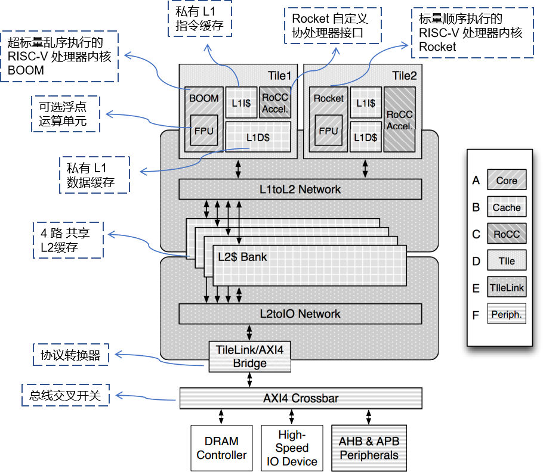
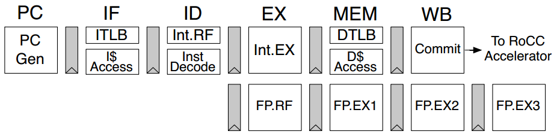
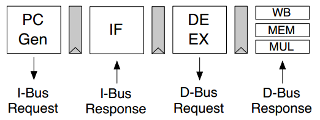

# The Rocket Chip Generator

[toc]

> [!important]
>
> **The Rocket Chip Generator** 包含与提及的 **文档** 与 **GitHub 项目** 链接
>
> **文档与规范**
>
> - [Rocket Chip 技术报告 No. UCB/EECS-2016-17](http://www.eecs.berkeley.edu/Pubs/TechRpts/2016/EECS-2016-17.html)：本文阅读基础
> - [RISC-V International](https://riscv.org/)：指令集架构标准
> - [BOOM documentation](https://boom-core.org/)：超标量乱序核心 BOOM 官方文档
>
> **核心生成器与框架**
>
> - [rocket-chip](https://github.com/chipsalliance/rocket-chip)：SoC 生成器源码
> - [riscv-boom](https://github.com/riscv-boom/riscv-boom)：超标量乱序核心 BOOM 源码
> - [chipyard](https://github.com/ucb-bar/chipyard)：敏捷开发集成框架
> - [chisel](https://www.chisel-lang.org/)：基于 Scala 的参数化硬件生成语言
>
> **测试与验证工具**
>
> - [riscv-isa-sim: Spike](https://github.com/riscv-software-src/riscv-isa-sim)：RISC-V ISA 黄金标准模拟器
> - [riscv-torture](https://github.com/ucb-bar/riscv-torture)：指令级随机压力测试
> - [groundtest](https://github.com/mwachs5/groundtest)：硬件级内存系统测试
> - [axe](https://github.com/CTSRD-CHERI/axe)：内存一致性模型验证
>
> **FPGA 部署**
>
> - [fpga-zynq](https://github.com/ucb-bar/fpga-zynq)：Zynq FPGA 移植支持

> [!note]
>
> #### **摘要**
>
> Rocket Chip 是一款开源的 **SoC 设计生成器**，能够输出可综合的 RTL 代码。它基于 **Chisel** 语言，将一系列用于构建核心、缓存和互连的复杂生成器库整合为完整的 SoC 系统。Rocket Chip 生成的通用处理器核心采用开放的 **RISC-V** ISA，同时提供了顺序执行核心生成器（**Rocket**）和乱序执行核心生成器（**BOOM**）。对于希望利用异构化专用技术提升性能的 SoC 设计人员，Rocket Chip 支持通过 **指令集扩展**、**协处理器** 或 **完全独立的全新核心** 等方式集成定制化加速器。截至目前（2016），Rocket Chip 已完成 11 次流片，成功制造出具备 Linux 启动功能的可运行硅片原型。

> [!tip]
>
> #### **术语**
>
> **处理器与执行**
> - **ISA (Instruction Set Architecture)**: 指令集架构。软硬件之间的接口标准，定义了处理器能够理解和执行的机器语言指令集合（如 RISC-V、ARM、x86）。
> - **superscalar**: 超标量。一种处理器架构，能够在一个时钟周期内发射多条指令到不同的执行单元，从而提高指令级并行度。
> - **branch prediction**: 分支预测。处理器在遇到条件分支指令时，预测其是否跳转及跳转目标地址的技术，以避免流水线停顿。
> - **BTB / BHT / RAS**: 分支预测关键结构。分别用于预测分支目标、分支方向与函数返回地址，降低控制相关流水线停顿。
> - **gshare / TAGE**: 常见动态分支预测器。gshare 结构较简洁，TAGE 通常精度更高但实现复杂度也更高。
> - **FPU (Floating-Point Unit)**: 浮点运算单元。负责执行浮点加减乘除等计算，影响科学计算与多媒体负载性能。
>
> **存储与一致性**
> - **MMU (Memory Management Unit)**: 内存管理单元。负责处理中央处理器（CPU）的内存访问请求，主要功能包括虚拟地址到物理地址的转换、内存保护等。
> - **TLB (Translation Lookaside Buffer)**: 转换后备缓冲器、页表缓存、快表。用于缓存虚拟地址到物理地址的转换结果，加速内存访问。
> - **L1 / L2 Cache**: 一级/二级缓存。L1 通常靠近核心、延迟更低；L2 容量更大，常作为多个核心间的共享缓存层。
> - **non-blocking cache**: 非阻塞缓存。在缓存未命中时仍可继续处理后续访存请求，从而提升内存级并行性。
> - **replacement policy**: 替换策略。当缓存已满且需要加载新数据时，决定淘汰哪个旧数据的算法。
>   - **LRU**：优先淘汰最长时间未使用的数据，命中率较好，实现开销较高。
>   - **FIFO**：优先淘汰最早进入缓存的数据，实现简单、硬件代价低。
>   - **Random**：随机淘汰，逻辑最简单，适合高相联度场景。
> - **cache line**: 缓存行。缓存与一致性协议管理数据的基本粒度，替换和失效通常都以缓存行为单位。
> - **cache coherent**: 缓存一致性。在多核系统中，确保多个处理器核心各自的私有缓存中对同一内存地址的数据保持一致的机制。
> - **coherence policy**: 一致性策略。实现缓存一致性的具体协议或规则，定义缓存行状态及状态转换条件。
>   - **MSI**：基础三状态（Modified / Shared / Invalid），实现简单。
>   - **MESI**：在 MSI 上增加 Exclusive，减少不必要总线通信。
>   - **MOESI**：在 MESI 上增加 Owned，优化共享写回流量。
>
> **互连与总线**
> - **NoC (Network-on-Chip)**: 片上网络。在单个芯片内部连接多个处理器核心、缓存、内存控制器等组件的通信网络架构，采用类似计算机网络的路由和数据包交换技术，以解决传统共享总线的带宽和扩展性瓶颈。
> - **TileLink**: 片上互连与一致性协议框架。用于描述缓存一致性事务并连接 Tile、缓存和外设，是 Rocket Chip 的核心互连基础。
> - **AXI (Advanced eXtensible Interface)**: 高性能片上总线协议。常用于连接处理器、L2 缓存与外部内存系统，支持高带宽和突发传输。
> - **AHB (Advanced High-performance Bus)**: AMBA 高性能总线。支持高效突发传输与流水化事务。
> - **APB (Advanced Peripheral Bus)**: 低功耗外设总线。主要用于低速控制类外设，接口简单、实现开销小。
>
> **扩展与 I/O**
> - **Tile**: 片块/计算单元。在 SoC 设计中，通常指包含一个或多个处理器核心、私有缓存（如 L1 缓存）以及本地路由器的基本模块化构建单元。
> - **coprocessor**: 协处理器。辅助主处理器完成特定任务（如浮点运算、加密、图形处理）的专用处理单元。
> - **RoCC (Rocket Custom Coprocessor)**: Rocket 自定义协处理器接口。Rocket Chip 提供的一种标准接口，允许开发者将自定义的硬件加速器直接挂载到处理器核心的流水线上。
> - **MMIO (Memory-Mapped I/O)**: 内存映射 I/O。将外设的控制寄存器和数据缓冲区映射到处理器的内存地址空间，使得处理器可以像访问内存一样访问外设。
> - **DMA (Direct Memory Access)**: 直接内存访问。外设可在不频繁占用 CPU 的情况下直接读写内存，常与一致性维护协同设计。

## an example of a Rocket Chip instance

总体而言，Rocket Chip 是一个 **生成器库**，可以 **参数化并组合成多种 SoC 设计**。

此实例具有两个片块（tile），连接到一个四路（4-bank）L2 缓存，而该 L2 缓存本身通过 AXI 互连连接到外部 I/O 和内存系统。

- 片块 1 包含一个带有 FPU 的乱序 BOOM 核心、L1 指令缓存和数据缓存，以及一个实现 RoCC 接口的加速器。
- 片块 2 与之类似，但它使用不同的核心——Rocket，并且具有不同的 L1 数据缓存参数。

> [!note]
>
> - **Core（核心）**：
>   - Rocket 标量核心生成器
>   - BOOM 乱序超标量核心生成器
>   - 可选的浮点运算单元（FPU）
>   - 可配置的功能单元流水线
>   - 可定制的分支预测器
> - **Caches（缓存）**：
>   - 一系列缓存和 TLB（地址转换缓冲区）生成器
>   - 可配置大小、相联度和替换策略
> - **RoCC（Rocket 自定义协处理器接口）**：
>   - 面向应用特定协处理器的模板
>   - 可暴露自定义参数
> - **Tile（计算单元模板）**：
>   - 用于生成支持缓存一致性的 tile 模板
>   - 可配置核心和加速器的数量与类型
>   - 可配置私有缓存的组织方式
> - **TileLink**：
>   - 用于生成缓存一致性代理网络及相关缓存控制器的生成器
>   - 配置选项包括：tile 数量、一致性策略、共享后备存储的存在与否、底层物理网络的实现方式
> - **Peripherals（外设）**：
>   - AMBA 兼容总线生成器（AXI、AHB-Lite、APB）
>   - 各类转换器和控制器
>   - 包括 Z-scale 处理器

## Rocket Core

Rocket 是一个 5 级流水线的顺序执行标量核心生成器，实现了 RV32G 和 RV64G ISA。它具备虚拟内存管理、非阻塞缓存和灵活的分支预测机制，并能通过参数化方式定制 ISA 扩展、浮点流水线深度以及缓存/TLB 配置。

> [!note]
>
> - **5 级流水线** 的顺序执行标量核心生成器，实现了 **RV32G** 和 **RV64G** ISA。
> - 支持基于页的 **虚拟内存的 MMU**。
> - 配备 **非阻塞数据缓存**。
> - 前端支持 **分支预测**，可配置，采用 **BTB**（分支目标缓冲）、**BHT**（分支历史表）、**RAS**（返回地址栈）。
> - 浮点运算部分使用 **Chisel 实现的浮点单元**。
> - 支持 **RISC-V 的机器级、监督级和用户级特权模式**。
> - 可配置参数包括：
>   - 可选支持部分 ISA 扩展（M、A、F、D）
>   - 浮点流水线级数
>   - 缓存和 TLB 的大小

## BOOM Core

BOOM: Berkeley Out-of-Order Machine

> *Fig. 1* *详细的 BOOM 流水线. \*表示可以配置核心的位置*

> *Fig. 2* *带分段的简易 BOOM 流水线*

从概念上讲，BOOM 分为 10 个阶段：Fetch, Decode, Register Rename, Dispatch, Issue, Register Read, Execute, Memory, Writeback and Commit。然而，在当前的实现中，这些阶段中的许多是合并在一起的，产生了七个阶段：**Fetch**, **Decode/Rename**, **Rename/Dispatch**, **Issue/RegisterRead**, **Execute**, **Memory** 和 **Writeback** （Commit 是异步发生的，所以它不被算作流水线的一部分）。

> [!note]
>
> - **完整分支预测**：支持 BTB、RAS 和可配置的后备预测器（如 gshare、TAGE）。
> - **内存系统**：加载/存储单元支持乱序执行和存储数据转发。
> - **兼容性**：BOOM tile 与 Rocket tile 完全 I/O 兼容，可直接融入 Rocket Chip 内存层次。
> - **可定制性**：借助 Chisel，功能单元组合、取指/译码/发射/提交宽度均可参数化。

## ~~Z-scale Core (已弃用)~~

> [!warning]
>
> [Z-scale](https://github.com/ucb-bar/zscale) 该项目目前 **已被弃用**，不再维护，且不符合最新 RISC-V 规范

> [!note]
>
> - **定位**：面向嵌入式与微控制器的轻量级 RISC-V 核心。
> - **架构**：实现 RV32IM ISA，采用 3 级顺序流水线，支持机器/用户模式。
> - **兼容性**：接口为 AHB-Lite，总线兼容 ARM Cortex-M 系列，但不适配 Rocket/BOOM 的缓存一致性架构。
> - **实现形式**：提供 Chisel 和 Verilog 两种实现。

## Uncore and TileLink

**TileLink**: 一个协议框架，用于描述一组实现特定缓存一致性策略的缓存一致性事务

> [!note]
>
> - **内存架构可配置：** Rocket Chip 包含了用于生成 **共享内存层次结构** 的生成器，可以自定义配置节点（tiles）数量、缓存策略、L2 缓存、内存通道等硬件参数。
> - **模块化设计：** TileLink 协议将“**网络/缓存控制器的实现**”与“**缓存一致性协议的设计**”解耦。简化硬件代码的编写和组件验证，同时防止系统死锁。
> - **可扩展性与兼容性：** TileLink 支持自定义一致性策略，且内置通用事务类型，使得没有缓存的外部设备（如加速器、DMA 引擎等）也能接入全局共享内存。
> - **底层实现灵活：** 提供了生成缓存控制器状态机、数据以及元数据内存阵列的生成器，借助 Chisel 语言，开发者可以生成不同类型的缓存架构（如目录式或监听式网络）。同时，系统不局限于使用交叉开关（Crossbar）来连接各个 Tile，还能兼容其他的物理网络设计。
> - **外部外设支持强大：** 提供了专门的 MMIO 路由生成器/TileLink 互连生成器，并内置了 TileLink 到 AXI4、AHB-Lite、APB 等协议的转换器，极大地方便了与第三方外设和 IP 核的集成。

## Supporting Infrastructure

### FPGA Support

支持将 Rocket Chip 部署到多种 Xilinx Zynq-7000 系列 FPGA……

### Memory System Testing

> [!note]
>
> - **目的**：硬件层面验证 Rocket Chip 的内存层次结构，尤其是软件难以覆盖的场景。
> - **方式**：
>
>   - **MemTest**：固定步长的写入/读取测试。
>   - **回归测试**：针对历史 bug，尤其是顺序/时序相关问题。
>   - **随机测试**：生成多种内存操作组合，记录 trace 并用 **Axe** 工具验证一致性。
> - **优势**：
>
>   - 能直接驱动 L2 互连，绕过 CPU 执行的限制。
>   - 更容易复现复杂的内存错误。
>   - 提供一致性模型验证的硬件级保障。

### Core Testing

> [!note]
>
> - **目的**：通过随机组合指令序列来发现核心实现中的潜在错误。
> - **方法**：
>
>   - 随机拼接汇编代码序列。
>   - 在核心与 **Spike 模拟器** 上同时运行，比较寄存器状态。
>   - 自动缩减错误程序，找到最小触发错误的测试用例。
> - **优势**：
>
>   - 能长时间运行，持续生成新测试。
>   - 自动保存错误触发程序，便于后续分析。
>   - 提供软件层面的验证，补充硬件测试手段。
